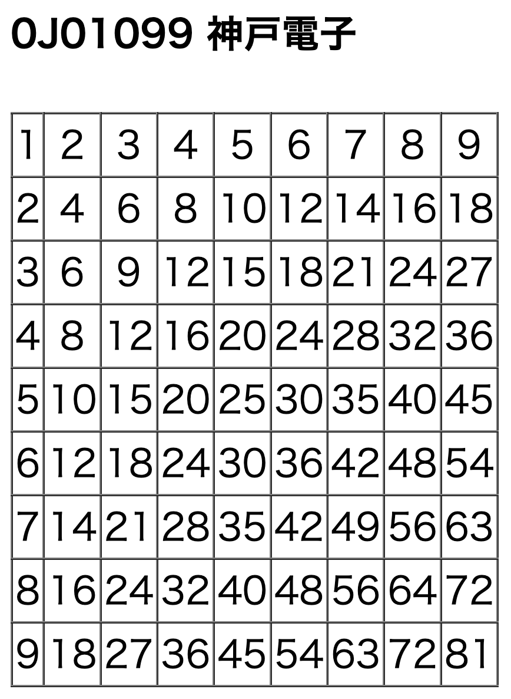

# 「PHPの基本」のチャレンジ問題

- [「PHPの基本」のチャレンジ問題](#phpの基本のチャレンジ問題)
  - [チャレンジ問題について](#チャレンジ問題について)

## チャレンジ問題について

[「PHPの基本」の課題](../basicphp-kadai/README.md)が早めに終わった方はこちらをチャレンジしてみてください。
(※あくまでチャレンジ問題ですので、評価には含まれません。)

- 『「PHPの基本」の課題』のcloneした、`public`ディレクトリに、`ninebynine2.php`作成し、以下のようにブラウザに表示される九九表を作成してください。
- for文を2つ使用してください。
- HTMLタグは自分で調べてみてください。

