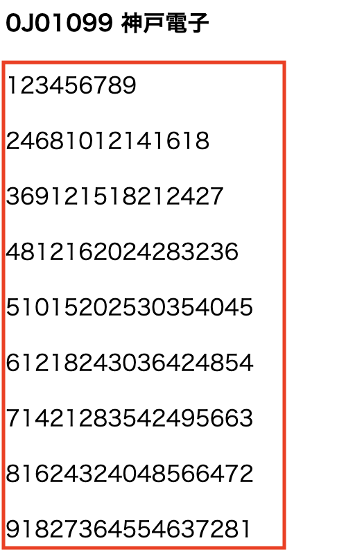
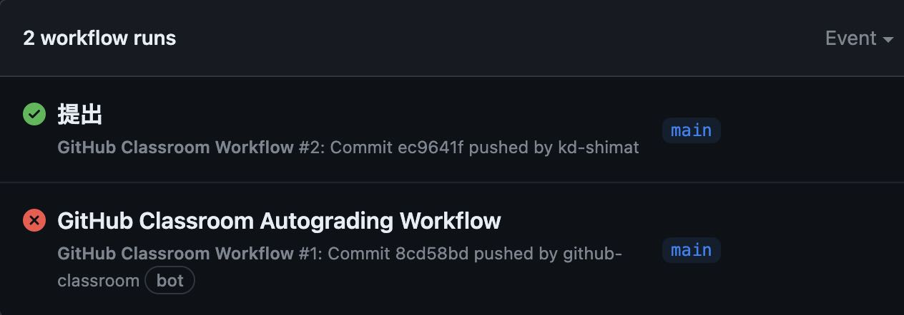
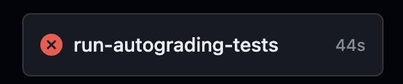
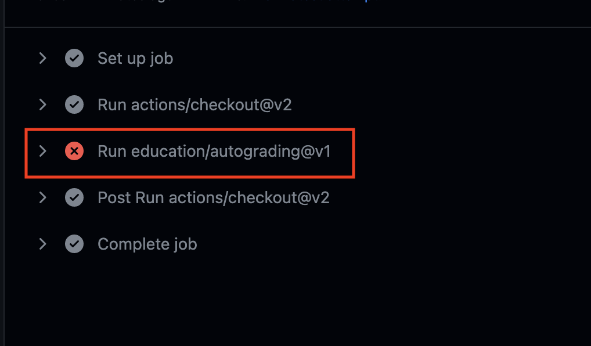

# 「PHPの基本」の課題

- [「PHPの基本」の課題](#phpの基本の課題)
  - [事前準備](#事前準備)
  - [課題内容](#課題内容)
    - [ヒント](#ヒント)
    - [ブラウザ上での確認方法を忘れた方へ](#ブラウザ上での確認方法を忘れた方へ)
  - [採点について](#採点について)
    - [課題の合格基準について](#課題の合格基準について)
    - [合格確認方法](#合格確認方法)
    - [エラーが出た時の対処法](#エラーが出た時の対処法)
      - [タイムアウトになっていないかを確認する](#タイムアウトになっていないかを確認する)
    - [プログラムが正確に書かれているか確認する](#プログラムが正確に書かれているか確認する)

## 事前準備

[こちら](https://classroom.github.com/a/7BZ9ZTet)からソースコードをcloneしてください。

## 課題内容

次に示す九九を以下の条件で作成してください。
- `public`ディレクトリに、`ninebynine.php`作成し、そこに記入してください。
- **for文を２つ用いて**作成してください。
- 改行に関しては`<p>`タグを用いて、行ってください。※`</p>`も忘れないように！<br><br>

`ninebynine.php`

```php
<!DOCTYPE html>
<html lang="ja">
<head>
    <meta charset="UTF-8">
    <meta name="viewport" content="width=device-width, initial-scale=1.0">
    <title>九九の出力練習課題</title>
</head>
<body>
    <h4><!-- ここに"出席番号 名前"を入れてください(間の半角スペースお忘れなく) --></h4>
    <?php
        # ここに九九のコードを記述する
    ?>
</body>
</html>
```

### ヒント

ブラウザ上の赤枠の箇所を**for文を使わずに**HTMLで表すと、下記のようになる。

```HTML
<p>123456789</p><p>24681012141618</p><p>369121518212427</p><p>4812162024283236</p><p>51015202530354045</p><p>61218243036424854</p><p>71421283542495663</p><p>81624324048566472</p><p>91827364554637281</p>
```

### ブラウザ上での確認方法を忘れた方へ

[『PHPの基本』の「ブラウザ上での確認」](https://2024web1.github.io/web_app_dev/basicphp/#%E3%83%96%E3%83%A9%E3%82%A6%E3%82%B6%E4%B8%8A%E3%81%A7%E3%81%AE%E7%A2%BA%E8%AA%8D)を参考に`ninebynine.php`を確認にチャレンジしてください。

## 採点について

提出した課題がGitHub上で自動採点されます。pushした課題が合格したかはpush後に必ず確認してください。

### 課題の合格基準について

- `出席番号 名前`が入力されていること。(※出席番号と名前の間の半角スペースお忘れなく！)
- `ninebynine.php`をブラウザで開いた時、段ごとに改行された九九が表示されること
- 九九を作成するプログラムがPHPで書かれていること
- `<p>`タグで改行していること

### 合格確認方法

1. pushし、課題を提出してください。
2. 下記青色背景のリンクからリモートリポジトリにアクセスしてください。※もしこのページを閉じている方は、[今回の課題ページ](https://classroom.github.com/a/7BZ9ZTet)からアクセスすることができます<br>
3. 画面上部にある`Actions`をクリックしてください。<br>
4. **一番上**の行のタイトル横に、緑色のチェックが入っていればOK。<br>
   

### エラーが出た時の対処法

自動採点がエラーになると、タイトルの横に赤いばつ印がでます。その場合の解決策を下記に示します。

#### タイムアウトになっていないかを確認する

※タイムアウト自体はGitHubの仕様上防ぎようがありませんので、あらかじめご了承ください。タイムアウトになっている場合は、GitHub上で処理を再開すると解決できます。<br>
例えば、エラーが出た場合、右端の赤枠で囲まれている箇所に処理時間があります。ここが4分前後かかっている場合は、まずタイムアウトの可能性を疑ってください。


具体的なタイムアウトの確認・解決方法は、

  1. `Actions`のタイトルが下記のようにリンクになっているので、クリック
      
  2. `run-autograding-tests.png`をクリック
      
  3. 赤いばつ印が出ている行をクリックし、開く
      
  4. `Operation timed out after 180000 milliseconds with 0 bytes received`のメッセージがあればタイムアウト
      
  5. 解決策としては、右上に`Re-run jobs`(再実行)のボタンがあるので、`Re-run failed jobs`(失敗した処理だけ再実行)をクリックしてください。
      <br>
      
  6. タイムアウトにならず処理が終了したらOK。また、タイムアウトになった場合は、同じことを繰り返す。※タイムアウトでないエラーは、次の解決策を参照。

### プログラムが正確に書かれているか確認する

プログラムが正確に書かれているかを確認してください。たとえ、ブラウザの画面でそれっぽく表示されても、自動採点ですので融通は聞きません。エラーが出た際は、以下の点を確認してください。

- 出席番号と名前の間に半角スペースはあるか
- 九九の数値は正しいか
- 九九を作成するプログラムがPHPで書かれているか
- `<p>`タグで改行されているか、`</p>`タグを忘れていないか 