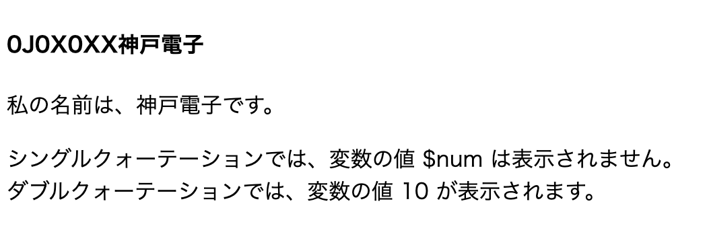

# PHPの基本

- [PHPの基本](#phpの基本)
  - [留意事項](#留意事項)
  - [ソースコードのclone](#ソースコードのclone)
  - [PHPの書き方](#phpの書き方)
    - [ブラウザ上での確認](#ブラウザ上での確認)
  - [演算子](#演算子)
  - [条件分岐](#条件分岐)
    - [if 文](#if-文)
      - [具体例](#具体例)
    - [switch文](#switch文)
      - [具体例](#具体例-1)
  - [繰り返し](#繰り返し)
    - [for 文](#for-文)
      - [具体例](#具体例-2)
    - [while文](#while文)
      - [具体例](#具体例-3)
  - [配列](#配列)
    - [定義](#定義)
      - [具体例](#具体例-4)
    - [要素の取り出し](#要素の取り出し)
    - [連想配列](#連想配列)
      - [具体例](#具体例-5)
  - [サンプル](#サンプル)
    - [ブラウザ上での確認](#ブラウザ上での確認-1)
  - [課題](#課題)
    - [ヒント](#ヒント)

## 留意事項
今後の資料では、</br>

1. Git, GitHubの環境構築手順
2. 課題ページへアクセスし、ソースコードをcloneするまでの手順
3. 編集したソースコードをadd, commit, pushし課題を提出するまでの手順

を省略する。もし、上記手順を復習したい場合はこれより以前の資料である`01.Git.pdf`、`02.HTML&CSS.pdf`、`03.PHPforBeginners.pdf`を参照すること。

## ソースコードのclone

[こちら](https://classroom.github.com/a/TQv2kbY8)の課題ページからソースコードを`C:¥xampp¥htdocs`へcloneすること。

<div style="page-break-before:always"></div>

## PHPの書き方

PHPにおける次の１～４の書き方についてサンプルコードを示す。

   1. コメント
   2. 変数
   3. 文字列の連結
   4. シングルクォーテーションとダブルクォーテーションの違い

**sample1.php**</br>


PHPでは、変数を「**$変数名**」で指定する。 変数名には、次の規則がある。（Javaと一緒）

1. 1文字目は英字またはアンダースコアを使う。
1. 2文字目以降は、英字、数字、アンダースコアが使える。
1. 英字の大文字と小文字は区別される。

### ブラウザ上での確認

1. `C:¥xampp¥xampp-control.exe`をクリックし、XAMPPのコントロールパネルを開き、Apacheを起動。
2. ブラウザのアドレスバーに`http://localhost/04_php_basic-GitHubのユーザー名/src/sample1.php` と入力すると次のように表示される。



**ダブルクォーテーション内で、変数を使用する場合、前後に「半角スペース」を必ず記述すること。**
上記の`sample1.php`の場合、ダブルクォーテーション内の変数`$num`の前後に半角スペースがないと`Undefined variable: numが表示されます。`というエラーとなる。

## 演算子

PHPで主に使う演算子は次のとおり。

|演算子|意味|
| - | - |
|\*\*|べき乗　$a \*\* $b  で aのb乗 を計算する（PHP5.6より）|
|++&nbsp;&nbsp;&nbsp;&nbsp;--|インクリメント（１を加算）、デクリメント（１を減算）|
|!|論理（否定）|
|\*&nbsp;&nbsp;&nbsp;&nbsp;/&nbsp;&nbsp;&nbsp;&nbsp;%|乗算、　除算、　剰余|
|+&nbsp;&nbsp;&nbsp;&nbsp;- &nbsp;&nbsp;&nbsp;&nbsp;.(ドット)|加算、　減算、　文字列の結合|
|<&nbsp;&nbsp;&nbsp;&nbsp;<=&nbsp;&nbsp;&nbsp;&nbsp;>&nbsp;&nbsp;&nbsp;&nbsp;>=|比較（より小さい、　以下、　より大きい、　以上）|
|==&nbsp;&nbsp;&nbsp;&nbsp;!=&nbsp;&nbsp;&nbsp;&nbsp;===|比較（等しい、　等しくない、　データ型も含め等しい）|
|`   `&&|論理（かつ）|
|`   `|||論理（または）|

<div style="page-break-before:always"></div>

## 条件分岐

### if 文

```PHP
if (  条件式　)  {
    条件式がTrue（真）の場合の処理;
} else {
    条件式がFalse（偽）の場合の処理; 
}
```

#### 具体例

```PHP
if ( $a  ==  $b ) {
    echo ' $a == $b'; 
} else {
    echo '$a != $b'; 
}
```

### switch文

```PHP
switch ( 式 ) {
    case  値１：
        式の値が「値１」の場合の処理;
        break;

    case  値２：
        式の値が「値２」の場合の処理;
        break;

・・・
    default:
        式の値がいずれの値でもない場合の処理; 
        break;
}
```

#### 具体例

```PHP

switch ( $a ) {
    case  '和食':
        echo 'うどん';
        break;
    case  '洋食':
        echo 'スパゲッティ';
        break;
    default: 
        echo 'ラーメン'; 
        break;
}
```

## 繰り返し

### for 文

```PHP
for ( 開始処理；　条件式；　更新処理 ) {
    繰り返し処理;
} 
```

#### 具体例

```PHP
for ( $i = 0;  $i < 10;  $i++ ) {
    繰り返し処理； echo  $i;
}
```

### while文

```PHP
while ( 条件式 ) {
    繰り返し処理;
}

```

#### 具体例

```PHP
while ( $a <= 10 ) {
    繰り返し処理； echo '10以下'; 
}
```

## 配列

### 定義

```PHP
配列名 = [ 値１, 値２, ．．．];
配列名 = array ( 値１, 値２, ．．． );
```

#### 具体例

```PHP
$fruits = [ 'リンゴ',  'ミカン',  'バナナ' ];
$fishes = array ( '鯛',  '鯖',  '鰤' ); //たい、さば、ぶり
```

### 要素の取り出し

```PHP
$fruits = [ 'リンゴ',  'ミカン',  'バナナ' ];
for ( $i = 0; $i < count($fruits); $i++) { //count($fruits) で配列$fruitsの要素数を返す
    echo  $fruits [ $i ]  . "<br>";
}
```

```PHP
$fishes = array ( '鯛',  '鯖',  '鰤' );
foreach ( $fishes  as  $fish ) { 　//配列$fishes の要素を $fish として繰り返し処理内で使用する
    echo  $fish . "<br>" ;
}

// PHPでは、基本的に「foreach（フォーイーチ）文」を使用する。
```

### 連想配列

PHPの配列は、「連想配列」の機能を備えていて、「キー」と「値」のペアでデータを格納することができる。

```PHP
配列名 = [ キーA => 値A,  キーB=>値B,  キーC=>値C, ．．．];
（「=>」は、「=」と「>」の２つの記号を用いて記述する。読み方は「ダブルアロー」）
```

#### 具体例

```PHP
$area =    [ '神戸'=>'078',  '大阪'=>'06',  '京都'=>'075' ];
foreach ( $area  as  $key  =>  $value ) { // 配列$area のキーを$key、値を$valueで処理する
    echo   $key . '市の市外局番は、' . $value . 'です。<br>'; 
}
```

<div style="page-break-before:always"></div>

## サンプル

**sample2.php**


### ブラウザ上での確認

1. `C:¥xampp¥xampp-control.exe`をクリックし、XAMPPのコントロールパネルを開き、Apacheを起動。
2. ブラウザのアドレスバーに`http://localhost/04_php_basic-GitHubのユーザー名/src/sample2.php` と入力すると次のように表示される。


<div style="page-break-before:always"></div>

## 課題

次に示す九九を**for文を２つ用いて**作成せよ。ただし、 `<p>`タグを用い、1から9の段ごとに改行すること。

</br>

**ninebynine.php**

</br>

### ヒント

ブラウザ上の赤枠の箇所を**for文を使わずに**HTMLで表すと、下記のようになる。

```HTML
<p>123456789</p><p>24681012141618</p><p>369121518212427</p><p>4812162024283236</p><p>51015202530354045</p><p>61218243036424854</p><p>71421283542495663</p><p>81624324048566472</p><p>91827364554637281</p>
```

課題が作成できたら、`ninebynine.php`を提出すること。
