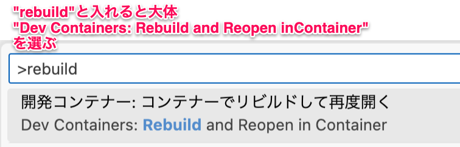
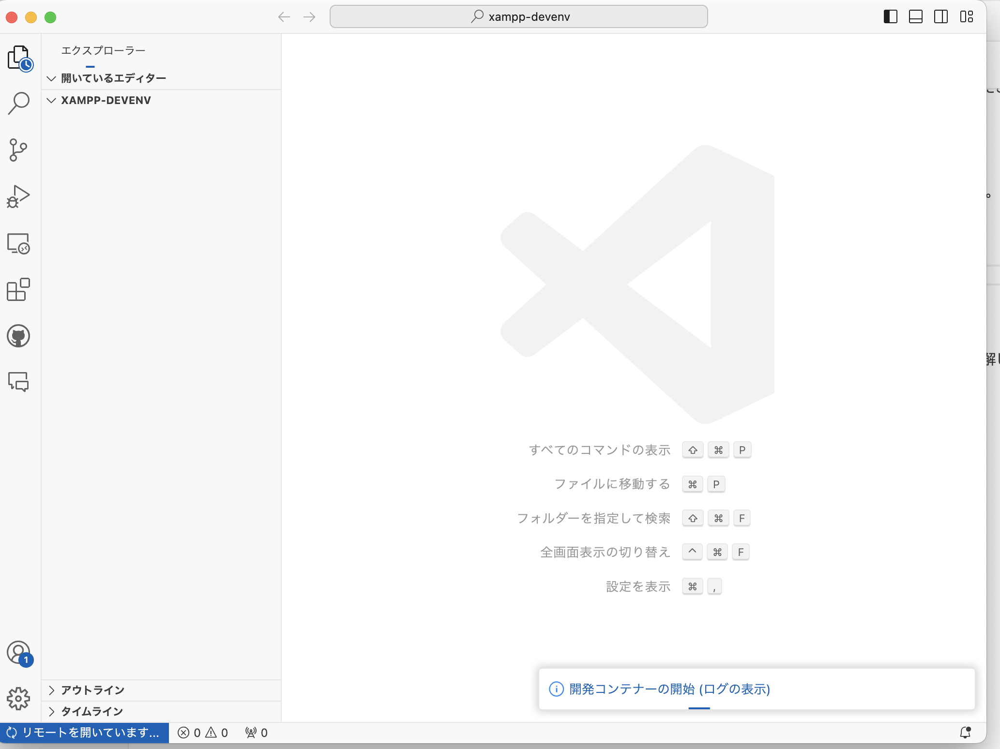
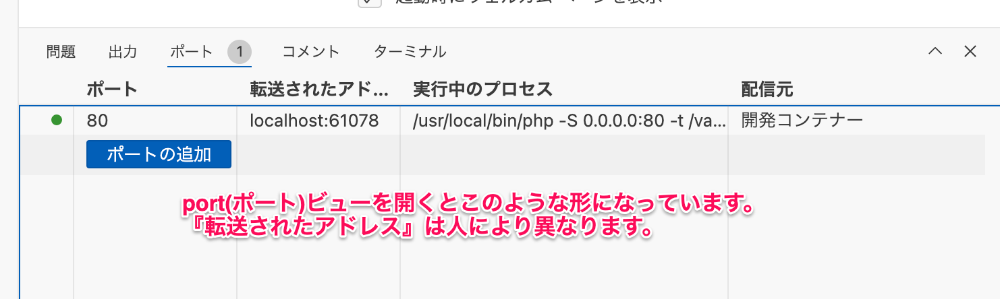
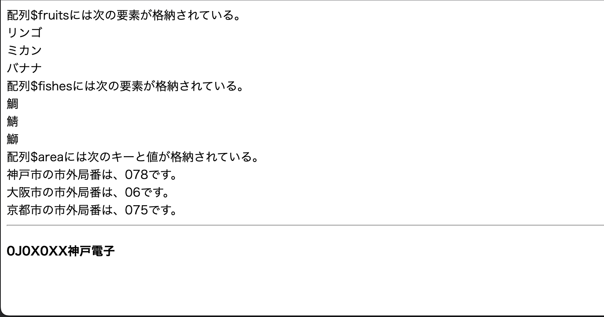

# PHPの基本

- [PHPの基本](#phpの基本)
  - [留意事項](#留意事項)
  - [ソースコードのclone](#ソースコードのclone)
  - [PHPの書き方](#phpの書き方)
  - [ブラウザ上での確認](#ブラウザ上での確認)
  - [演算子](#演算子)
  - [条件分岐](#条件分岐)
    - [if 文](#if-文)
      - [具体例](#具体例)
    - [switch文](#switch文)
      - [具体例](#具体例-1)
  - [繰り返し](#繰り返し)
    - [for 文](#for-文)
      - [具体例](#具体例-2)
    - [while文](#while文)
      - [具体例](#具体例-3)
  - [配列](#配列)
    - [定義](#定義)
      - [具体例](#具体例-4)
    - [要素の取り出し](#要素の取り出し)
    - [連想配列](#連想配列)
      - [具体例](#具体例-5)
  - [サンプル](#サンプル)

## 留意事項

今後の資料では、<br>

1. Git, GitHubの環境構築手順
2. 課題ページへアクセスし、ソースコードをcloneするまでの手順
3. 編集したソースコードをadd, commit, pushし課題を提出するまでの手順

を省略します。もし、上記手順を復習したい場合はこれより以前の資料である[Git、GitHub](../git/README.md)、[HTMLとCSS](htmlcss/README.md)、[はじめてのPHP](firstphp/README.md)を参照してください。

## ソースコードのclone

[こちら](https://classroom.github.com/a/GJI9AolZ)のページからソースコードを`C:¥web_app_dev`へcloneしてください。

## PHPの書き方

PHPにおける次の１～４の書き方についてサンプルコードを示します。

   1. コメント
   2. 変数
   3. 文字列の連結
   4. シングルクォーテーションとダブルクォーテーションの違い

まず、`public`ディレクトリに、`sample1.php`を作成し、以下のコードを入力してください。

```php
<!DOCTYPE html>
<html lang="ja">

<head>
    <meta charset="UTF-8">
    <meta name="viewport" content="width=device-width, initial-scale=1.0">
    <title>サンプル1</title>
</head>

<body>
    <!-- これはHTMLのコメントです。 -->
    <h4>0J0X0XX神戸電子</h4>
    <?php
    // PHPのスクリプト内で1行コメントを書くときに使います。
    /*
       C言語やJavaと同じように、
    　 スクリプト内で複数行のコメントを書くときに使います。
    */

    $first_name = "電子"; // 変数の宣言では「型」は必要ありません
    $last_name = "神戸";
    // 文字列の連結は「.(ドット)」を使う
    echo '<p>私の名前は、' . $last_name . $first_name . 'です。</p>';
    $num = 10;
    echo 'シングルクォーテーションでは、変数の値 $num は表示されません。<br>';
    echo "ダブルクォーテーションでは、変数の値 $num が表示されます。";
    ?>
</body>

</html>
```

PHPでは、変数を「**$変数名**」で指定します。 変数名には、次の規則があります。（Javaと一緒）

1. 1文字目は英字またはアンダースコアを使う。
2. 2文字目以降は、英字、数字、アンダースコアが使える。
3. 英字の大文字と小文字は区別される。

## ブラウザ上での確認

ブラウザ上で確認をするために、開発環境に切り替えます。

1. VScodeで、cloneしたディレクトリ`04-basic-php-GitHubのユーザー名`が開かれていることを確認してください。
2. コマンドパレットを開き(Ctrl-Shift-P Macは、(Cmd-Shift-P))、といれ、`rebuild`と入れてみてください。これで、 `Dev Container: Rebuild and Reopen in Container` が出てくるので選んでください。 
3. 構成を読み取り、選択肢が出てきます、 **PHP実習環境** の側を選んでください。 
4. しばらく構成処理が行われ(CPUパワーとネットワークに依存)、構成が行われます。 
  - 気になる方はログを出すようにすると進行状況がわかります。 
5. `04-BASIC-PHP-ユーザー名[開発コンテナー...`というプルダウンをクリックし、`public`ディレクトリがあればOKです。他のディレクトリやファイルは授業中にはさわりません。<br>
6. 開発環境で操作しているとき、VSCode下部にある**ポート**にて、Webサーバーとの接続先が出るようになっています。
7. 今回は1行しかないので、マウスカーソルをあてる(ホバーする)と、地球マークが出てくるので選んでください。

8. これでブラウザに渡されて結果の確認ができます。今回の課題は `sample1.php` なので、以下の手順で表示中のページのリンクに `sample1.php` を追加してみてください。

   1. Ctrl-L(Cmd-L)を押すと大抵のブラウザはアドレス欄を編集できるようになります。
   2. アドレスの末尾に `/sample1.php` を付けてください。 
   3.  ファイルを作成していれば内容が出てきます。

**ダブルクォーテーション内で、変数を使用する場合、前後に「半角スペース」を必ず記述してください。**
上記の`sample1.php`の場合、ダブルクォーテーション内の変数`$num`の前後に半角スペースがないと`Undefined variable: numが表示されます。`というエラーとなります。

## 演算子

PHPで主に使う演算子は次のとおり。

|演算子|意味|
| - | - |
|\*\*|べき乗　$a \*\* $b  で aのb乗 を計算する（PHP5.6より）|
|++&nbsp;&nbsp;&nbsp;&nbsp;--|インクリメント（１を加算）、デクリメント（１を減算）|
|!|論理（否定）|
|\*&nbsp;&nbsp;&nbsp;&nbsp;/&nbsp;&nbsp;&nbsp;&nbsp;%|乗算、　除算、　剰余|
|+&nbsp;&nbsp;&nbsp;&nbsp;- &nbsp;&nbsp;&nbsp;&nbsp;.(ドット)|加算、　減算、　文字列の結合|
|<&nbsp;&nbsp;&nbsp;&nbsp;<=&nbsp;&nbsp;&nbsp;&nbsp;>&nbsp;&nbsp;&nbsp;&nbsp;>=|比較（より小さい、　以下、　より大きい、　以上）|
|==&nbsp;&nbsp;&nbsp;&nbsp;!=&nbsp;&nbsp;&nbsp;&nbsp;===|比較（等しい、　等しくない、　データ型も含め等しい）|
|&&|論理（かつ）|
|\|\||論理（または）|

## 条件分岐

### if 文

```PHP
if (  条件式　)  {
    条件式がTrue（真）の場合の処理;
} else {
    条件式がFalse（偽）の場合の処理; 
}
```

#### 具体例

```PHP
if ( $a  ==  $b ) {
    echo ' $a == $b'; 
} else {
    echo '$a != $b'; 
}
```

### switch文

```PHP
switch ( 式 ) {
    case  値１：
        式の値が「値１」の場合の処理;
        break;

    case  値２：
        式の値が「値２」の場合の処理;
        break;

・・・
    default:
        式の値がいずれの値でもない場合の処理; 
        break;
}
```

#### 具体例

```PHP

switch ( $a ) {
    case  '和食':
        echo 'うどん';
        break;
    case  '洋食':
        echo 'スパゲッティ';
        break;
    default: 
        echo 'ラーメン'; 
        break;
}
```

## 繰り返し

### for 文

```PHP
for ( 開始処理；　条件式；　更新処理 ) {
    繰り返し処理;
} 
```

#### 具体例

```PHP
for ( $i = 0;  $i < 10;  $i++ ) {
    繰り返し処理； echo  $i;
}
```

### while文

```PHP
while ( 条件式 ) {
    繰り返し処理;
}

```

#### 具体例

```PHP
while ( $a <= 10 ) {
    繰り返し処理； echo '10以下'; 
}
```

## 配列

### 定義

```PHP
配列名 = [ 値１, 値２, ．．．];
配列名 = array ( 値１, 値２, ．．． );
```

#### 具体例

```PHP
$fruits = [ 'リンゴ',  'ミカン',  'バナナ' ];
$fishes = array ( '鯛',  '鯖',  '鰤' ); //たい、さば、ぶり
```

### 要素の取り出し

```PHP
$fruits = [ 'リンゴ',  'ミカン',  'バナナ' ];
for ( $i = 0; $i < count($fruits); $i++) { //count($fruits) で配列$fruitsの要素数を返す
    echo  $fruits [ $i ]  . "<br>";
}
```

```PHP
$fishes = array ( '鯛',  '鯖',  '鰤' );
foreach ( $fishes  as  $fish ) { 　//配列$fishes の要素を $fish として繰り返し処理内で使用する
    echo  $fish . "<br>" ;
}

// PHPでは、基本的に「foreach（フォーイーチ）文」を使用する。
```

### 連想配列

PHPの配列は、「連想配列」の機能を備えていて、「キー」と「値」のペアでデータを格納することができる。

```PHP
配列名 = [ キーA => 値A,  キーB=>値B,  キーC=>値C, ．．．];
（「=>」は、「=」と「>」の２つの記号を用いて記述する。読み方は「ダブルアロー」）
```

#### 具体例

```PHP
$area =    [ '神戸'=>'078',  '大阪'=>'06',  '京都'=>'075' ];
foreach ( $area  as  $key  =>  $value ) { // 配列$area のキーを$key、値を$valueで処理する
    echo   $key . '市の市外局番は、' . $value . 'です。<br>'; 
}
```

## サンプル

`sample2.php`

```php
<!DOCTYPE html>
<html lang="ja">

<head>
    <meta charset="UTF-8">
    <meta name="viewport" content="width=device-width, initial-scale=1.0">
    <title>サンプル2</title>
</head>

<body>
    <?php
    $fruits = ['リンゴ', 'ミカン', 'バナナ'];
    echo '配列$fruitsには次の要素が格納されている。<br>';
    for ($i = 0; $i < count($fruits); $i++) {
        echo  $fruits[$i]  . "<br>";
    }
    $fishes = array('鯛', '鯖', '鰤'); // タイ、サバ、ブリ
    echo '配列$fishesには次の要素が格納されている。<br>';
    foreach ($fishes  as  $fish) {
        echo  $fish . "<br>";
    }
    $area = ['神戸' => '078',  '大阪' => '06',  '京都' => '075'];
    echo  '配列$areaには次のキーと値が格納されている。<br>';
    foreach ($area  as  $key  =>  $value) {
        echo   $key . '市の市外局番は、' . $value . 'です。<br>';
    }
    ?>
    <hr>
    <h4>0J0X0XX神戸電子</h4> <!-- 注意：クラス、番号、氏名は自分のものに変更すること！ -->
</body>

</html>
```

1. 先ほどの[ブラウザ上での確認](#ブラウザ上での確認)と同様の操作を行い、アドレスの末尾に `/sample2.php` と入力すると次のように表示されます。



**ここまでの資料はサンプルです。本章「PHPの基本」の課題は後日公開します。**
