# Cookie

- [Cookie](#cookie)
  - [事前準備](#事前準備)
  - [Cookieとは](#cookieとは)
  - [Cookieの基本仕様](#cookieの基本仕様)
  - [サンプル](#サンプル)
    - [cookie1](#cookie1)
    - [cookie2](#cookie2)
    - [cookie3](#cookie3)
    - [cookie4](#cookie4)

## 事前準備

[こちらのページ]()から、ソースコードを`C:¥web_app_dev`へcloneしてください。

## Cookieとは

Webサーバーが、Webブラウザを通じてユーザーのコンピュータに一時的にデータを書き込んで保存する仕組みです。Netscape Communications社が同社のブラウザにCookieを組み込んだのが始まりです。(1994年)

ユーザに関する情報や最後にサイトを訪れた日時、そのサイトの訪問回数などを記録し、ユーザーの識別に使われ、認証システムや、Webによるサービスをユーザごとにカスタマイズするパーソナライズシステムの要素技術として利用されています。

本来、サーバサイド技術においては、サーバからクライアント側に対して書き込みを行うことは許されません。 
→データを書き込むことは、対象の端末を操作するということだからです。

ちなみに、ChromeやFirefoxのブラウザで「F12」キーをクリックすると「デベロッパーツール」が表示され、そこでCookieの値を確認することができます。

Chromeの場合だと、以下の手順で確認できます。
1. 「F12」キーでデベロッパーツールを開く
2. デベロッパーツールの「アプリケーション」タブを選択する
3. 「ストレージ」のセクションにある「Cookies」アイコンを開く
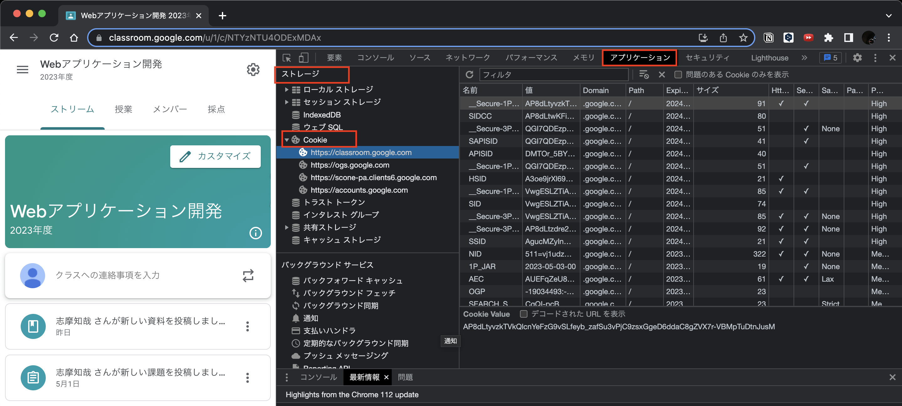

## Cookieの基本仕様

HTTPレスポンス・メッセージの「Set-Cookie:」ヘッダーで発行するCookie情報を送信する。 発行するCookieには、「名前(Cookie名)とその値」、「有効期限」「適用範囲（ドメイン名とパス名）」などが記述されている。

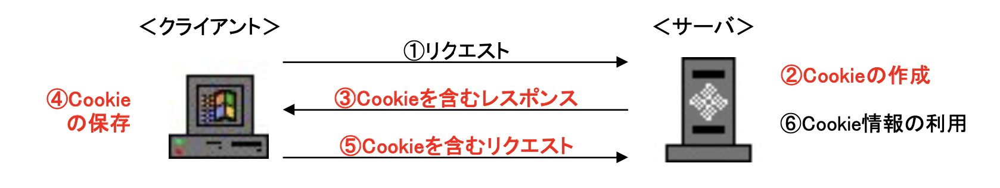 

- 名前(Cookie名)とその値（必須情報） 
Cookie名は、Webサーバ側で決定し、名前を変えて複数のCookieを発行することができる。値はCookieそのものを表し、この値でユーザーを識別する。

- 有効期限 
有効期限がセットされている場合、そのCookieをハードディスクに保存する。（固定Cookie） 有効期限がセットされていない場合、パソコン内のメモリーにだけ保持し、Webブラウザを閉じると同時に消える。（セッションCookie）

- 適用範囲 
Cookieの適用範囲とは、WebブラウザがCookieを送り返すWebサーバーを指し、ドメイン名とパス名で表す。 Webサーバーから「domain=sample.com; path＝/auth」とCookieが送られてきた場合、sample.comの/auth ディレクトリ以下にアクセスする場合のみCookieを送る。同じsample.comのサイトでも、他のディレクトリへアクセスする場合には送らない。Webサーバーのドメイン名と異なるドメイン名を適用範囲とするCookieは無効と判断する。（保存しない） 適用範囲の情報がセットされていなかった場合、受信したWebサーバーのドメイン名とパス名を自動的にセットする。

## サンプル

作成するファイルは、`cookie1.php`、`cookie2.php`、`cookie3.php`、`cookie4.php`。 

### cookie1

ブラウザ（クライアント）からApacheサーバに `cookie1.php` へのリクエストを送信する。Apacheサーバは `cookie1.php` のHTMLをレスポンスするが、この時点ではまだCookieは生成されていない。イラストで表すと次のようになる。 
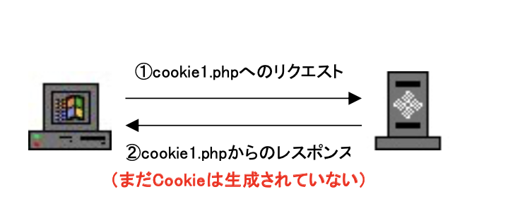  
ブラウザは、`cookie1.php` の内容を画面に表示する。（下図はユーザー名「神戸」を入力した状態） 
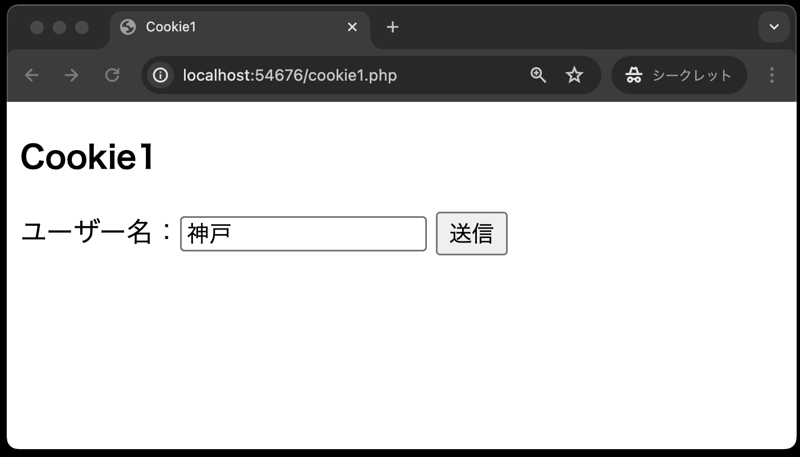  

ソースコードは下記となる。 
**cookie1.php**
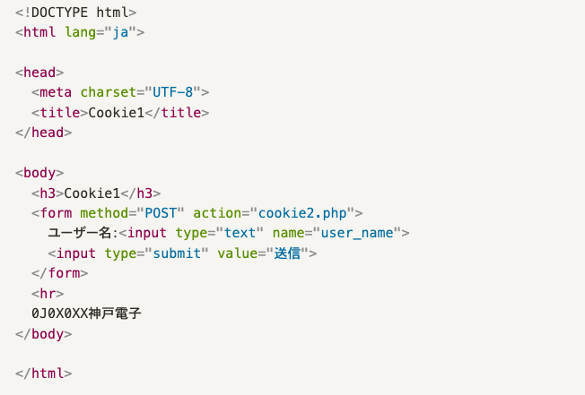 
この画面で、ユーザー名に「神戸」と入力し、送信ボタンを押すと、`cookie2.php`にデータが送信される。  

### cookie2

`cookie2.php` は、受信した「ユーザー名」の値（神戸）をもとにクッキー名`cookie_name` でCookieを生成する。そして、「神戸さん、ようこそ！」のHTMLとともに、生成したCookieをクライアントにレスポンスする。 
ブラウザは、送信されてきたCookieを保存し、`cookie2.php` の内容を画面に表示する。イラストと画面表示は次のようになる。 
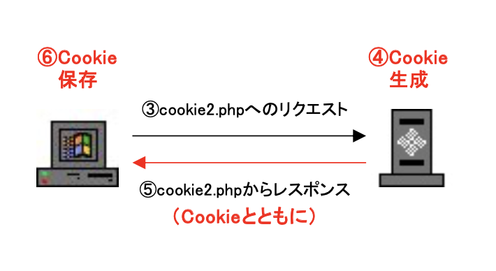  
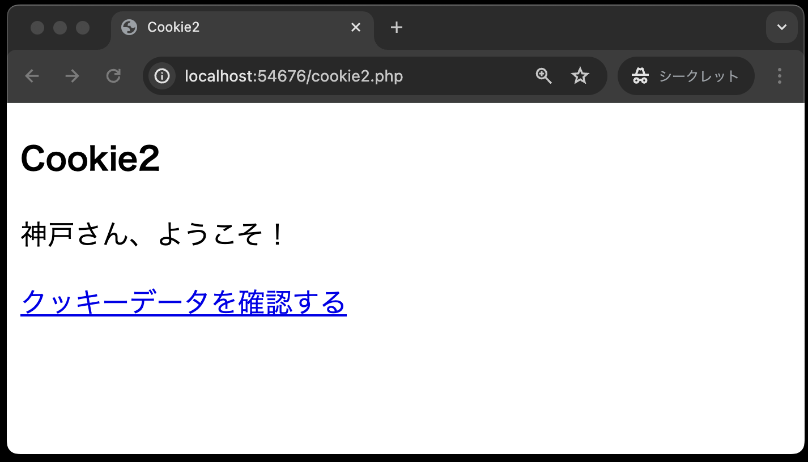  
「クッキーデータを確認する」リンクをクリックすると、保存したCookieデータとともに `cookie3.php` へのリクエストをApacheサーバに送信する。（保存したデータとは、クッキー名：cookie_name、値：神戸の組み合わせ）  
ソースコードは下記となる。 

**cookie2.php**

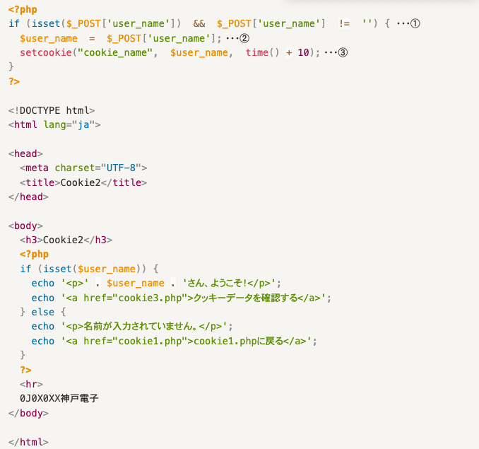

①: `if(isset($_POST['user_name'])  &&  $_POST['user_name']  !=  '') {` 
パラメータ名 `user_name` でデータが送られてきていることを確認している 

- `isset($_POST['user_name'])`
  - PHPの `isset( )` 関数で、 `$_POST['user_name']` の値があれば `True` を返す
- `$_POST['user_name'] != ''`
  - `$_POST['user_name']` の値が「空文字」でなければ `True` を返す 
  
②: `$user_name = $_POST['user_name'];` 
パラメータ名 `user_name` で送られてきた値を取得している。 

③: `setcookie("cookie_name", $user_name, time( ) + 10);` 
送られてきた値をクッキー名 `cookie_name` で保存するクッキーデータを用意する。 
このとき、第3引数の `time( ) + 10` でクッキーの有効期限を設定している。 
`time( )` 関数は、PHPで定義されている関数で、現在時刻をUnixエポック(1970年1月1日 00:00:00 GMT)からの 通算秒 として返す関数で、`time( ) + 10` で現在時刻から10秒間だけ有効なクッキーとしている。 
有効期限を指定しない場合、クライアント側のブラウザが閉じられる消えてしまうクッキーとなる。 
（例）有効期限を現在時刻から3日間とする場合、つぎのように指定する。 
`　　　time( ) + 60 * 60 * 24 * 3` 
`　　　`※60(秒) \* 60(分) \* 24(時間) \* 3(日)  = 259,200(秒)

### cookie3

`cookie3.php` は、Cookieデータを取得したのち、Cookieデータを破棄するデータとともにレスポンスを返す。イラストと画面表示は次のようになる。

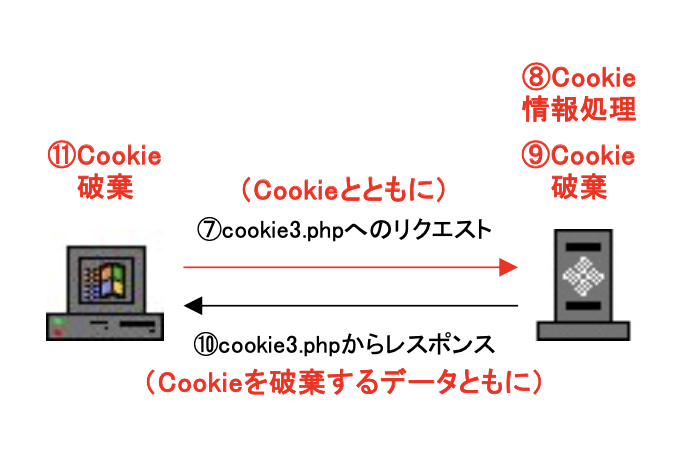 
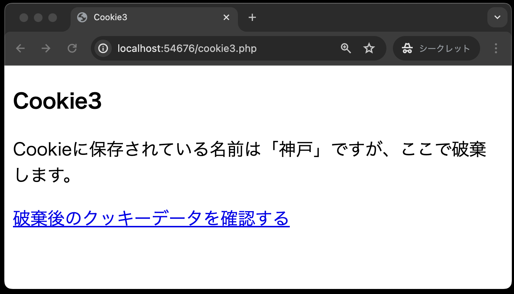  

「破棄後のクッキーデータを確認する」リンクをクリックすると、`cookie4.php` へのリクエストをApacheサーバに送信する。このとき、クッキーデータは破棄されているので、送信されない。

ソースコードは下記となる。 
**cookie3.php**

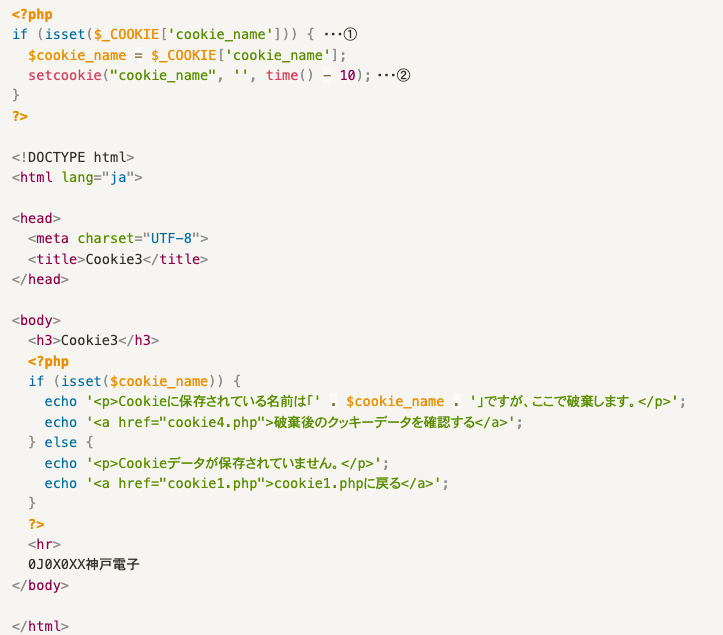

①: `$_COOKIE['cookie_name']` 
`$_COOKIE[ ]` は連想配列。（`$_GET[ ]` や `$_POST[ ]` も連想配列） 
②: `setcookie("cookie_name", '', time( ) - 10);` 
クッキーを破棄するには、有効期限を昔の時間に設定する。 
ここでは、現在時刻から10秒前の時間を設定している。

ちなみに、`cookie2.php` でCookieの有効期限を `time( ) + 10`で10秒間に設定したが、10秒以上経過した後、`cookie2.php` から `cookie3.php` にアクセスすると、Cookieが保存されていないので以下のような画面になる。

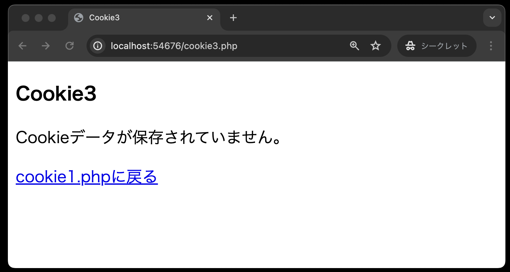 

### cookie4

クッキーデータは送信されてこないので、`cookie4.php` がクッキーデータを取得しようとすると、そのようなデータがないという注意メッセージが表示される。

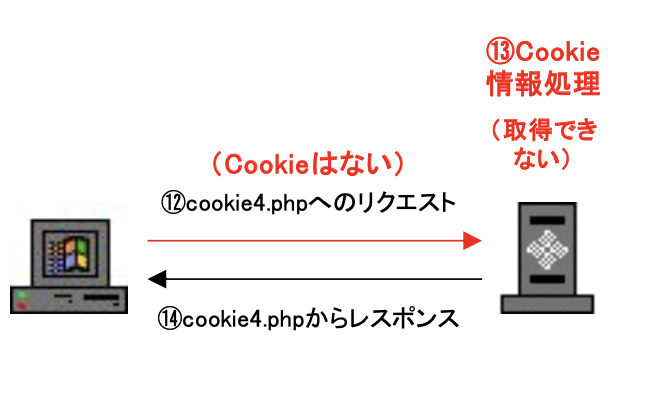  
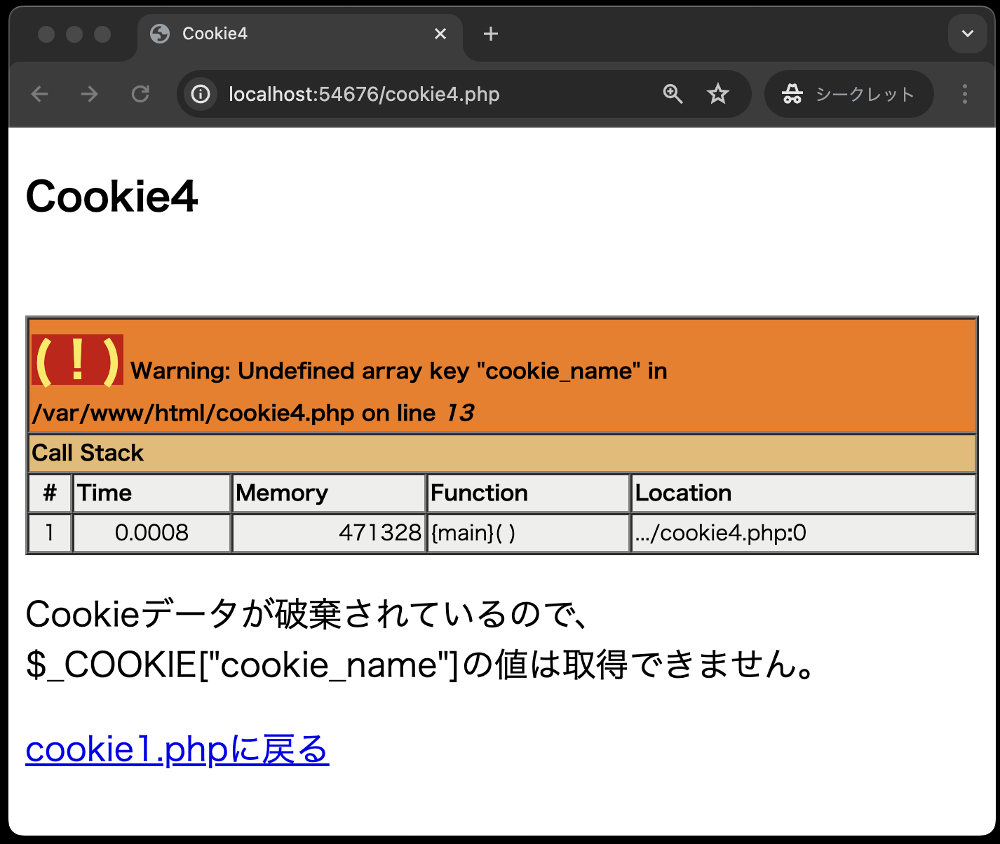 

**エラーメッセージの意味（要約）**

未定義の配列キーである `cookie_name` が `cookie4.php` の X行目(on line X)に書かれている。
※画像のエラーメッセージは、Windowsとは違う環境で確認しているため、リソースへのパスがWindowsとは異なる。

ソースコードは下記となる。 
**cookie4.php**
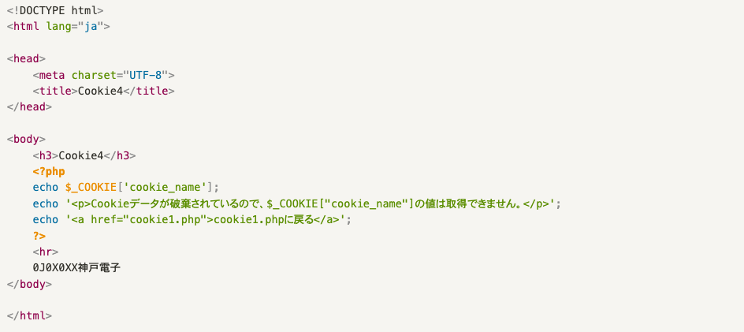 

`echo $_COOKIE['cookie_name'];` 
クッキー名`cookie_name`の値を画面に表示しようとしているが、すでに破棄されているため 値を取得できない旨のメッセージが表示される。

**cookie1~4のプログラムを作成完了しても、まだGitHubにpushはしないでください。次章の「07.Session」で作成するプログラムを完成させなければpushしてはいけません。**
