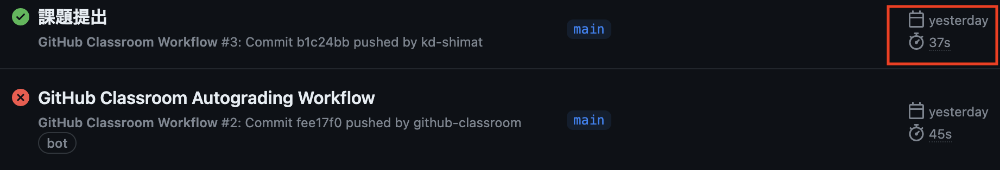
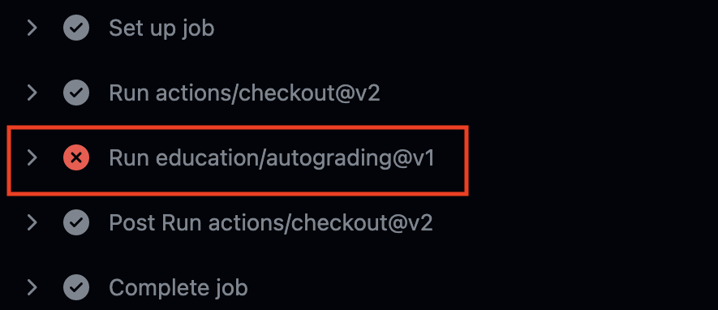

# データベース作成

- [データベース作成](#データベース作成)
  - [事前準備](#事前準備)
  - [課題の進め方について](#課題の進め方について)
  - [課題について](#課題について)
  - [やるべきこと](#やるべきこと)
  - [テーブル構成・初期値](#テーブル構成初期値)
    - [personテーブル](#personテーブル)
    - [companyテーブル](#companyテーブル)
  - [課題提出前に確認するポイント](#課題提出前に確認するポイント)
  - [データベースをリセットする方法](#データベースをリセットする方法)
  - [採点について](#採点について)
    - [課題の合格基準について](#課題の合格基準について)
    - [合格確認方法](#合格確認方法)
    - [エラーが出た時の対処法](#エラーが出た時の対処法)
    - [タイムアウトになっていないかを確認する](#タイムアウトになっていないかを確認する)
    - [プログラムが正確に書かれているか確認する](#プログラムが正確に書かれているか確認する)

## 事前準備

[こちらのページ](https://classroom.github.com/a/KdnmrCMI)から、ソースコードを`C:¥web_app_dev`へcloneしてください。

## 課題の進め方について

本章については、別途Web資料[Webアプリケーション開発 学習用コンテナについて](https://densuke.github.io/xampp-devenv-doc/guide/)を中心に進めます。

## 課題について

この課題では、自分でデータベースにテーブルと初期値を投入していただきます。

## やるべきこと

2つのテーブルを作成してください。
それぞれのテーブル構成は後述します。

* person
* company

その上で、このテーブル構成をエクスポートし、`db`ディレクトリ上に `init.sql` という名前で配置してください。

## テーブル構成・初期値

### personテーブル

personテーブルは、以下のカラムを持つものとします。
全てのカラムはNULLを許容しない(not null)とします。

* `uid`: int型、主キーとして設定、 auto_increment付き
* `name`: varchar型、最大文字数20
* `company_id`: int型
* `age`: int型

初期値として、以下のレコードを挿入してください
なお`uid`は自動採番(auto_increment)されるため省略しています。

|  name |company_id|age|
|-------|---------:|--:|
|財津一郎|          1| 5|
|田宮二郎|          2|15|
|北島三郎|          3|25|
|伊東四朗|          4|35|
|糸井五郎|          1|45|
|鶴田六郎|          2|55|

### companyテーブル

companyテーブルでは、以下のカラムを持つものとします。
全てのカラムはNULLを許容しない(not null)とします。

* `cid`: int型、主キーとして設定、 auto_increment付き
* `name`: varchar型、最大文字数20
* `address`: varchar型、最大文字数40

初期値として、以下のレコードを挿入してください。
なお `cid` は自動採番(auto_increment)されるため省略しています。

|  name |address          |
|-------|-----------------|
|東京商事|東京都中央区中央1-1-1|
|大阪商会|大阪市北区中之島2-2-2|
|神戸工業|神戸市中央区三宮町3-3-3|

## 課題提出前に確認するポイント

* テーブル構造・初期値がファイル `db/init.sql` に配置されていること
* phpMyAdmin起動時に `person`および`company`テーブルができていること
  * カラム構造のチェックをある程度含めていることがあります
* 初期値として挿入したレコードが存在すること

## データベースをリセットする方法

データベースをSQLにてエクスポートした後、リセットしたい場合は以下の手順をVSCode上で実施すると、リセットできます。

1. 一度DevContainer(PHP開発環境)を終了する(`Reopen Folder Locally`)
2. ターミナルを開いて
   ```
   docker compose down --remove-orphan -v
   ```
3. DevContainer(PHP開発環境)で開く

この操作により、以下の操作が行われます。

1. データベースがリセットされ、初期データベースが作成されます
2. 初期化用SQLコードが`db`にあれば順次読み込んでデータベースに反映されます

ただし、初期化用SQLコードがエラーを起こしていた場合、dbコンテナが終了してしまうため接続ができなくなります。

## 採点について

提出した課題がGitHub上で自動採点されます。pushした課題が合格したかはpush後に必ず確認してください。

### 課題の合格基準について

* テーブル構造・初期値がファイル `db/init.sql` に配置されていること
* phpMyAdmin起動時に `person`および`company`テーブルができていること
  * カラム構造のチェックをある程度含めていることがあります
* 初期値として挿入したレコードが存在すること

### 合格確認方法

1. 本課題の[課題ページ](https://classroom.github.com/a/KdnmrCMI)に再度アクセスしてください。
2. 画面上部にある`Actions`をクリックしてください。<br>

1. **一番上**の行に、緑色のチェックが入っていればOKです。<br>


### エラーが出た時の対処法

自動採点がエラーになると、**一番上**の行に赤いばつ印がでます。その場合の解決策を以下に示します。

### タイムアウトになっていないかを確認する

※右端の赤枠で囲まれている箇所に処理時間がでますが、**4分前後**かかっている場合には、まずタイムアウトの可能性を疑ってください。


具体的なタイムアウトの確認・解決方法は、

  1. `Actions`のタイトルが以下のようにリンクになっているので、クリック
      
  2. `run-autograding-tests.png`をクリック
   
  3. 赤いばつ印が出ている箇所をクリック
  
  1. `::error::Setup timed out in XXXXXX milliseconds`のメッセージがあればタイムアウト
   
  6. 解決策としては、右上に`Re-run jobs`(再実行)のボタンがあるので、`Re-run failed jobs`(失敗した処理だけ再実行)をクリックする。
  <br>
  
  7. タイムアウトにならず3分以内に処理が終了したらOK。※タイムアウトでないエラーは、次の解決策を参照。

### プログラムが正確に書かれているか確認する

プログラムが正確に書かれているかを確認してください。たとえ、ブラウザの画面でそれらしく表示されても、自動採点なので融通は効きません。エラーが出た際は、以下の点を確認してください。
