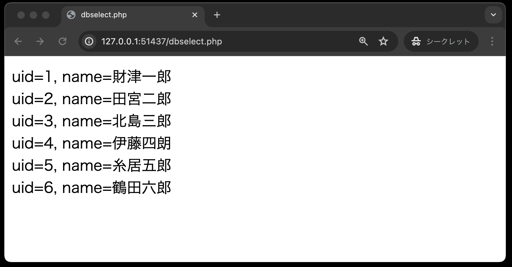
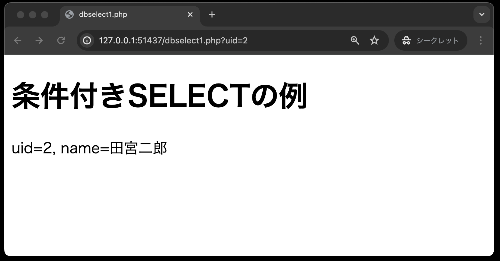
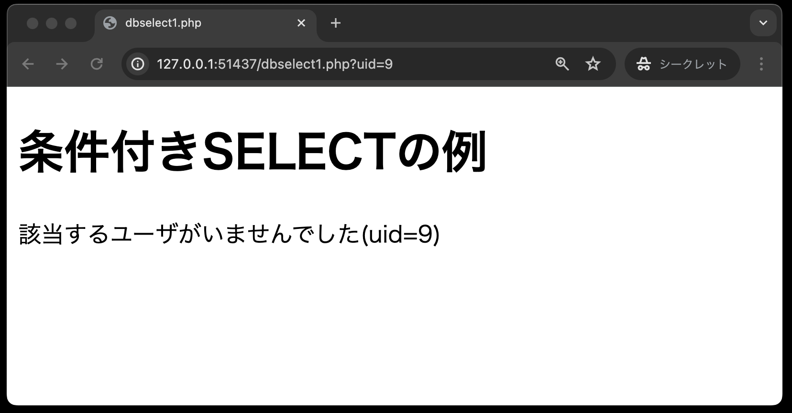
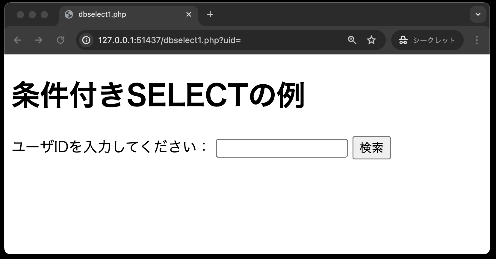

# データベース利用

- [データベース利用](#データベース利用)
  - [事前準備](#事前準備)
  - [基本のSQL文](#基本のsql文)
  - [PDO（PHP　Data　Object）クラスの利用](#pdophpdataobjectクラスの利用)
  - [SELECT文](#select文)
  - [UPDATE文](#update文)
  - [INSERT文](#insert文)
  - [DELETE文](#delete文)
  - [条件付きSELECT文にチャレンジ](#条件付きselect文にチャレンジ)
  - [採点について](#採点について)
    - [課題の合格基準](#課題の合格基準)
    - [合格確認方法](#合格確認方法)
    - [エラーが出た時の対処法](#エラーが出た時の対処法)
    - [タイムアウトになっていないかを確認する](#タイムアウトになっていないかを確認する)
    - [プログラムが正確に書かれているか確認する](#プログラムが正確に書かれているか確認する)

## 事前準備

[こちらのページ](https://classroom.github.com/a/_EUpxz7R)から、ソースコードを`C:¥web_app_dev`へcloneしてください。

## 基本のSQL文

- SELECT文: テーブルからデータを抽出する
- INSERT文: テーブルにデータを挿入する
- UPDATE文: テーブルのデータ内容を更新する
- DELETE文: テーブルからデータを削除する

## PDO（PHP　Data　Object）クラスの利用

PHPからデータベースへ接続するには `PDO`（PHP Data Objects）クラスを使用します。
この`PDO`クラスのオブジェクトは次の構文で作成します。<br>
※日本語の部分(「接続するデータベース」「接続するデータベースを利用するユーザー名」「そのパスワード」)は接続するデータベース環境によって異なります。

```php
// dsn(Data Source Name(データソース名))は、プログラム側が操作対象のデータベースを指定するための識別名
$user = '接続するデータベースを利用するユーザー名';
$password = 'そのパスワード';
$dsn = 'mysql:host=ホスト名;dbname=接続するデータベース名;charset=utf8'; 
$pdo = new PDO($dsn, $user, $password);
```

**【注意】**<br>
- `$dsn`に設定する値には、決してスペースを間に入れないように！エラーが発生する場合があります！
- `$dsn`に設定する値で、「：」（コロン）と「；」（セミコロン）を間違わないように！

また、以降のサンプルプログラムで出てくる`person`テーブルは、`db`ディレクトリ内のSQLによって、Dev Container起動時に既に構築済みです。
テーブル構造は、前章の[データベース利用](../db-create/README.md)で作成した`person`テーブルとほぼ同じものです。
いかに改めてテーブル構造を記載しておきます。

`person`テーブル構造

* `uid`: int型、主キーとして設定、 auto_increment付き
* `name`: varchar型、最大文字数20
* `company_id`: int型
* `age`: int型

以下が、初期値です。
なお`uid`は自動採番(auto_increment)されるため省略しています。

|  name |company_id|age|
|-------|---------:|--:|
|財津一郎|          1| 5|
|田宮二郎|          2|15|
|北島三郎|          3|25|
|伊東四朗|          3|35|
|糸井五郎|          1|45|
|鶴田六郎|          2|55|

## SELECT文

`dbselect.php`



```php
<!DOCTYPE html>
<html lang="ja">

<head>
    <meta charset="UTF-8">
    <meta name="viewport" content="width=device-width, initial-scale=1.0">
    <title>dbselect.php</title>
</head>

<body>
    <?php
    // データベースの接続アカウント情報・・・①
    $user = 'sampleuser';
    $password = 'samplepass';
    $host = 'db';
    $dbName = 'SAMPLE';
    $dsn = 'mysql:host=' . $host . ';dbname=' . $dbName . ';charset=utf8';

    // 例外処理・・・②
    try {
        // PDOを用いてデータベースに接続する
        $pdo = new PDO($dsn, $user, $password);
    } catch (PDOException $e) {
        // 接続できなかった場合のエラーメッセージ
        exit('データベースに接続できませんでした：' . $e->getMessage());
    }

    // SQLの定義: personテーブルから全てのレコードを取得する
    $sql = 'SELECT * FROM person';

    // $pdoを用いて$sqlを実行する・・・③
    $stmt = $pdo->query($sql);
    // 実行結果を $results に格納する
    $results = $stmt->fetchAll();
    // 配列をループして、各要素を出力する 'uid=UID, name=NAME'の形式で
    foreach ($results as $row) {
        echo 'uid=' . $row['uid'] . ', name=' . $row['name'] . '<br>';
    }
    // データベースを切断する
    $pdo = null;
    ?>

</body>

</html>
```

①: データベース「SAMPLE」を利用するための設定値です。

以下の3つは、`env.txt`で設定した環境変数です。
`$user = 'sampleuser';`(ユーザー名)<br>
`$password = 'samplepass';`(パスワード)<br>
`$dbName = 'SAMPLE';`(データベース名)<br>

以下の`$host`はホスト名であり、`composer.yml` で設定されたデータベースコンテナのサービス名を使用します。
`$host = 'db';`<br>

②: PDOオブジェクトを作成するときは、データベースへの接続不良等のの例外が発生する可能性があるので、`try ～ catch` 構文を利用します。

③: `$stmt = $pdo->query($sql);`<br>
単純なSELECT文を実行する場合には、`PDO`クラスの `query( )` メソッドを使用します。<br>
戻り値は「`PDOStatement`（ピー・ディー・オー・ステートメント）オブジェクト」です。<br>
`->`（ハイフンと小なり記号）は「シングルアロー」と読み、Javaの「．」（ドット演算子）に相当します。
つまり、 `$pdo` が`PDO`クラスのオブジェクトであり、このオブジェクトが持つ `query` メソッドを呼び出しているのです。

④: `$results = $stmt->fetchAll( );`<br>
`PDOStatement`クラスの`fetchAll( )`メソッドで、SELECT文で取り出したデータを連想配列の形式で取り出します。

⑤: `$pdo = null;`<br>
処理が終了した後はデータベースへの接続を閉じておきます。

## UPDATE文

UPDATEのSQL文を定義するとき、更新する値の箇所に **「?」（プレースホルダという）** を使用します。
定義したSQL文をデータベース側に送信する前に`PDO`クラスの `prepare( )` （プリペアー）メソッドを実行し、`PDOStatement`オブジェクトを作成します。

作成した`PDOStatement`オブジェクトの `execute( )`（エクゼキュート）メソッドでデータベース側にSQL文を送ります。
そして、この `execute( )` メソッド実行時に、**「?」** の箇所に代入する値を指定しています。

`dbupdate.php`


```php
<!DOCTYPE html>
<html lang="ja">

<head>
    <meta charset="UTF-8">
    <meta name="viewport" content="width=device-width, initial-scale=1.0">
    <title>dbupdate.php</title>
</head>

<body>
    <?php
    // データベースの接続アカウント情報
    $user = 'sampleuser';
    $password = 'samplepass';
    $host = 'db';
    $dbName = 'SAMPLE';
    $dsn = 'mysql:host=' . $host . ';dbname=' . $dbName . ';charset=utf8';

    try {
        // PDOを用いてデータベースに接続する
        $pdo = new PDO($dsn, $user, $password);
    } catch (PDOException $e) {
        // 接続できなかった場合のエラーメッセージ
        exit('データベースに接続できませんでした：' . $e->getMessage());
    }

    // 指定したuidのnameを変更するためのプレースホルダー入りのSQL文・・・①
    $sql = 'UPDATE person SET name = ? WHERE uid = ?';

    $stmt = $pdo->prepare($sql); // ・・・②

    // uid=5のnameを'野口五郎'に変更する・・・③
    $stmt->execute(['野口五郎', 5]);

    // SQLの定義: personテーブルから全てのレコードを取得する
    $sql = 'SELECT * FROM person';

    // $pdoを用いて$sqlを実行する
    $stmt = $pdo->query($sql);

    // 実行結果を $results に格納する
    $results = $stmt->fetchAll();

    // 配列をループして、各要素を出力する 'uid=UID, name=NAME'の形式で
    foreach ($results as $row) {
        echo 'uid=' . $row['uid'] . ', name=' . $row['name'] . '<br>';
    }
    ?>

</body>

</html>
```

①: `$sql = 'UPDATE person SET name = ? WHERE uid = ?';`<br>
UPDATE文を定義するときに、値の部分を「?」（プレースホルダ）を用いて記述しています。
プレースホルダを用いた記述は、**SQLインジェクション対策**にもなります。

②: `$stmt = $pdo->prepare($sql);`<br>
定義したSQL文をデータベースに送信する前に`PDO`クラスの `prepare( )` メソッドを実行し、 `PDOStatement`クラスのオブジェクトを作成します。

③: `$stmt->execute(['野口五郎',  5]);`<br>
作成したPDOStatementオブジェクトの `execute( )` メソッドでデータベース側へSQL文を送信します。

このとき、「?」（プレースホルダ）の部分に値を代入するため、配列の形式でデータを引数として渡しますが、「?」（プレースホルダ）の順番と配列のデータの**順番を対応させる**ようにしてください。

サンプルコードの場合、`name = ?` の「?」に「野口五郎」を、`uid = ?` の「?」に「5」の値を代入しています。
つまり、『`uid=5`のデータの氏名を「糸居五郎」から「野口五郎」に変更する』というSQL文を実行しているのです。

なお、この`execute( )`メソッドの戻り値は、成功した場合に `TRUE` を、失敗した場合に `FALSE` を返します。
必要があれば戻り値（`TRUE`または`FALSE`）を受け取ればよいです。

③の行以降は、dbselect.phpと同じ処理内容で、テーブルpersonの全データを表示する処理を行っています。

## INSERT文

INSERT文もUPDATE文と同様に、**「?」（プレースホルダ）**　を利用してSQL文を定義します。

`dbinsert.php`


```php
<!DOCTYPE html>
<html lang="ja">

<head>
    <meta charset="UTF-8">
    <meta name="viewport" content="width=device-width, initial-scale=1.0">
    <title>dbinsert.php</title>
</head>

<body>
    <?php
    // データベースの接続アカウント情報
    $user = 'sampleuser';
    $password = 'samplepass';
    $host = 'db';
    $dbName = 'SAMPLE';
    $dsn = 'mysql:host=' . $host . ';dbname=' . $dbName . ';charset=utf8';

    try {
        // PDOを用いてデータベースに接続する
        $pdo = new PDO($dsn, $user, $password);
    } catch (PDOException $e) {
        // 接続できなかった場合のエラーメッセージ
        exit('データベースに接続できませんでした：' . $e->getMessage());
    }

    // --- データの挿入
    // プレースホルダーを用いてpersonテーブルに値を挿入するSQL文を定義・・・①
    $sql = 'INSERT INTO person (name, company_id, age) VALUES (?, ?, ?)';
    $stmt = $pdo->prepare($sql); // ②
    // $stmtを使い、プレースホルダーに値を入れてSQL文を実行する・・・③
    // name = 深沢七郎, company_id = 3, age = 29
    $stmt->execute(['深沢七郎', 3, 29]);

    // --- 結果の取得
    // SQLの定義: personテーブルから全てのレコードを取得する
    $sql = 'SELECT * FROM person';

    // $pdoを用いて$sqlを実行する
    $stmt = $pdo->query($sql);
    // 実行結果を $results に格納する
    $results = $stmt->fetchAll();
    // 配列をループして、各要素を出力する 'uid=UID, name=NAME'の形式で
    foreach ($results as $row) {
        echo 'uid=' . $row['uid'] . ', name=' . $row['name'] . '<br>';
    }
    // データベースを切断する
    $pdo = null;
    ?>

</body>

</html>
```

①: `$sql = 'INSERT INTO person (name, company_id, age) VALUES (?, ?, ?)';`<br>
INSERT文を定義するときも、値の部分を「?」（プレースホルダ）を用いて記述します。
最初の「?」が「`name`」、2番目の「?」が「`company_id`」、3番目の「?」が「`age`」の値に対応します。
なお、`person`テーブルのカラム`uid`については、自動採番(auto increment)のため、省略できます。

②: `$stmt = $pdo->prepare($sql);`<br>
定義したSQL文をデータベースに送信する前に`PDO`クラスの `prepare( )` メソッドを実行し、 `PDOStatement`クラスのオブジェクトを作成します。

③: `$stmt->execute( ['深沢七郎',  3,  29] );`<br>
作成した`PDOStatement`クラスの `execute( )` メソッドで実際にデータベースへSQL文を送信します。
このとき、「?」（プレースホルダ）の部分に値を代入するため、配列の形式でデータを引数として渡しますが、「?」（プレースホルダ）の順番と配列のデータの順番を対応させるよう注意してください。
このサンプルコードでは、次のように値を代入しています。

|値|「?」の順番|項目（列名）|
| - | - | - |
|深沢七郎|1番目|name|
|3|2番目|company_id|
|29|3番目|age|

③の行以降は、dbselect.phpと同じ処理内容で、テーブルpersonの全データを表示する処理を行っています。

## DELETE文

このDELETE文もUPDATE文、INSERT文同様に **「?」（プレースホルダ）** を利用してSQL文を定義します。

`dbdelete.php`


```php
<!DOCTYPE html>
<html lang="ja">

<head>
    <meta charset="UTF-8">
    <meta name="viewport" content="width=device-width, initial-scale=1.0">
    <title>dbdelete.php</title>
</head>

<body>
    <?php
    // データベースの接続アカウント情報
    $user = 'sampleuser';
    $password = 'samplepass';
    $host = 'db';
    $dbName = 'SAMPLE';
    $dsn = 'mysql:host=' . $host . ';dbname=' . $dbName . ';charset=utf8';

    try {
        // PDOを用いてデータベースに接続する
        $pdo = new PDO($dsn, $user, $password);
    } catch (PDOException $e) {
        // 接続できなかった場合のエラーメッセージ
        exit('データベースに接続できませんでした：' . $e->getMessage());
    }

    // --- データの挿入
    // プレースホルダーを用いてpersonテーブルから該当するnameを持つレコードを削除するSQLを準備・・・①
    $sql = 'DELETE FROM person WHERE name = ?';
    $stmt = $pdo->prepare($sql); // ②
    // 深沢七郎のレコードを削除・・・③
    $stmt->execute(['深沢七郎']);

    // --- 結果の取得
    // SQLの定義: personテーブルから全てのレコードを取得する
    $sql = 'SELECT * FROM person';

    // $pdoを用いて$sqlを実行する
    $stmt = $pdo->query($sql);
    // 実行結果を $results に格納する
    $results = $stmt->fetchAll();
    // 配列をループして、各要素を出力する 'uid=UID, name=NAME'の形式で
    foreach ($results as $row) {
        echo 'uid=' . $row['uid'] . ', name=' . $row['name'] . '<br>';
    }
    // データベースを切断する
    $pdo = null;
    ?>

</body>

</html>
```

①: `$sql = 'DELETE FROM person WHERE name = ?';`

DELETE文を定義するときも、値の部分を「?」（プレースホルダ）を用いて記述します。
このSQL文は、名前が一致するデータを削除するDELETE文を定義しています。

②: `$stmt = $pdo->prepare($sql);`

定義したSQL文をデータベースに送信する前に`PDO`クラスの `prepare( )` メソッドを実行し、 `PDOStatement`クラスのオブジェクトを作成する。

③: `$stmt->execute(['深沢七郎']);`

作成した`PDOStatement`クラスの `execute( )` メソッドで実際にデータベースへSQL文を送信する。 このとき、「?」（プレースホルダ）の部分に値を代入するため、配列の形式でデータを引数として渡すが、 ここでは、名前が「深沢七郎」のデータを削除するDELETE文を実行する。

③の行以降は、dbselect.phpと同じ処理内容で、テーブルpersonの全データを表示する処理を行っている。

## 条件付きSELECT文にチャレンジ

前段の[SELECT文](#select文)では、対象となるテーブルのすべてのデータを抽出しましたが、実際にはある条件でデータを抽出することのほうがよく使われます。

ここでは、ユーザーID（uid）を指定して、データを抽出する検索ページを作成してください。
なお、このチャレンジ問題は自動採点の評価対象外です。
SELECT〜DELETE文を完了した方は、是非チャレンジしてください！

1. `person`テーブルにデータのあるユーザーIDを入力し、「検索」ボタンを押した時<br>
→該当する`uid`と`name`が表示される



1. `person`テーブルにデータのないユーザーIDを入力し、「検索」ボタンを押した時<br>
→該当するデータが無い旨のメッセージが表示される



1. ユーザーIDを入力せず、「検索」ボタンを押した時<br>
→検索フォームが表示のまま



`dbselect1.php`

```php
<!DOCTYPE html>
<html lang="ja">

<head>
    <meta charset="UTF-8">
    <meta name="viewport" content="width=device-width, initial-scale=1.0">
    <title>dbselect1.php</title>
</head>

<body>
    <h1>条件付きSELECTの例</h1>
    <?php
    // もしも$_GET['uid']が空なら、uidを求めるフォームを表示(GETメソッド使用)
    if (                   ) {
    ?>
        <!-- 検索フォームを以下に記述 -->


        <!-- ここまで -->
    <?php
    } else {
        // ---データベースに接続するためのアカウント情報を以下の変数に設定
        $user = '';
        $password = '';
        $host = '';
        $dbName = '';
        $dsn = '';

        try {
            // PDOを用いてデータベースに接続する
            
        } catch (PDOException $e) {
            // 接続できなかった場合のエラーメッセージ
            
        }
        
        // uidをキーにして、GETメソッドで受け取ったuidを代入
        $uid = 
        // SQLの定義: personテーブルからuidが一致するレコードを取得する
        $sql = 
        $stmt = 
        // SQLプレースホルダーに値をバインド
        $stmt->
        // 一件だけなのでfetch()を使って結果レコードを取得・・・①
        $row = 
        // 結果が空ならば、該当するユーザがいない旨を表示
        if (           ) {
            echo 
        } else {
            // 結果があれば、uidとnameを表示
            echo 
        }
        // データベースを切断する
        $pdo = 
    }
    ?>

</body>

</html>
```

**【捕捉説明】**
SELECT文の実行結果で何を取得するかに応じて `fetchAll( )` と `fetch( )` の使い分けが必要です。

今回の検索条件ユーザーID(`uid`)は、`person`テーブルの**主キー**であり、取得データは**必ず1件のみ**です。
このように、取得データが1件のみと確定している場合は、`fetch( )`を使用します。

`fetchAll( )`は、1件以上取得データがある場合に使用します。

また、`fetch( )`の戻り値は「1件の連想配列」であるため取得したデータから`uid`などの要素を取り出す場合はループ処理は不要です。
以下にそれぞれの違いを表にまとめております。

|  メソッド名 |取得データ|戻り値|要素を取り出す際のループ処理|
|---------|---------|-----------|------------|
|fetch|1件のみ|1件の連想配列|不要|
|fetchAll|1件以上|1件以上の連想配列|必要|

## 採点について

提出した課題がGitHub上で自動採点されます。
pushした課題が合格したかはpush後に必ず確認してください。

### 課題の合格基準

以下の3つを合格基準とします。

1. dbupdate.phpにて、データが正しく更新されること
1. dbinsert.phpにて、データが正しく挿入されること
1. dbdelete.phpにて、データが正しく削除されること

### 合格確認方法

1. 本課題の[課題ページ](https://classroom.github.com/a/_EUpxz7R)に再度アクセスする。
2. 画面上部にある`Actions`をクリックしてください。<br>

1. **一番上**の行に、緑色のチェックが入っていればOKです。<br>


### エラーが出た時の対処法

自動採点がエラーになると、**一番上**の行に赤いばつ印がでます。その場合の解決策を以下に示します。

### タイムアウトになっていないかを確認する

※右端の赤枠で囲まれている箇所に処理時間がでますが、**4分前後**かかっている場合には、まずタイムアウトの可能性を疑ってください。


具体的なタイムアウトの確認・解決方法は、

  1. `Actions`のタイトルが以下のようにリンクになっているので、クリック
      
  2. `run-autograding-tests.png`をクリック
   
  3. 赤いばつ印が出ている箇所をクリック
  
  1. `::error::Setup timed out in XXXXXX milliseconds`のメッセージがあればタイムアウト
   
  6. 解決策としては、右上に`Re-run jobs`(再実行)のボタンがあるので、`Re-run failed jobs`(失敗した処理だけ再実行)をクリックする。
  <br>
  
  7. タイムアウトにならず3分以内に処理が終了したらOK。※タイムアウトでないエラーは、次の解決策を参照。

### プログラムが正確に書かれているか確認する

プログラムが正確に書かれているかを確認してください。たとえ、ブラウザの画面でそれらしく表示されても、自動採点なので融通は効きません。エラーが出た際は、以下の点を確認してください。
