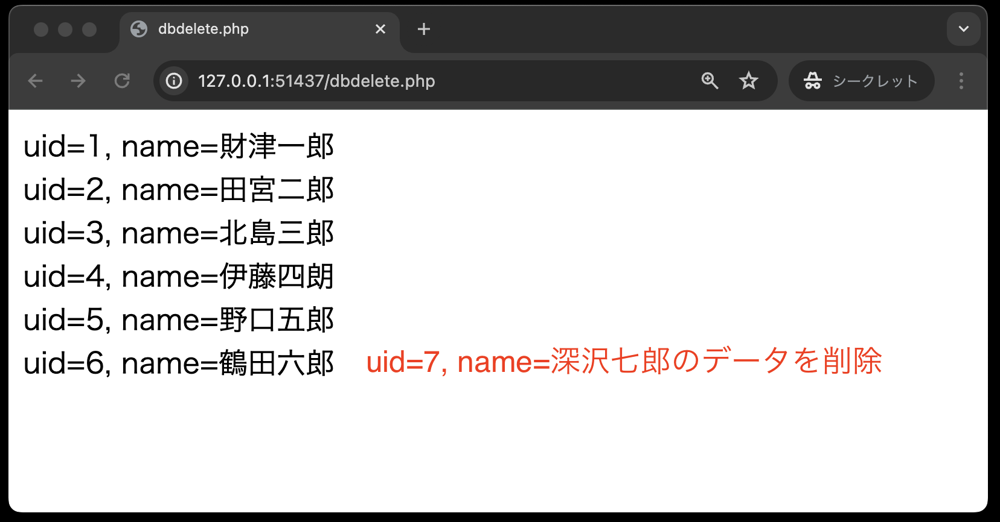
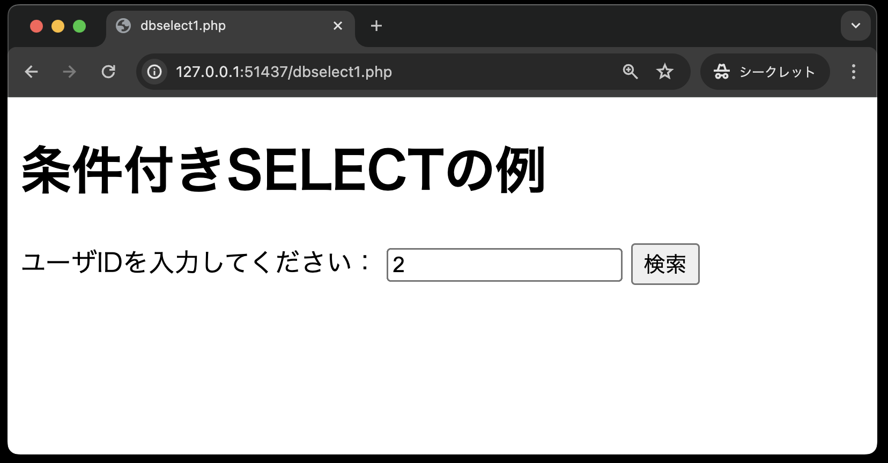

# データベースの利用

- [データベースの利用](#データベースの利用)
  - [事前準備](#事前準備)
  - [基本のSQL文](#基本のsql文)
  - [PDO（PHP　Data　Object）の利用](#pdophpdataobjectの利用)
  - [SELECT文](#select文)
  - [UPDATE文](#update文)
  - [INSERT文](#insert文)
  - [DELETE文](#delete文)
  - [条件付きSELECT文](#条件付きselect文)
  - [課題の作成と提出](#課題の作成と提出)
    - [作成したソースコードをpush](#作成したソースコードをpush)
  - [採点について](#採点について)
    - [課題の合格基準](#課題の合格基準)
    - [合格確認方法](#合格確認方法)
    - [エラーが出た時の対処法](#エラーが出た時の対処法)
    - [タイムアウトになっていないかを確認する](#タイムアウトになっていないかを確認する)
    - [プログラムが正確に書かれているか確認する](#プログラムが正確に書かれているか確認する)
      - [どこでエラーがでているか確認する](#どこでエラーがでているか確認する)
      - [プログラムが正確に書かれているか確認する](#プログラムが正確に書かれているか確認する-1)
  - [GitHub上での採点についてのお願い](#github上での採点についてのお願い)

## 事前準備

[こちらのページ]()から、ソースコードを`C:¥web_app_dev`へcloneしてください。

## 基本のSQL文

- SELECT文: テーブルからデータを抽出する
- INSERT文: テーブルにデータを挿入する
- UPDATE文: テーブルのデータ内容を更新する
- DELETE文: テーブルからデータを削除する

## PDO（PHP　Data　Object）の利用

PHPからデータベースへ接続するには「PDO」（PHP Data Objects）クラスを使用します。このPDOクラスのオブジェクトは次の構文で作成します。<br>
※日本語の部分(「接続するデータベース」「接続するデータベースを利用するユーザー名」「そのパスワード」)は接続するデータベース環境によって異なります。

```php
// dsnは、Data Source Name(データソース名)の略称
$dsn = 'mysql:host=localhost;dbname=接続するデータベース;charset=utf8'; 
$user = '接続するデータベースを利用するユーザー名';
$password = 'そのパスワード';
$pdo = new PDO($dsn, $user, $password);
```

**【注意】**<br>
- `$dsn`に設定する値には、決してスペースを間に入れないこと！エラーが発生する場合があります！
- `$dsn`に設定する値で、「：」（コロン）と「；」（セミコロン）を間違わないように！<br><br>
なお、実際にPDOオブジェクトを作成するときは例外が発生する可能性があるので、`try ～ catch` 構文を利用します。

## SELECT文

`dbselect.php`


```php
<!DOCTYPE html>
<html lang="ja">

<head>
    <meta charset="UTF-8">
    <meta name="viewport" content="width=device-width, initial-scale=1.0">
    <title>dbselect.php</title>
</head>

<body>
    <?php
    // $dsnにスペースは入れないこと。GitHub上でエラーとなる。
    $dsn = 'mysql:host=localhost;dbname=php;charset=utf8'; // データソース名・・データベースは「php」 ①
    $user = 'kobe'; // ユーザー名 ①
    $password = 'denshi'; // パスワード ①

    try {
        $pdo = new PDO($dsn, $user, $password); // データベースへ接続するオブジェクト作成    
        $sql = 'select  *  from  person'; // SQL文の定義    
        $stmt = $pdo->query($sql); // SELECT文の実行 ②
        $results = $stmt->fetchAll(); // 実行結果を連想配列の形で取り出す ③    
        foreach ($results  as  $result) { // 配列のデータを1件ずつ処理する    
            echo 'uid=' . $result['uid'] . ', name=' . $result['name'] . '<br>';
        }
    } catch (Exception $e) {
        echo 'Error:' . $e->getMessage();
        die();
    }
    $pdo = null; // データベースへの接続を閉じる ④    
    ?>
</body>

</html>
```

①: <br>
`$dsn = 'mysql:host=localhost;dbname=php;charset=utf8';`<br>
`$user = 'kobe';`<br>
`$password = 'denshi';`

データベース「php」を利用するための設定値です。

**ここ今回のDcoker環境での変更箇所**

******************************
ユーザー名「kobe」、パスワード「denshi」は、データベース「php」作成時の以下のgrant文で宣言した

`grant all privileges on php.* to kobe@localhost identified by 'denshi';`
******************************

②: `$stmt = $pdo->query($sql);`

単純なSELECT文を実行する場合には、PDOクラスの `query( )` メソッドを使用します。<br>
戻り値は「`PDOStatement`（ピー・ディー・オー・ステートメント）オブジェクト」です。<br>
`->`（ハイフンと小なり記号）は「シングルアロー」と読み、Javaの「．」（ドット演算子）に相当するします。
つまり、 `$pdo` がPDOクラスのオブジェクトであり、このオブジェクトが持つ `query` メソッドを呼び出しているのです。

③: `$results = $stmt->fetchAll( );`

`PDOStatement`クラスの`fetchAll( )`メソッドで、SELECT文で取り出したデータを連想配列の形式で取り出します。

④: `$pdo = null;`

処理が終了した後はデータベースへの接続を閉じておきます。

## UPDATE文

UPDATEのSQL文を定義するとき、更新する値の箇所に **「?」（プレースホルダという）** を使用します。
定義したSQL文をデータベース側に送信する前にPDOクラスの `prepare( )` メソッド（プリペアー・メソッド）を実行し、 `PDOStatement`オブジェクトを作成します。
作成した`PDOStatement`オブジェクトの `execute( )`（エクゼキュート）メソッドでデータベース側にSQL文を送ります。
そして、この `execute( )` メソッド実行時に、**「?」** の箇所に代入する値を指定しています。

`dbupdate.php`


```php
<!DOCTYPE html>
<html lang="ja">

<head>
    <meta charset="UTF-8">
    <meta name="viewport" content="width=device-width, initial-scale=1.0">
    <title>dbupdate.php</title>
</head>

<body>
    <?php
    // $dsnにスペースは入れないこと。GitHub上でエラーとなる。
    $dsn = 'mysql:host=localhost;dbname=php;charset=utf8';
    $user = 'kobe';
    $password = 'denshi';

    try {
        $pdo = new PDO($dsn, $user, $password);
        $sql = 'update person set name = ? where  uid  =  ?'; // ①
        $stmt = $pdo->prepare($sql); // ②
        $stmt->execute(['野口五郎',  5]); // ③

        $sql = 'select * from person';
        $stmt = $pdo->query($sql);
        $results = $stmt->fetchAll();
        foreach ($results  as  $result) {
            echo 'uid=' . $result['uid'] . ', name=' . $result['name'] . '<br>';
        }
    } catch (Exception $e) {
        echo 'Error:' . $e->getMessage();
        die();
    }
    $pdo = null;
    ?>
</body>

</html>
```

①: `$sql = 'update person set name = ? where uid = ?';`<br>
UPDATE文を定義するときに、値の部分を「?」（プレースホルダ）を用いて記述しています。
プレースホルダを用いた記述は、SQLインジェクション対策にもなります。

②: `$stmt = $pdo->prepare($sql);`<br>
定義したSQL文をデータベースに送信する前にPDOクラスの `prepare( )` メソッドを実行し、 `PDOStatement`クラスのオブジェクトを作成します。

③: `$stmt->execute(['野口五郎',  5]);`<br>
作成したPDOStatementオブジェクトの `execute( )` メソッドでデータベース側へSQL文を送信します。
このとき、「?」（プレースホルダ）の部分に値を代入するため、配列の形式でデータを引数として渡しますが、「?」（プレースホルダ）の順番と配列のデータの順番を対応させるようにしてください。

サンプルコード場合、`name = ?` の「?」に「野口五郎」を、`uid = ?` の「?」に「5」の値を代入しています。
つまり、『`uid=5`のデータの氏名を「糸居五郎」から「野口五郎」に変更する』というSQL文を実行しているのです。

なお、この`execute( )`メソッドの戻り値は、成功した場合に `TRUE` を、失敗した場合に `FALSE` を返します。
必要があれば戻り値（`TRUE`または`FALSE`）を受け取ればよいです。

③の行以降は、dbselect.phpと同じ処理内容で、テーブルpersonの全データを表示する処理を行っています。

## INSERT文

INSERT文もUPDATE文と同様に、**「?」（プレースホルダ）**　を利用してSQL文を定義します。

`dbinsert.php`


```php
<!DOCTYPE html>
<html lang="ja">

<head>
    <meta charset="UTF-8">
    <meta name="viewport" content="width=device-width, initial-scale=1.0">
    <title>dbinsert.php</title>
</head>

<body>
    <?php
    // $dsnにスペースは入れないこと。GitHub上でエラーとなる。
    $dsn = 'mysql:host=localhost;dbname=php;charset=utf8';
    $user = 'kobe';
    $password = 'denshi';
    try {
        $pdo = new PDO($dsn, $user, $password);
        $sql = 'insert into person(name, company_id, age) values(?, ?, ?)'; // ①
        $stmt = $pdo->prepare($sql); // ②
        $stmt->execute(['深沢七郎',  3,  29]); // ③

        $sql = 'select * from person';
        $stmt = $pdo->query($sql);
        $results = $stmt->fetchAll();
        foreach ($results  as  $result) {
            echo 'uid=' . $result['uid'] . ', name=' . $result['name'] . '<br>';
        }
    } catch (Exception $e) {
        echo 'Error:' . $e->getMessage();
        die();
    }
    $pdo = null;
    ?>
</body>

</html>
```

①: `$sql = 'insert  into  person(name,  company_id,  age)  values(?, ?, ?)';`<br>
INSERT文を定義するときも、値の部分を「?」（プレースホルダ）を用いて記述します。
最初の「?」が「`name`」、2番目の「?」が「`company_id`」、3番目の「?」が「`age`」の値に対応します。

②: `$stmt = $pdo->prepare($sql);`<br>
定義したSQL文をデータベースに送信する前にPDOクラスの `prepare( )` メソッドを実行し、 `PDOStatement`クラスのオブジェクトを作成します。

③: `$stmt->execute( ['深沢七郎',  3,  29] );`<br>
作成した`PDOStatement`クラスの `execute( )` メソッドで実際にデータベースへSQL文を送信します。
このとき、「?」（プレースホルダ）の部分に値を代入するため、配列の形式でデータを引数として渡しますが、「?」（プレースホルダ）の順番と配列のデータの順番を対応させるよう注意してください。
このサンプルコードでは、次のように値を代入しています。

|値|「?」の順番|項目（列名）|
| - | - | - |
|深沢七郎|1番目|name|
|3|2番目|company_id|
|29|3番目|age|

③の行以降は、dbselect.phpと同じ処理内容で、テーブルpersonの全データを表示する処理を行っています。

## DELETE文

このDELETE文もUPDATE文、INSERT文同様に **「?」（プレースホルダ）** を利用してSQL文を定義します。

`dbdelete.php`


```php
<!DOCTYPE html>
<html lang="ja">

<head>
    <meta charset="UTF-8">
    <meta name="viewport" content="width=device-width, initial-scale=1.0">
    <title>dbdelete.php</title>
</head>

<body>
    <?php
    // $dsnにスペースは入れないこと。GitHub上でエラーとなる。
    $dsn = 'mysql:host=localhost;dbname=php;charset=utf8';
    $user = 'kobe';
    $password = 'denshi';
    try {
        $pdo = new PDO($dsn, $user, $password);
        $sql = 'delete from person where name = ?'; // ①
        $stmt = $pdo->prepare($sql); // ②
        $stmt->execute(['深沢七郎']); // ③

        $sql = 'select * from person';
        $stmt = $pdo->query($sql);
        $results = $stmt->fetchAll();
        foreach ($results  as  $result) {
            echo 'uid=' . $result['uid'] . ', name=' . $result['name'] . '<br>';
        }
    } catch (PDOException $e) {
        echo 'Error:' . $e->getMessage();
        die();
    }
    $pdo = null;
    ?>
</body>

</html>
```

①: `$sql = 'delete from person where name = ?';`

DELETE文を定義するときも、値の部分を「?」（プレースホルダ）を用いて記述します。
このSQL文は、名前が一致するデータを削除するDELETE文を定義しています。

②: `$stmt = $pdo->prepare($sql);`

定義したSQL文をデータベースに送信する前にPDOクラスの `prepare( )` メソッドを実行し、 `PDOStatement`クラスのオブジェクトを作成する。

③: `$stmt->execute(['深沢七郎']);`

作成した`PDOStatement`クラスの `execute( )` メソッドで実際にデータベースへSQL文を送信する。 このとき、「?」（プレースホルダ）の部分に値を代入するため、配列の形式でデータを引数として渡すが、 ここでは、名前が「深沢七郎」のデータを削除するDELETE文を実行する。

③以降は、dbselect.phpと同じ処理内容で、テーブルpersonの全データを表示する処理を行っている。

## 条件付きSELECT文

前段の[SELECT文](#select文)では、対象となるテーブルのすべてのデータを抽出したが、実際にはある条件でデータを抽出することのほうがよく使われる。

ここでは、ユーザーID（uid）を指定して、データを抽出するサンプルを示す。なお、uidが指定されていない場合や、データのないuidが指定された場合にも対処する。

1. uid=2が指定されたとき<br>
`http://localhost/10_database_sql-GitHubのユーザー名/src/dbselect1.php?uid=2`<br>


2. uidが指定されていないとき<br>
`http://localhost/10_database_sql-GitHubのユーザー名/src/dbselect1.php`<br>


3. データのないuidが指定されたとき<br>
`http://localhost/10_database_sql-GitHubのユーザー名/src/dbselect1.php?uid=9`<br>


`dbselect1.php`

```php
<!DOCTYPE html>
<html lang="ja">

<head>
    <meta charset="UTF-8">
    <meta name="viewport" content="width=device-width, initial-scale=1.0">
    <title>dbselect1.php</title>
</head>

<body>
    <?php
    if (!isset($_GET['uid'])) { // ①
        echo 'uidが指定されていません。';
    } else {
        $uid = $_GET['uid'];
        // $dsnにスペースは入れないこと。GitHub上でエラーとなる。
        $dsn = 'mysql:host=localhost;dbname=php;charset=utf8';
        $user = 'kobe';
        $password = 'denshi';

        try {
            $pdo = new PDO($dsn, $user, $password);
            $sql = 'select * from person where uid = ?'; // ②
            $stmt = $pdo->prepare($sql); // ③
            $stmt->execute([$uid]); // ④
            $result = $stmt->fetch(); // ⑤ ※データが1件だけの場合は「fetch( )」メソッドを使う                

            if (empty($result['uid'])) { // ⑥
                echo '指定されたuid=' . $uid . 'のデータはありません。';
            } else {
                echo '指定されたuid=' . $result['uid'] . ', name=' . $result['name'] . '<br>';
            }
        } catch (Exception $e) {
            echo 'Error:' . $e->getMessage();
            die();
        }
        $pdo = null;
    }
    ?>
</body>

</html>
```

①: `isset($_GET['uid'] )`

パラメータ名 uid で値が送られてきているかどうかを `isset( )` 関数を利用してチェックする。値が送られてきている場合は「True」、送られてきていない場合は「False」の戻り値が返ってくる。

②: `$sql = 'select ¥* from person where uid = ?';`

uid が一致するデータを抽出するSELECT文を「?」（プレースホルダ）を使用して定義している。


③: `$stmt = $pdo->prepare($sql);`

定義したSQL文をデータベースに送信する前にPDOクラスの `prepare( )` メソッドを実行し、 `PDOStatement`クラスのオブジェクトを作成する。

④: `$stmt->execute([$uid]);`

作成した`PDOStatement`クラスの `execute( )` メソッドで実際にデータベースへSQL文を送信する。 ここでは、uid の値が**①**で受け取ったパラメータ名 uid の値と一致するデータを抽出するSELECT文を実行する。

⑤: `$result = $stmt->fetch( );`

`PDOStatement`クラスの `fetch( )` メソッドは、SELECT文で取り出したデータを**1件だけ**取り出す。取り出したデータは、やはり連想配列の形式で格納されている。

**【重要】SELECT文の実行結果で何を取得するかに応じて `fetchAll( )` と `fetch( )` を使い分ける。**

⑥: `empty($result['uid'])`

`empty( )` 関数は、引数で指定された値が空であるかどうかをチェックする。値が存在し、かつその値が空や0でなければ FALSE を返し、それ以外の場合は TRUE を返す。

## 課題の作成と提出

### 作成したソースコードをpush

今回の資料から、pushまでの説明は省略する。忘れた場合は、これより以前の資料を見返し確認すること。

## 採点について

提出した課題はGitHub上で自動採点される。提出後、課題が合格しているかを確認すること。合格していない場合は修正後pushし、再提出すること。

### 課題の合格基準

以下の3つを合格基準とする。

1. dbupdate.phpにて、データが正しく更新されること
1. dbinsert.phpにて、データが正しく挿入されること
1. dbdelete.phpにて、データが正しく削除されること


### 合格確認方法

1. 本課題の[課題ページ](https://classroom.github.com/a/aRogXsGL)に再度アクセスする。
1. 画面上部にある`Actions`をクリックする。<br>

1. **一番上**の行に、緑色のチェックが入っていればOK。※その下に赤いばつ印が入っているものがあるが、それは無視する。<br>


### エラーが出た時の対処法

自動採点がエラーになると、**一番上**の行に赤いばつ印がでる。その場合の解決策を以下に示す。

### タイムアウトになっていないかを確認する

※右端の赤枠で囲まれている箇所に処理時間がでるが、**2分以上**かかっている場合はタイムアウトとなる。


なお、タイムアウトの場合は、GitHub上で処理を再開すると解決できる。具体的なタイムアウト解決方法は、

  1. Actionsタブをクリック
  2. タイトルが下記のようにリンクになっているので、クリック<br>
      <br>
  3. Autogradingをクリック<br>
   <br>
   

  4. 赤いばつ印が出ている箇所をクリック<br>
   <br>
  1. `::error::Setup timed out in 120000 milliseconds`のメッセージがあればタイムアウト

  6. 右上に`Re-run jobs`(再実行)のボタンがあるので、`Re-run failed jobs`(失敗した処理だけ再実行)をクリックする。
  <br>
  
  7. タイムアウトにならず2分以内に処理が終了したらOK。※タイムアウトでないエラーは、次の解決策を参照。


### プログラムが正確に書かれているか確認する

プログラムが正確に書かれているかを確認すること。たとえ、ブラウザの画面でそれっぽく表示されても、自動採点なので融通がきかない。エラーが出た際は、以下を確認すること。

#### どこでエラーがでているか確認する

今回は3つの自動採点(update, insert, delete)があるので、以下の手順で、どごでエラーが出ているか確認する。

1. Actionsタブをクリック
2. タイトルが下記のようにリンクになっているので、クリック
      <br>
3. Autogradingをクリック<br>
   <br>
4. 赤いばつ印が出ている箇所をクリック<br>
  <br>
1. エラーがあるソースコードは、下記画像のように、エラーメッセージが表示されるので、これにエラーが出ているソースコードを特定できる。<br>
<br>

#### プログラムが正確に書かれているか確認する

プログラムが正確に書かれているかを確認する。たとえ、ブラウザの画面でそれっぽく表示されても、自動採点ですので融通はききません。エラーが出た際は、サンプルコードと差異がないか確認してください。


## GitHub上での採点についてのお願い

今回、再度GitHub上での採点をするにあたりお願いがあります。それは、<br>
GitHubに課題をpushする前に、**必ずブラウザで動作確認をしてください。**　理由は下記の2つです。<br>

1. Webアプリケーションはブラウザ上で動作することが前提であるため。
2. GitHubの採点処理時間に上限があるため。<br>
以前の自動採点プログラムと比べ、処理時間の高速化には成功したものの、GitHubの合計処理時間には毎月上限があります。むやみやたらにpushすると、上限に達しかねないので、必ずブラウザ上で正常に動作することを確認してからpushしてください。**エラーの原因が特定できない場合は、お気軽に質問してください。**
