# デバッグセミナー

- [デバッグセミナー](#デバッグセミナー)
  - [事前準備](#事前準備)
  - [デバッグとは？デバッグの重要性とは？](#デバッグとはデバッグの重要性とは)
  - [本学の学生にデバッグが必要な理由](#本学の学生にデバッグが必要な理由)
  - [本セミナーで扱うデバッグについて](#本セミナーで扱うデバッグについて)
  - [デバッグのステップ](#デバッグのステップ)
  - [手動デバッグ](#手動デバッグ)
  - [デバッガを使ったデバッグ](#デバッガを使ったデバッグ)
  - [デバッガの基本的な操作](#デバッガの基本的な操作)
    - [ブレークポイントの設定](#ブレークポイントの設定)
  - [エラーが出た箇所と、エラーの原因が違う箇所の特定](#エラーが出た箇所とエラーの原因が違う箇所の特定)
  - [デストコードを使ったデバッグ](#デストコードを使ったデバッグ)
  - [composerを使ったPHPUnitの導入](#composerを使ったphpunitの導入)
  - [テストコードを書いてみる](#テストコードを書いてみる)
  - [まとめ](#まとめ)

## 事前準備

[こちらのページ](https://classroom.github.com/a/_xOfm4t0)から、ソースコードを`C:¥web_app_dev`へcloneしてください。

## デバッグとは？デバッグの重要性とは？

デバッグとは、プログラムのバグを見つけて修正することです。
バグとは、プログラムが意図しない動作をすることです。
バグがあると、プログラムが正しく動作しないため、デバッグが必要です。

デバッグの重要性は、デバッグのスキルがあるかどうかで、開発の効率性が大きく変わりことです。
デバッグのスキルがあると、修正箇所をすぐに見つけられるため、バグを素早く修正できます。

例えば、こういった経験はありませんか？

- プログラムを書いている途中で、バグが発生してしまい、どこが原因かわからない
- エラーは出ていないが、プログラムが正しく動作していない
- エラーの原因箇所のおおよその検討はついたが、検証が難しい

多かれ少なかれ、誰しもが上記のような経験をしていると思います。
本セミナーを通して、デバッグのスキルを身につけることで、上記のような問題を解決する一助となれば幸いです。

## 本学の学生にデバッグが必要な理由

本学の学生の開発状況には、以下のような特徴があります。

1. 仕様が明確ではない
2. 開発スケジュールがタイト
3. 創ることに重きを置いている校風

つまり、「開発しながら都度都度確認する」というスタイルをとらなければならない状況が多いです。
そんな時こそ、デバッグのスキルが必要です。

## 本セミナーで扱うデバッグについて

本セミナーでは、以下のデバッグの種類を扱います。

1. 手動デバッグ
2. デバッガを使ったデバッグ
3. テストコードを使ったデバッグ

言語は、PHPを使いますが、デバッグのスキルは言語に依存しません。
本セミナーで学んだことは、他の言語にも転用できるので、そこは心配しないでください。

## デバッグのステップ

デバッグは、以下のステップで行います。

1. バグの再現
2. バグの原因の仮説を立てる
3. 仮説を検証する ← ここで役にたつ！
4. 仮説が正しければ、修正する
5. 仮説が間違っていれば、次の仮説を立てる
6. バグが修正されるまで、ステップ1から繰り返す

デバッグの種類が違っても、基本的なステップは変わりません。

## 手動デバッグ

手動デバッグは、プログラムの動作を確認しながらバグの原因を探すため、バグの原因を見つけるまでに時間がかかることがあります。
しかし、手動デバッグは、バグの原因を探すための基本的なスキルを身につけるためには最適な方法です。

「Webアプリケーション開発」の授業でも紹介しましたが、手動デバッグを実施する上では、`var_dump`を使うことが多いです。
`var_dump`は、変数、配列、オブジェクトの中身を確認するための関数です。

特に、配列やオブジェクトなど、複雑なデータ構造を扱う場合には、`var_dump`を使うことで、データ構造を理解しやすくなります。
以下は、そういった複雑なデータ構造を扱う場合の`var_dump`の使い方で、`$array`という配列を`var_dump`で出力する例です。

`pulic`ディレクトリ直下の、var_dump.phpに以下のコードを記述してください。

```php
<?php
$array = [
    'key1' => 'value1',
    'key2' => 'value2',
    'key3' => [
        'key4' => 'value4',
        'key5' => 'value5',
    ],
];

var_dump($array);
```

上記のコードをブラウザで確認しましょう。
久しぶりなのでブラウザの確認方法のおさらいです。

1. VSCode上で、`Ctrl+Shift+P`(Macの場合は`Cmd+Shift+P`)を押し、コンテナを起動する
2. VSCode上で、`Ctrl+J`(Macの場合は`Cmd+J`)を押し、ターミナルを表示する
3. 画面下部のポートをクリックし、地球儀マークをクリックする<br>
   
4. ブラウザが表示されるので「var_dump.php」のリンクをクリックし、以下のような表示がされればOK

```php
/var/www/html/var_dump.php:11:
array (size=3)
  'key1' => string 'value1' (length=6)
  'key2' => string 'value2' (length=6)
  'key3' => 
    array (size=2)
      'key4' => string 'value4' (length=6)
      'key5' => string 'value5' (length=6)
```

`var_dump`の出力結果は、以下のような情報を提供しています。

- `array(size=3)`：配列の要素数が3つであることを示しています
- `'key1' => string 'value1' (length=6)`：`key1`というキーに`value1`という値が入っていることを示しています

`var_dump`の出力結果を見ることで、配列やオブジェクトの中身を理解しやすくなります。
これにより、デバッグの際に、バグの原因を見つけやすくなります。

## デバッガを使ったデバッグ

上記のように、`var_dump`を使って手動デバッグを行うこともできますが、コードが複雑になると、バグの原因を見つけるのに時間がかかるとともに、一時的ではありますが、ソースコードを修正する必要があります。
そこで、**デバッガ**を使ったデバッグが有効です。

デバッガを使ったデバッグとは、デバッガというツールを使い、プログラムの動作を一時停止させながら、処理の流れを追うことでバグの原因を探す方法です。
PHPには、デバッガとして**Xdebug**というツールがあります。
まずは、そのツールの使い方を学びましょう。

Xdebugを使うようにするには以下の手順を踏む必要があります。

1. VSCode上で、`Ctrl+Shift+P`(Macの場合は`Cmd+Shift+P`)を押し、コンテナを起動する(既に起動している場合は不要)
2. 左バーの虫と三角のアイコンを押して、「launch.jsonファイルを作成します」をクリックする
   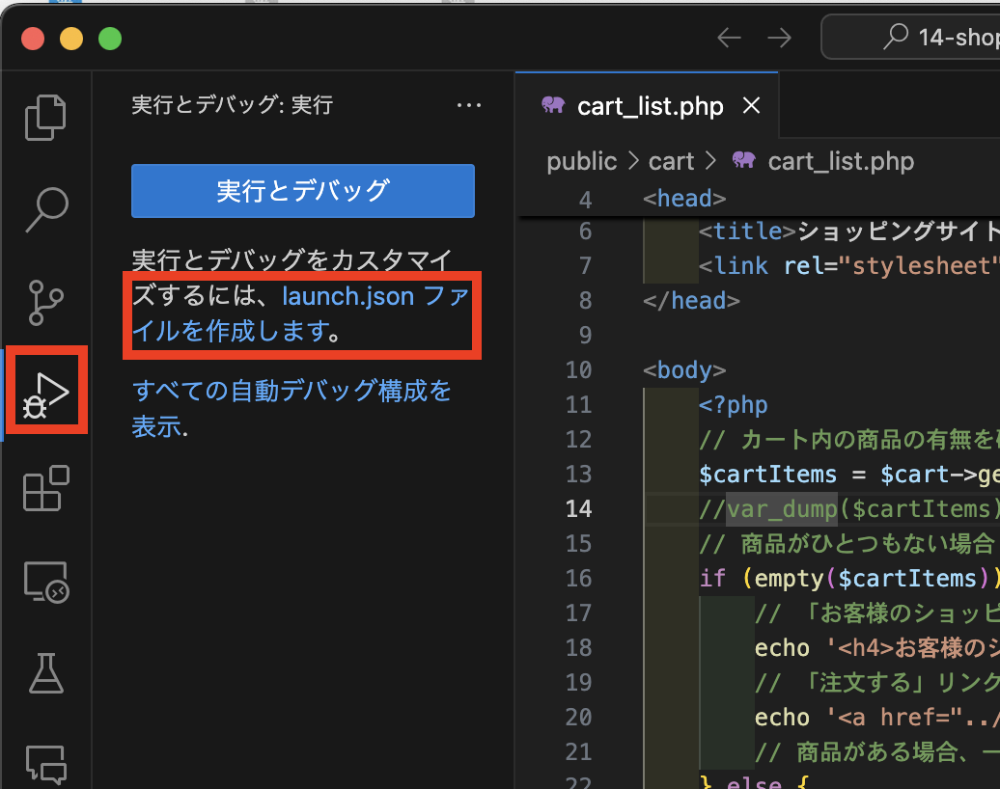
3. 以下のように画面が変わる
    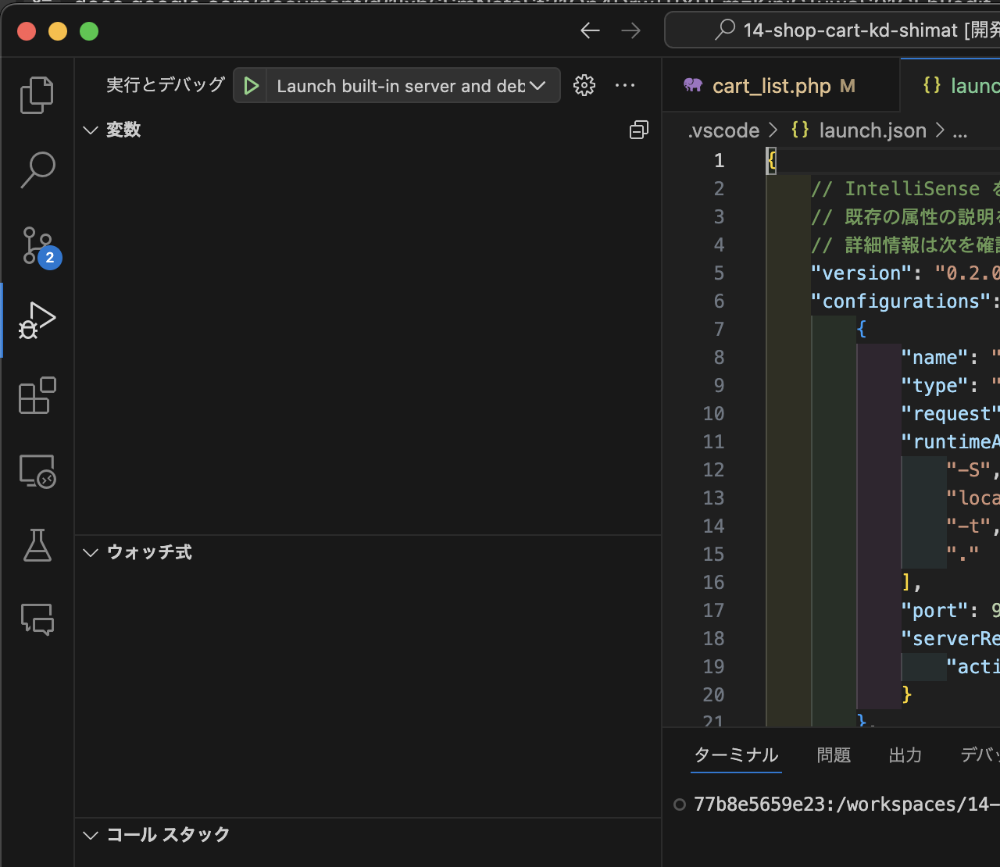
4. 上部の「実行とデバッグ」というプルダウンリストからPHP(Xdebug)を選択する
   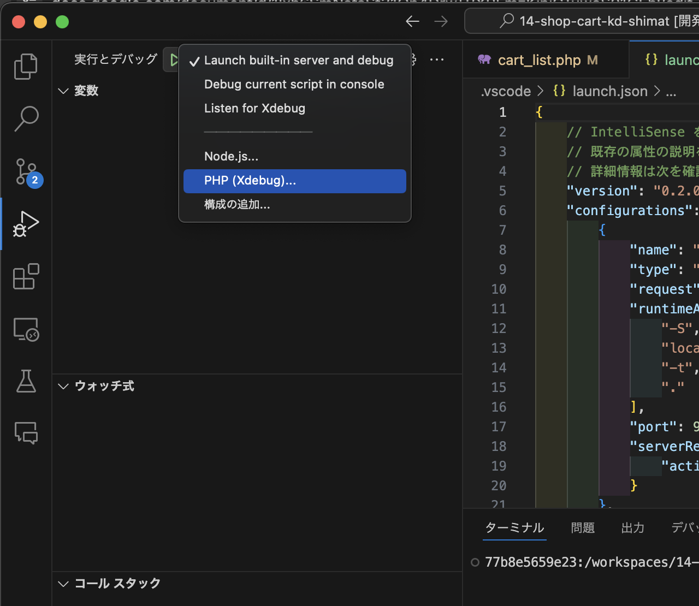
5. 「Launch built-in server and Debug 」を選ぶ
    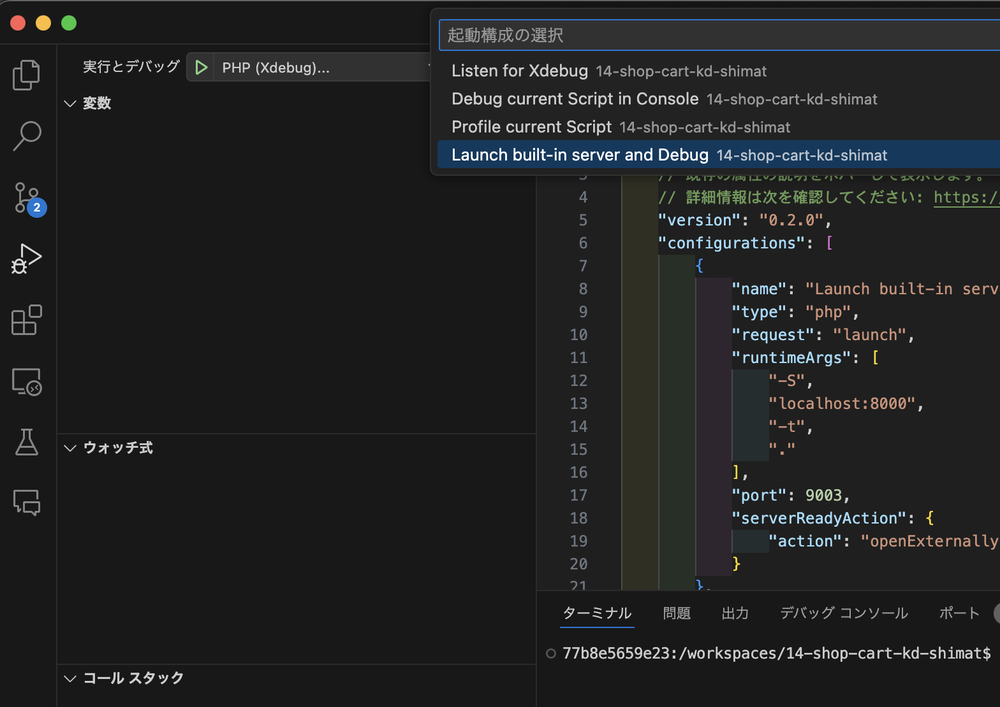
6. 実行とデバッグの横の緑三角をクリック
   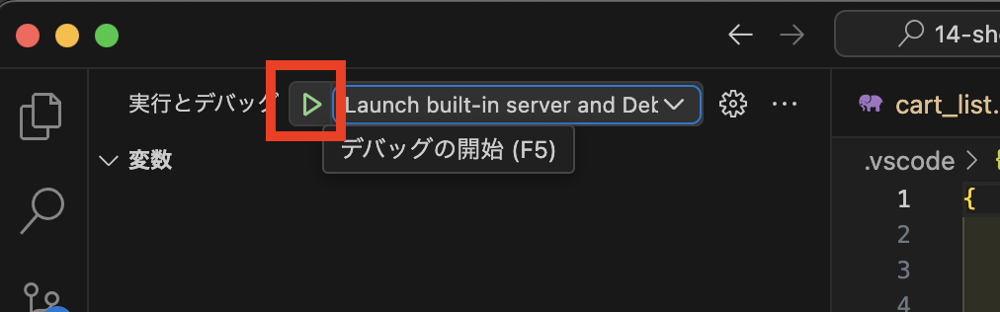
7. ブラウザが立ち上がり、デバッガが起動する
   以下のように、ブラウザが立ち上がり、http://localhost:8080/ にアクセスされます
    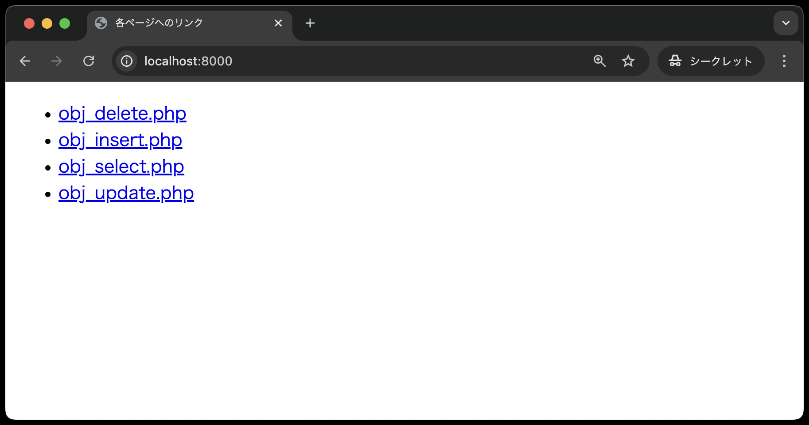

これで、デバッガの準備が整いました。
では、実際にデバッガを使ってみましょう。

今回は、一例として、以前「Webアプリケーション開発」授業で扱った、[オブジェクト指向プログラミング①](../object-i/README.md)と[オブジェクト指向プログラミング②](../object-ii/README.md)のコードをデバッグしてみます。
**※デバッグのために、わざとバグを仕込んでいるコードがあります。**

## デバッガの基本的な操作

まずは、バグを見つける前に、デバッガの基本的な操作を学びましょう。

### ブレークポイントの設定

デバッガを使ってプログラムをデバッグする際には、ブレークポイントを設定します。
ブレークポイントとは、プログラムの実行を一時停止させるためのポイントのことです。
ブレークポイントを設定するには、以下の手順を行います。

1. ブレークポイントを設定したい行にカーソルを合わせる
   今回は、`public/classes/dbphp`の`selectAll`メソッドの`return $persons`(18行目)にブレークポイントを設定します。
    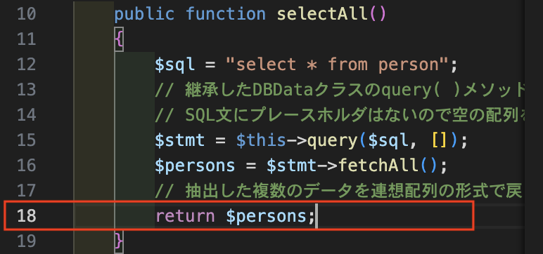
2. 18行目にカーソルを合わせ、`F9`キーを押すとブレークポイントが設定される、すると行番号の左側に丸(赤い丸のときもある)が表示される
   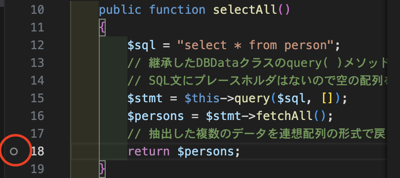

3. ブレークポイントが設定されたら、ブラウザに戻り、「obj_select.php」のリンクをクリックする
   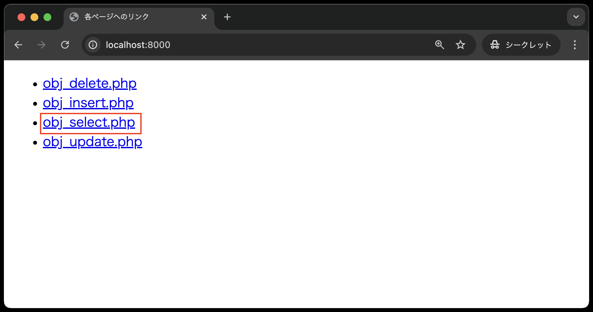

4. ブレークポイントが設定された行でプログラムが一時停止される
   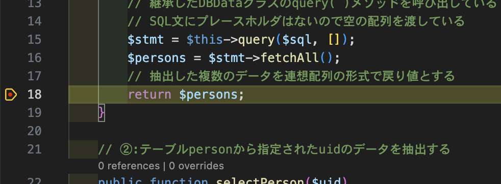

5. デバッガの左側のバーで、 `selectAll`メソッドでのブレークポイントより前の行までの変数の値を確認できる
   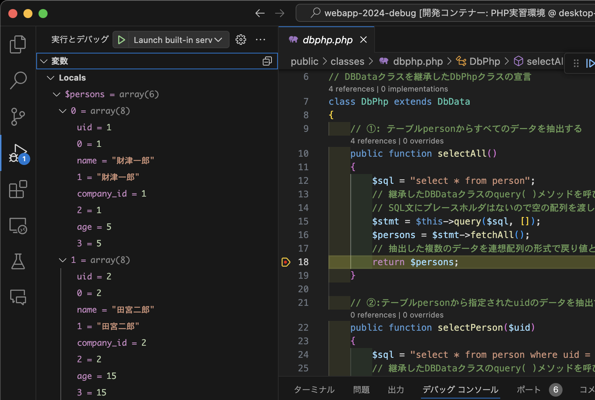

このように、ブレークポイントを設定することで、プログラムの実行を一時停止し、変数の値を確認することができます。
つまり、ブレークポイントを使うことで、ソースコードを修正することなく、var_dumpと同等、もしくはそれ以上の情報を得ることができます。

更に、デバッガには、以下のような操作を使い、より効率的にデバッグ作業を行うことができます。

- `F11`：ステップイン（関数内に入る）
- `F10`：ステップオーバー（関数内に入らずに次の行に進む）
- `Shift+F11`：ステップアウト（関数から出る）
- `F5`：続行(次のブレークポイントまで実行、ブレークポイントがない場合は、プログラムが終了するまで実行)

また、コマンド以外にも、VSCode上の以下のコントロールパネルでも同様の操作ができます。
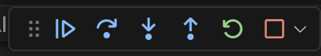

次はこれらも使い、もう少し具体的にデバッグしてみましょう。

## エラーが出た箇所と、エラーの原因が違う箇所の特定

デバッガを使って、エラーが出た箇所と、エラーの原因が違う箇所を特定してみましょう。

1. 前回設定したブレークポイントを削除する
   `public/classes/dbphp`の`selectAll`メソッドの`return $persons`(18行目)のブレークポイントを`F9`キーで削除してください。
   左側の丸が消えれば削除されています。

2. ブラウザに戻り、「obj_insert.php」のリンクをクリックする
   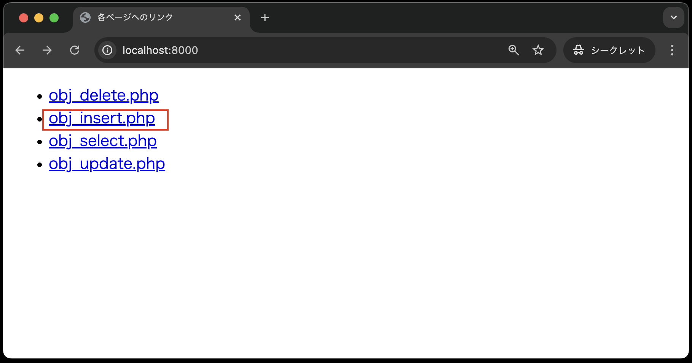

3. デバッガでは、システムエラーが発生した箇所でプログラムが一時停止される
   ただし、ブレークポイントが設定されていないため、変数の値を確認することができず、エラーの原因がわかりません。
   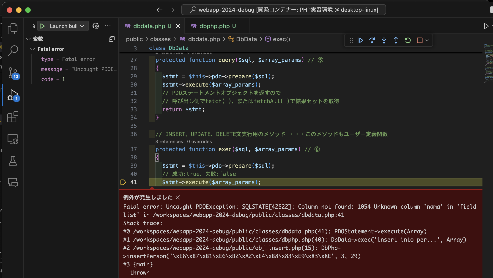
   とりあえず、下の画像の続行(もしくは`F5`キー)ボタンを押して一度プログラムを終了させてください。
   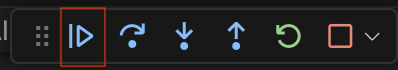

4. エラーの原因を特定するために、ブレークポイントを設定する
   今回は、ブレークポイント以外の、デバッガの機能も使いながらデバッグしたいので、`public/classes/obj_insert.php`の`$dbPhp = new DbPhp();`(14行目)にブレークポイントを設定します。
    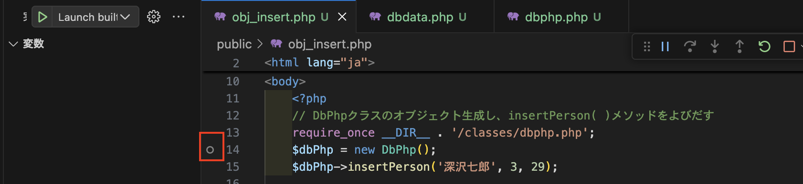

5. ブレークポイントが設定されたら、ブラウザに戻り、「obj_insert.php」のリンクをクリックする
    

6. ブレークポイントが設定された行でプログラムが一時停止される
   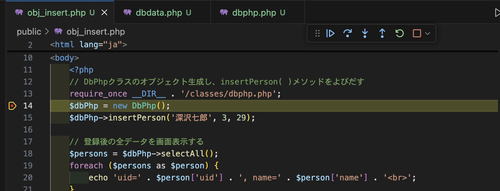

7. コントロールパネルを使って、システムエラーが発生した箇所まで進む
   まずは、ステップオーバー(`F10`)キーを使って、次の行に進みます。
   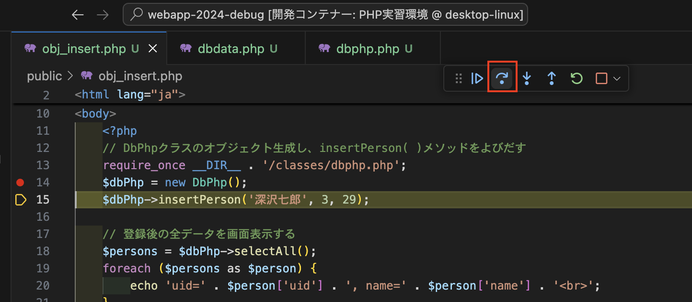

8. ステップイン(`F11`)を使って、`insertPerson`メソッドに入る
   以下のように、`insertPerson`メソッドに入ることができます。
   左側のバーメソッドの引数の値が確認できます。
   それを見る限りはエラーの原因になるようなものは見当たりません。
   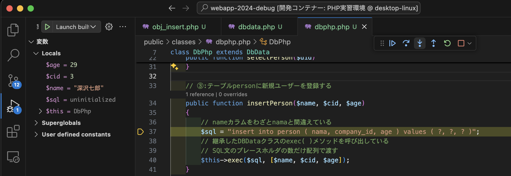

9. ステップオーバー(`F10`)を使って、40行目に進む
   左側のバーに、`$sql`の変数の値が表示されているのがわかります。
   このメソッド内では、あくまで変数を定義しただけなので、エラーは発生していません。
   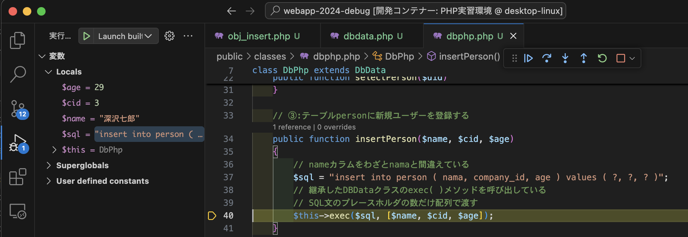

10. ステップイン(`F11`)を使って、`exec`メソッドに入る
    以下のように、`exec`メソッドに入ることができます。
    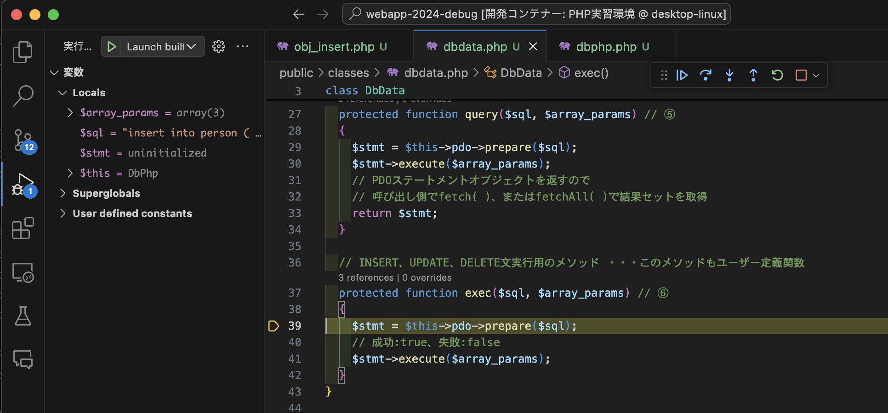

11. おおよそのエラーのあたりをつける
    先ほどの例外発生した箇所は、`exec`メソッドの中で、`$stmt->execute();`の行でした。
    デバッガを使って、ここまでのプログラムの流れを確認してきましたが、基本的には、`insertPerson`メソッド、`exec`メソッドに引数を渡している処理が続いていました。

    `stmt->execute();`はSQLを実行する処理です。
    つまり、今まで渡ってきた引数を使って形成されるSQLに何らかの構文エラーが起こっていることが考えられます。
    改めて、左のバーで変数の値を確認してみましょう。
    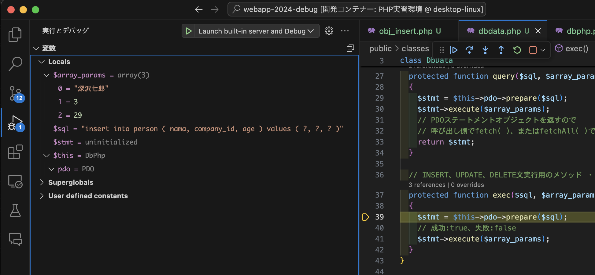

     `$sql`の値を確認すると、以下のようになっています。

     ```sql
      insert into person ( nama, company_id, age ) values ( ?, ?, ? )
      ```

    よくよく確認すると、personテーブルのカラム名が`nama`になっています。
    正しくは、`name`です。
    このため、SQLの構文エラーが発生していたと考えられます。
    dbphp.phpのinsertPersonメソッドのSQL文を修正すれば正しく動作するはずです。

このように、デバッガを使って、エラーの原因箇所を特定することができます。
実は、今回のケースでは例外が発生した以下の英文を見るだけでも、エラーの原因はある程度特定できました。


しかし、デバッガを使うことで、プログラムの処理の流れを確認しながら、エラーの原因を特定することができます。

## デストコードを使ったデバッグ

ここからは少し番外編です。
学生時代の開発では、このテストコードを使ったデバッグよりも、手動デバッグやデバッガを使ったデバッグが使いやすいと思います。
しかし、近年の開発では、テストコードを使ったデバッグが重要視されており、テストコードの知見を得ることにはメリットがあります。

## composerを使ったPHPUnitの導入

PHPには、PHPUnitというテストフレームワークがあり、テストコードを書くことができます。

それを導入するために本セミナーではcompoerを使います。
composerは、PHPのパッケージ管理ツールです。
composerを使うことで、PHPのパッケージを簡単にインストールすることができます。

ここでいうパッケージとは、PHPのライブラリやフレームワークのことです。
例えば、LaravelやSymfonyといったフレームワークや、PHPUniteやMonologなど便利なライブラリがあります。

composerを使ってPHPUnitをインストールする手順は以下の通りです。
composerは既にインストールされています。

1. VSCode上で、`Ctrl+Shift+P`(Macの場合は`Cmd+Shift+P`)を押し、コンテナを起動する(既に起動している場合は不要)
2. `Ctrl+J`(Macの場合は`Cmd+J`)を押して、ターミナルを開く
3. `composer require --dev phpunit/phpunit`と入力し、PHPUnitをインストールする
4. `vendor/bin/phpunit --version`と入力し、PHPUnitのバージョンが確認できればインストール成功
   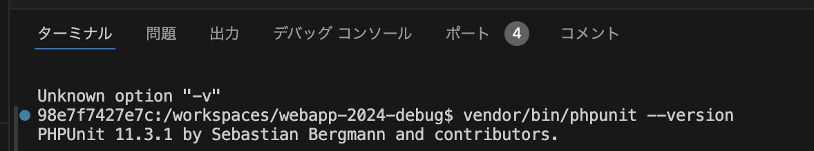

## テストコードを書いてみる

では実際に、テストコードを書いてみましょう。

`public`ディレクトリ直下に、mytest.phpというファイルを作成し以下を記述してください。

```php
<?php

// PHPUnitのクラスであるTestCaseを使用するための記述です、本筋とはずれますので今回は解説は省略します
require_once dirname(__FILE__) . '/../vendor/autoload.php';
use PHPUnit\Framework\TestCase;

/**
 * サンプル用テストプログラム
 */
class MyTest extends TestCase
{
    /**
     * 配列の数が期待通りかをテストします。
     */
    public function test1()
    {
        $arr = [100, 200, 300];
        $this->assertCount(3, $arr); // 成功
    }

    /**
     * 値が空であるかをテストします。
     */
    public function test2()
    {
        $value = null;
        $this->assertEmpty($value); // 成功

        $value = 'VALUE';
        $this->assertEmpty($value); // 失敗
    }

    /**
     * 値が期待通りであるかをテストします。
     */
    public function test3()
    {
        $value = 3;

        $this->assertEquals(3, $value); // 成功
        $this->assertEquals(2, $value); // 失敗
    }
}
```

**【解説】**

`Myclass MyTest extends TestCase`:<br>
クラス名は自由につけて構いませんが、`Testcase`を継承することで、テストコードに必要なメソッドが使用できます。

`public function test1()`、`public function test2()`、`public function test3()`:<br>
テストメソッドは、`test`で始まるメソッド名をつける必要があります。

`$this->assertCount(3, $arr);`:<br>
`assertCount`メソッドは、配列の要素数が期待通りかをテストします。

`$this->assertEmpty($value);`:<br>
`assertEmpty`メソッドは、値が空であるかをテストします。

`$this->assertEquals(3, $value);`:<br>
`assertEquals`メソッドは、値が期待通りであるかをテストします。

テストコードを書いたら、以下の手順でテストを実行してみましょう。

1. VSCode上で、`Ctrl+Shift+P`(Macの場合は`Cmd+Shift+P`)を押し、コンテナを起動する(既に起動している場合は不要)
2. `Ctrl+J`(Macの場合は`Cmd+J`)を押して、ターミナルを開く
3. `vendor/bin/phpunit public/mytest.php`と入力し、テストを実行する
4. テストが実行された場合は、以下のように表示されます
   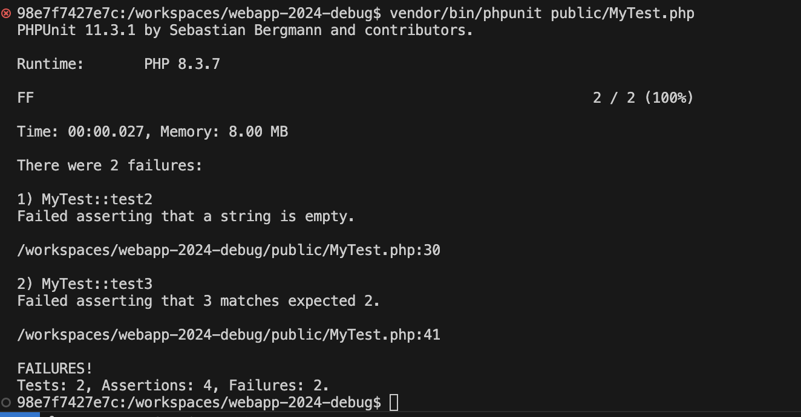

今回は、テストコードのみを書きましたが、実際の開発では、プログラムの動作を確認するためのテストコードを書くことが基本です。
今回は、オブジェクト指向プログラミングのクラスのメソッドが正しく動作するかをテストしてみましょう。

mytest.phpに`test4`メソッドを追加してください。

```php
    /**
     * selectAllメソッドが期待通りの値を返すかをテストします。
     */
    public function test4()
    {
        require_once __DIR__ . '/classes/dbphp.php';
        $dbPhp = new DbPhp();
        $persons = $dbPhp->selectAll();
        $this->assertCount(6, $persons); // 成功
    }
```

このテストメソッドは、`selectAll`メソッドが期待通りの値を返すかをテストしています。
ここでいう期待通りの値とは、`selectAll`メソッドが返す配列の要素数が6であることを期待しています。

テストコードを書いたら、`vendor/bin/phpunit --filter test4 public/mytest.php`と入力して、テストを実行してみましょう。
テストが成功した場合は、テスト結果の「Assersions」という数が増え、「Failures」の数は変わらずで表示されます。

このように、テストコードを書くことで、プログラムの動作を確認することができます。
では、実際の開発現場ではなぜテストコードを書く必要があるのでしょうか？

それは、第3者にプログラムが正しく動作することを証明するためです。
第3者とは、お客様だけではありません。
プロジェクトが正しく運用されるためには、上司やチームメンバーに対しても、プログラムが正しく動作することを客観的に保証する必要があります。

そのための手段として、テストコードが重宝されているのです。
(※私が現役の時は、すべて手動でプログラムを動かし、エクセルとスクショで管理していました...とほほ...)

ちなみに、このテストコードというのは、入力に対する出力が期待通りかを機械的に確認するときに力を発揮します。
つまり、上記例のようなオブジェクト指向プログラミングのように、ロジックの部分をクラスのメソッドとして切り出している場合に非常に有効な手段なのです。

こういった意味でもオブジェクト指向プログラミングは、プログラムの保守性を高めるために非常に有効な手段です。

## まとめ

- デバッグの種類
  本セミナーではデバッグの種類として、手動デバッグ、デバッガを使ったデバッグ、テストコードを使ったデバッグを紹介しました。
  ちなみに、今回紹介したのは一例であり、他にも様々なデバッグの方法があります。

- 他言語にも転用可能
  本セミナーで学んだデバッグのスキルは、PHPに限らず、他の言語にも転用できます。
  PHP以外の言語を極めたいという方もいらっしゃるでしょう。
  他の言語を学ぶ際にも、デバッグのスキルを活かしてください。

- デバッグをする際の心構え
  デバッグへの解決策は1つではありませんが、デバッグをする際に最もやってはいけないことが、あてずっぽうでコードを書き換えることです。
  仮にバグが修正されたとしても、そのバグの原因が何だったのかがわからなくなってしまい、次に似たようなバグが発生した際に対処できなくなります。
  今回紹介した手法等を参考に、バグの原因を特定し、根拠をもって修正することを心がけましょう。

- パッケージ管理ツール利用のすすめ
  個人的には、composerのようなパッケージ管理ツールの利用は開発の幅が広がり、非常に便利です。
  他言語でもこのようなツールはありますので、制作演習Ⅱや総合開発実習でも積極的に利用してみてください。
  