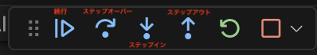

# デバッグセミナー

- [デバッグセミナー](#デバッグセミナー)
  - [事前準備](#事前準備)
  - [デバッグとは？デバッグの重要性とは？](#デバッグとはデバッグの重要性とは)
  - [本学の学生にデバッグが必要な理由](#本学の学生にデバッグが必要な理由)
  - [本セミナーで扱うデバッグについて](#本セミナーで扱うデバッグについて)
  - [デバッグのステップ](#デバッグのステップ)
  - [手動デバッグ](#手動デバッグ)
  - [デバッガを使ったデバッグ](#デバッガを使ったデバッグ)
  - [デバッガの基本的な操作](#デバッガの基本的な操作)
    - [ブレークポイントの設定](#ブレークポイントの設定)
  - [エラーが出た箇所と、エラーの原因が違う箇所の特定](#エラーが出た箇所とエラーの原因が違う箇所の特定)
  - [番外編](#番外編)

## 事前準備

[こちらのページ]()から、ソースコードを`C:¥web_app_dev`へcloneしてください。

## デバッグとは？デバッグの重要性とは？

デバッグとは、プログラムのバグを見つけて修正することです。
バグとは、プログラムが意図しない動作をすることです。
バグがあると、プログラムが正しく動作しないため、デバッグが必要です。

デバッグの重要性は、デバッグのスキルがあるかどうかで、開発の効率性が大きく変わりことです。
デバッグのスキルがあると、修正箇所をすぐに見つけられるため、バグを素早く修正できます。

例えば、こういった経験はありませんか？

- プログラムを書いている途中で、バグが発生してしまい、どこが原因かわからない
- エラーは出ていないが、プログラムが正しく動作していない
- エラーの原因箇所のおおよその検討はついたが、検証が難しい

多かれ少なかれ、誰しもが上記のような経験をしていると思います。
本セミナーを通して、デバッグのスキルを身につけることで、上記のような問題を解決する一助となれば幸いです。

## 本学の学生にデバッグが必要な理由

本学の学生の開発状況には、以下のような特徴があります。

1. 仕様が明確ではない
2. 開発スケジュールがタイト
3. 創ることに重きを置いている校風

つまり、「開発しながら都度都度確認する」というスタイルをとらなければならない状況が多いです。
そんな時こそ、デバッグのスキルが必要です。

## 本セミナーで扱うデバッグについて

本セミナーでは、以下のデバッグの種類を扱います。

1. 手動デバッグ
2. デバッガを使ったデバッグ
3. テストコードを使ったデバッグ

言語は、PHPを使いますが、デバッグのスキルは言語に依存しません。
本セミナーで学んだことは、他の言語にも転用できるので、そこは心配しないでください。

## デバッグのステップ

デバッグは、以下のステップで行います。

1. バグの再現
2. バグの原因の仮説を立てる
3. 仮説を検証する
4. 仮説が正しければ、修正する
5. 仮説が間違っていれば、次の仮説を立てる
6. バグが修正されるまで、ステップ1から繰り返す

デバッグの種類が違っても、基本的なステップは変わりません。

## 手動デバッグ

手動デバッグは、プログラムの動作を確認しながらバグの原因を探すため、バグの原因を見つけるまでに時間がかかることがあります。
しかし、手動デバッグは、バグの原因を探すための基本的なスキルを身につけるためには最適な方法です。

「Webアプリケーション開発」の授業でも紹介しましたが、手動デバッグを実施する上では、`var_dump`を使うことが多いです。
`var_dump`は、変数、配列、オブジェクトの中身を確認するための関数です。

特に、配列やオブジェクトなど、複雑なデータ構造を扱う場合には、`var_dump`を使うことで、データ構造を理解しやすくなります。
以下は、そういった複雑なデータ構造を扱う場合の`var_dump`の使い方です。
以下は、`$array`という配列を`var_dump`で出力する例です。

```php
<?php
$array = [
    'key1' => 'value1',
    'key2' => 'value2',
    'key3' => [
        'key4' => 'value4',
        'key5' => 'value5',
    ],
];

var_dump($array);
```

上記のコードを実行すると、以下のような出力が得られます。

```php
array(3) {
  ["key1"]=>
  string(6) "value1"
  ["key2"]=>
  string(6) "value2"
  ["key3"]=>
  array(2) {
    ["key4"]=>
    string(6) "value4"
    ["key5"]=>
    string(6) "value5"
  }
}
```

`var_dump`の出力結果は、以下のような情報を提供しています。

- `array(3)`：配列の要素数が3つであることを示しています
- `["key1"]=> string(6) "value1"`：`key1`というキーに`value1`という値が入っていることを示しています

`var_dump`の出力結果を見ることで、配列やオブジェクトの中身を理解しやすくなります。
デバッグの際には、`var_dump`を使って、データ構造を理解するようにしましょう。

## デバッガを使ったデバッグ

上記のように、`var_dump`を使って手動デバッグを行うこともできますが、コードが複雑になると、バグの原因を見つけるのが難しくなったり、時間がかかったりすることがあります。
そこで、デバッガを使ったデバッグが有効です。

デバッガを使ったデバッグとは、デバッガというツールを使ってプログラムの動作を一時停止させながら、バグの原因を探す方法です。
PHPには、デバッガとしてXdebugというツールがあります。
まずは、そのツールの使い方を学びましょう。

Xdebugを使ったデバッグの手順は以下の通りです。

1. VSCode上で、`Ctrl+Shift+P`(Macの場合は`Cmd+Shift+P`)を押し、コンテナを起動する
2. 左バーの虫と三角のアイコンを押して、「launch.jsonファイルを作成します」をクリックする
   
3. 以下のように画面が変わる
    
4. 上部の「実行とデバッグ」というプルダウンリストからPHP(Xdebug)を選択する
   
5. 「Launch built-in server and Debug 」を選ぶ
    
6. 実行とデバッグの横の緑三角をクリック
   
7. ブラウザが立ち上がり、デバッガが起動する
   以下のように、ブラウザが立ち上がり、http://localhost:8080/ にアクセスされる
    

これで、デバッガの準備が整いました。
では、実際にデバッガを使ってみましょう。

今回は、一例として、以前「Webアプリケーション開発」授業で扱った、オブジェクト指向プログラミングの課題をデバッグしてみます。
**※デバッグのために、一部のコードにはわざといくつかバグを仕込んでいます。**

## デバッガの基本的な操作

まずは、バグを見つける前に、デバッガの基本的な操作を学びましょう。

### ブレークポイントの設定

デバッガを使ってプログラムをデバッグする際には、ブレークポイントを設定します。
ブレークポイントとは、プログラムの実行を一時停止させるためのポイントのことです。
ブレークポイントを設定するには、以下の手順を行います。

1. ブレークポイントを設定したい行にカーソルを合わせる
   今回は、`public/classes/dbphp`の`selectAll`メソッドの`return $persons`(18行目)にブレークポイントを設定します。
    
2. `F9`キーを押してブレークポイントが設定されると、行番号の左側に丸(赤い丸のときもある)が表示される
   

3. ブレークポイントが設定されたら、ブラウザに戻り、「obj_select.php」のリンクをクリックする
   

4. ブレークポイントが設定された行でプログラムが一時停止される
   

5. デバッガの左側のバーで、 ブレークポイントより前の行までの変数の値を確認できる
   

このように、ブレークポイントを設定することで、プログラムの実行を一時停止し、変数の値を確認することができます。
また、デバッガには、以下のような操作があります。

- `F11`：ステップイン（関数内に入る）
- `F10`：ステップオーバー（関数内に入らずに次の行に進む）
- `Shift+F11`：ステップアウト（関数から出る）
- `F5`：続行(次のブレークポイントまで実行、ブレークポイントがない場合は、プログラムが終了するまで実行)

また、コマンド以外にも、VSCode上の以下のコントロールパネルでも同様の操作ができます。


次はこれらも使い、もう少し具体的にデバッグしてみましょう。

## エラーが出た箇所と、エラーの原因が違う箇所の特定

デバッガを使って、エラーが出た箇所と、エラーの原因が違う箇所を特定してみましょう。

1. 前回設定したブレークポイントを削除する
   `public/classes/dbphp`の`selectAll`メソッドの`return $persons`(18行目)のブレークポイントを`F9`キーで削除してください。
   左側の丸が消えれば削除されています。

2. ブラウザに戻り、「obj_insert.php」のリンクをクリックする
   

3. デバッガでは、システムエラーが発生した箇所でプログラムが一時停止される
   ただし、ブレークポイントが設定されていないため、変数の値を確認することができず、エラーの原因がわかりません。
   
   とりあえず、下の画像の続行ボタンを押して一度プログラムを終了させてください。
   

4. エラーの原因を特定するために、ブレークポイントを設定する
   今回は、ブレークポイント以外の、デバッガの機能も使いながらデバッグしたいので、`public/classes/obj_insert.php`の`$dbPhp = new DbPhp();`(14行目)にブレークポイントを設定します。
    

5. ブレークポイントが設定されたら、ブラウザに戻り、「obj_insert.php」のリンクをクリックする
    

6. ブレークポイントが設定された行でプログラムが一時停止される
   

7. コントロールパネルを使って、システムエラーが発生した箇所まで進む
   まずは、ステップオーバー(`F10`)キーを使って、次の行に進みます。
   

8. ステップイン(`F11`)を使って、`insertPerson`メソッドに入る
   以下のように、`insertPerson`メソッドに入ることができます。
   左側のバーメソッドの引数の値が確認できます。
   それを見る限りはエラーの原因になるようなものは見当たりません。
   

9. ステップオーバー(`F10`)を使って、40行目に進む
   左側のバーに、`$sql`の変数の値が表示されているのがわかります。
   このメソッド内では、あくまで変数を定義しただけなので、エラーは発生していません。
   

10. ステップイン(`F11`)を使って、`exec`メソッドに入る
    以下のように、`exec`メソッドに入ることができます。
    

11. おおよそのエラーのあたりをつける
    先ほどの例外発生した箇所は、`exec`メソッドの中で、`$stmt->execute();`の行でした。
    デバッガを使って、ここまでのプログラムの流れを確認してきましたが、基本的には、`insertPerson`メソッド、`exec`メソッドに引数を渡している処理が続いていました。

    `stmt->execute();`はSQLを実行する処理です。
    つまり、今まで渡ってきた引数を使って形成されるSQLに何らかの構文エラーが起こっていることが考えられます。
    改めて、左のバーで変数の値を確認してみましょう。
    

     `$sql`の値を確認すると、以下のようになっています。

     ```sql
      insert into person ( nama, company_id, age ) values ( ?, ?, ? )
      ```

    よくよく確認すると、personテーブルのカラム名が`nama`になっています。
    正しくは、`name`です。
    このため、SQLの構文エラーが発生していたと考えられます。
    dbphp.phpのinsertPersonメソッドのSQL文を修正すれば正しく動作するはずです。

このように、デバッガを使って、エラーの原因箇所を特定することができます。
実は、今回のケースでは例外が発生した以下の英文を見るだけでも、エラーの原因はある程度特定できました。


しかし、デバッガを使うことで、エラーの原因をより具体的に特定することができます。

## 番外編

1. エラーと向き合う心構え
   今回は、手動デバッグ、デバッガを使ったデバッグ、テストコードを使ったデバッグを学びました。
   このことから言えることは、デバッグへの解決策は1つではないということです。
2. フロントエンドのデバッグツール