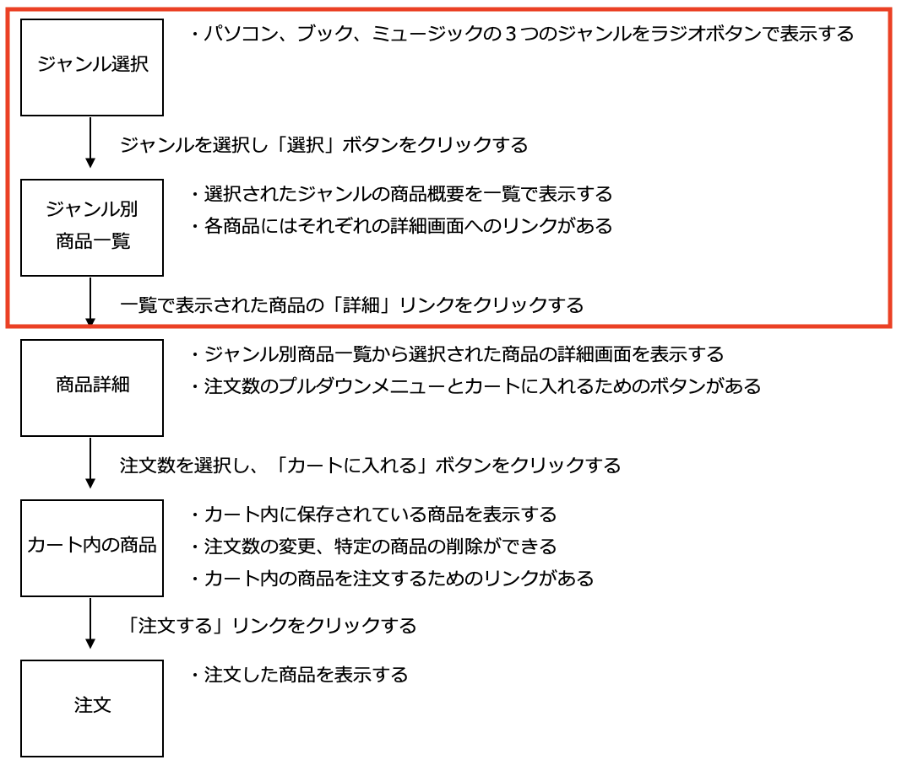

# 仕様書① : ジャンル選択画面、ジャンル別商品一覧画面

- [仕様書① : ジャンル選択画面、ジャンル別商品一覧画面](#仕様書--ジャンル選択画面ジャンル別商品一覧画面)
  - [事前準備](#事前準備)
  - [画面遷移図](#画面遷移図)
  - [本章で使用するテーブルについて](#本章で使用するテーブルについて)
  - [ジャンル選択画面(index.php)](#ジャンル選択画面indexphp)
    - [データベースの基本事項を定義するクラスDbData](#データベースの基本事項を定義するクラスdbdata)
    - [商品データを操作するクラスProduct](#商品データを操作するクラスproduct)
    - [ジャンル別商品一覧画面（product\_select.php）](#ジャンル別商品一覧画面product_selectphp)
    - [動作確認](#動作確認)

## 事前準備

[こちらのページ]()から、ソースコードを`C:¥web_app_dev`へcloneすること。

```text
public
├── classes
│   ├── dbdata.php  ←データベースの基本事項を定義する
│   └── product.php ←「商品」に関するProduct.class を定義する
├── footer.php        ←画面のフッターを構成する
├── header.php        ←画面のヘッダーを構成する
├── index.php         ←３つのジャンルから１つのジャンルを選択する画面
└── product
    ├── product_detail.php    ←特定の商品の詳細内容を表示する
    └── product_select.php    ←選択されたジャンルの商品一覧を表示する
```

## 画面遷移図

本章では、以下の2つの画面を作成します。



## 本章で使用するテーブルについて

使用するテーブルは、以下の通りです。

**テーブル名：items**

以下はテーブル構造です。

| カラム名 | データ型 | 制約 |
| - | - | - |
|ident|int|主キー、not null制約|
|name|varchar型|最大文字数50、not null制約|
|maker|varchar型|最大文字数50、not null制約|
|price|int型||
|image|varchar型|最大文字数20|
|genre|varchar型|最大文字数10|

また、初期データとして以下のものが登録されています。

| ident | name | maker | price | image | genre |
| - | - | - | - | - | - |
|1|NEC LAVIE|NEC|61980|pc001.jpg|pc|
|2|dynabook AZ45|東芝|80784|pc002.jpg|pc|
|3|Surface Pro|マイクロソフト|167980|pc003.jpg|pc|
|4|FMV LIFEBOOK|富士通|221480|pc004.jpg|pc|
|5|MacBook Pro|Apple|142800|pc005.jpg|pc|
|6|確かな力が身につくPHP「超」入門|松浦健一郎/司ゆき|2678|book001.jpg|book|
|7|スラスラわかるJavaScript|生形　可奈子|2484|book002.jpg|book|
|8|SCRUM BOOT CAMP THE BOOK|西村　直人ほか|2592|book003.jpg|book|
|9|かんたんUML入門 (プログラミングの教科書)|大西　洋平ほか|3218|book004.jpg|book|
|10|Webデザイナーのための jQuery入門|高津戸 壮|3110|book005.jpg|book|
|11|÷(ディバイド)|エド・シーラン|1818|music001.jpg|music|
|12|Live in San Diego [12 inch Analog]|Eric Clapton|3956|music002.jpg|music|
|13|25(UK盤)|Adele|1205|music003.jpg|music|
|14|Somehow,Someday,Somewhere|ai kuwabara trio project|2700|music004.jpg|music|
|15|Singles[Explicit]|マルーン5|1530|music005.jpg|music|

phpMyAdmin上でも確認できます。


## ジャンル選択画面(index.php)

- パソコン、ブック、ミュージックの３つのジャンルをラジオボタンで表示する
- ブックにデフォルトチェックが入っている<br>


ジャンル選択画面（index.php）のジャンルを選択し、「選択」ボタンをクリックすると、ジャンル別商品一覧画面（product_select.php）に遷移します。

**index.php** のコードは以下のとおりです。（実態はHTMLのみ）

```php
<!DOCTYPE html>
<html lang="ja">

<head>
  <meta charset="UTF-8">
  <title>ショッピングサイト</title>
  <link rel="stylesheet" href="./css/minishop.css">
</head>

<body>
  <h3>ジャンル選択</h3>
  お好みのジャンルを選択してください。<br>
  <form method="POST" action="product/product_select.php"> <!-- ① -->
    <label><input type="radio" name="genre" value="pc">パソコン</label>&nbsp;&nbsp; <!-- ② -->
    <label><input type="radio" name="genre" value="book" checked>ブック</label>&nbsp;&nbsp;
    <label><input type="radio" name="genre" value="music">ミュージック</label>&nbsp;&nbsp;
    <input type="submit" value="選択">
  </form>
</body>
</html>
```

①: `<form method="POST" action="product/product_select.php">`

`action`属性のパスの記載方法は相対パスとなっています。
この場合、index.php から見て product_select.php は「product」フォルダ内にあるため、パスの記載は「product/product_select.php」となります。

②: `<label><input type="radio" name="genre" value="pc">パソコン</label>&nbsp;&nbsp;`

`<label></label>`タグでラジオボタンを囲むことにより、「パソコン」という文字をクリックしてもラジオボタンが選択されます。

### データベースの基本事項を定義するクラスDbData

このミニショップ用のクラスを作成して使用します。
`$dsn`、`$user`、`$password` の値がWebアプリケーション「ミニショップ」用になっている以外は、[ログイン認証①](../login-i/README.md)で作成したクラス`DbData`と同じ内容です。

**dbdata.php** のコードは以下のとおりです。

```php
<?php
// DbDataクラスの宣言
class DbData
{
    // PDOオブジェクト用のプロパティ(メンバ変数)の宣言
    protected $pdo;

    // コンストラクタ
    // 「__construct」の「̲̲__」は「_(アンダースコア)」を2つ記述する
    public function __construct()
    {
        // PDOオブジェクトを生成する
        $user = 'sampleuser';
        $password = 'samplepass';
        $host = 'db';
        $dbName = 'SAMPLE';
        $dsn = 'mysql:host=' . $host . ';dbname=' . $dbName . ';charset=utf8';
        try {
            $this->pdo = new PDO($dsn, $user, $password);
        } catch (Exception $e) {
            // 接続できなかった場合のエラーメッセージ
            exit('データベースに接続できませんでした：' . $e->getMessage());
        }
    }

    // SELECT文実行用のqueryメソッド ・・・このメソッドはユーザー定義関数
    protected function query($sql, $array_params)
    {
        $stmt = $this->pdo->prepare($sql);
        $stmt->execute($array_params);
        // PDOステートメントオブジェクトを返すので
        // 呼び出し側でfetch( )、またはfetchAll( )で結果セットを取得
        return $stmt;
    }

    // INSERT、UPDATE、DELETE文実行用のメソッド ・・・このメソッドもユーザー定義関数
    protected function exec($sql, $array_params)
    {
        $stmt = $this->pdo->prepare($sql);
        // 成功:true、失敗:false
        $stmt->execute($array_params);
        // 【今回追記】実行結果(true or false)を利用するので、戻り値を返す
        return $stmt;
    }
}
```

### 商品データを操作するクラスProduct

データベースの基本事項を定義するクラス`DbData`を継承し、商品データを操作するクラス`Product`を定義します。

このミニショップ全体では、このほかにカート内の商品を操作するクラス`Cart`と注文を処理するクラス`Order`を定義する予定です。

今回は、選択されたジャンルの商品データを抽出するメソッドを次の条件でこのProduct.class に定義する。

```text
アクセス修飾子： public
メソッド名： getItems
引数： $genre （選択されたジャンル）
戻り値： 抽出した商品データの結果セット
```

**product.php** のコードは以下のとおりです。


＊この `getItems` メソッドを、「product_select.php」 で呼び出して利用します。（そのコードは次に示します。）

### ジャンル別商品一覧画面（product_select.php）

ジャンル別商品一覧画面 ： **product\_select.php**

- 選択されたジャンルの商品概要を一覧で表示する
- 各商品にはそれぞれの詳細画面へのリンクがある


ジャンル選択画面（index.php）から選択されたジャンルのデータは、このジャンル別商品一覧画面 （product_select.php）が受け取るが、ここで処理する内容は以下のとおりです。

1. 送られてきたジャンルの値を受け取る。
2. Product.class のオブジェクトを生成する
3. Productオブジェクトの `getItems( )` メソッドを呼び出し、抽出した商品データの結果セットを受け取る
4. 商品データの結果セットから商品を取り出し一覧画面を作成する

この **product_select.php** のコードは以下のとおりです。


**`<td>`セル内のクラス設定について**

各セルの幅や高さ、左詰め・右詰め・中央ぞろえなどといった表示に関する設定を行っている。具体的な設定は、src\css\minishop.css に記述してある。

①: `'<td class="td_mini_img"></td>' .`

`class="td_mini_img"` の効果は 「minishop.css」に定義されており、画像を表示するセルのサイズを幅・高さともに40pxとしている。`class="mini_img"` の効果も「minishop.css」に定義されており、画像の大きさをセルのサイズに合わせる。<br><br>

②: `'<td class="td_item_name">' . $item['name'] . '</td>' .`

`class="td_item_name"` の効果は「minishop.css」に定義されており、商品名を表示するセルの横幅を200pxとし、収まりきらない場合は折り返して表示する。<br><br>

③: `'<td class="td_item_maker">' . $item['maker'] . '</td>' .`

`class="td_item_maker"` の効果は「minishop.css」に定義されており、メーカー等を表示する。セルの横幅を150pxとし、収まりきらない場合は折り返して表示する。<br><br>

④-1: `'<td class="td_right">&yen;' . number_format($item['price']) . '</td>' .`

`class="td_right"` の効果は「minishop.css」に定義されており、セル内のデータを右詰で表示する。<br><br>

④-2: `'<td class="td_right">&yen;' . number_format($item['price']) . '</td>' .`

`&yen;` は 「¥」 を表し、`number_format( )` 関数は、数字を3桁ごとにカンマ区切りにする関数。これにより「2678」を「¥2,678」と表示している。<br><br>

⑤: `'<td><a href="product_detail.php?ident=' . $item['ident'] . '">詳細</a></td>' .`

各商品の「詳細」の文字には、詳細画面を表示する「product_detail.php」へのリンクが張られている。そして、「product_detail.php」 にはクエリパラメータ `$ident` でその商品の商品番号を送信する。

### 動作確認

以上の作業終了後、次のように画面が表示されることを確認する。

- 最初に「ジャンル選択」画面にアクセスする。<br>


- ジャンルを選択し「選択」ボタンをクリックするとその「ジャンル別商品一覧」画面が表示される。<br>
＊図は「ブック」のジャンルを選択した場合。それぞれのジャンルで正しく商品一覧が表示されることを確認する。<br>


- 「パソコン」を選んだ場合<br>


- ミュージックを選んだ場合<br>


**ミニショップの商品に関する機能はまだ完成ではありません。まだpushはしないでください。**
