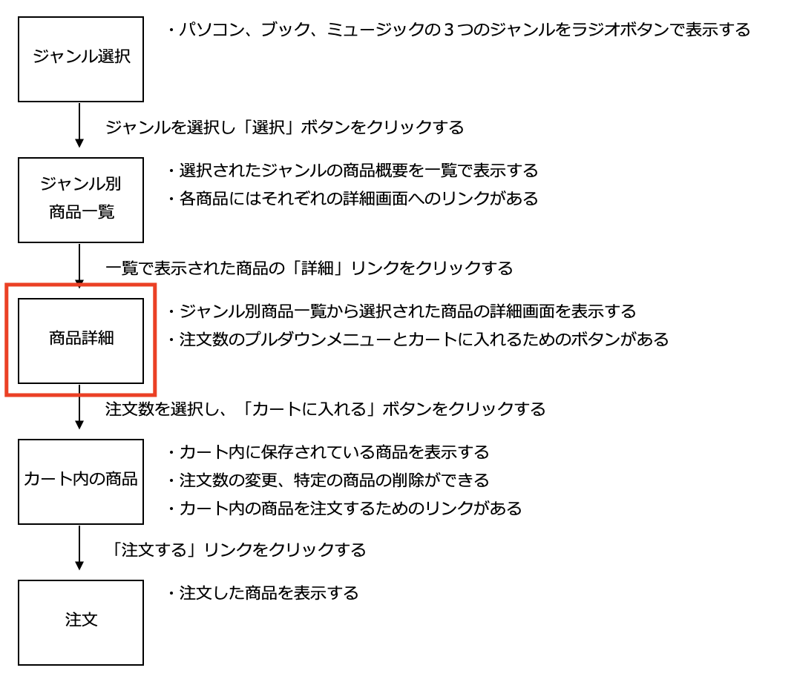
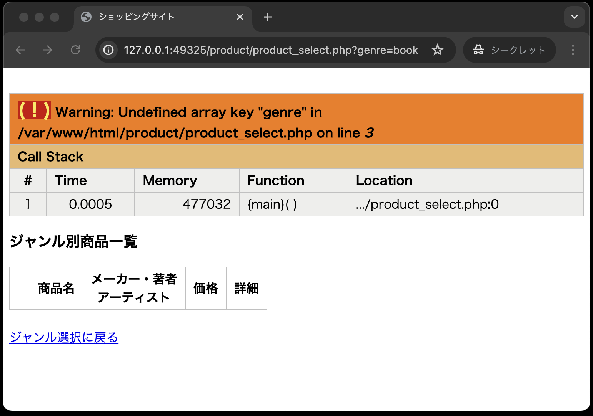

# 仕様書② : ジャンル選択画面、ジャンル別商品一覧画面

- [仕様書② : ジャンル選択画面、ジャンル別商品一覧画面](#仕様書--ジャンル選択画面ジャンル別商品一覧画面)
  - [事前準備](#事前準備)
  - [この章でやること](#この章でやること)
  - [クラスProductの修正](#クラスproductの修正)
    - [商品詳細画面(product\_detail.php)](#商品詳細画面product_detailphp)
  - [ジャンル別商品一覧画面(product\_select.php)の修正](#ジャンル別商品一覧画面product_selectphpの修正)
  - [動作確認](#動作確認)
  - [課題の提出と採点について](#課題の提出と採点について)
    - [課題の合格基準](#課題の合格基準)
    - [合格確認方法](#合格確認方法)
    - [エラーが出た時の対処法](#エラーが出た時の対処法)
    - [タイムアウトになっていないかを確認する](#タイムアウトになっていないかを確認する)
    - [プログラムが正確に書かれているか確認する](#プログラムが正確に書かれているか確認する)
      - [どこでエラーがでているか確認する](#どこでエラーがでているか確認する)
      - [プログラムが正確に書かれているか確認する](#プログラムが正確に書かれているか確認する-1)
  - [GitHub上での採点についてのお願い](#github上での採点についてのお願い)

## 事前準備

前回の[仕様書① : ジャンル選択画面、ジャンル別商品一覧画面](../ec-site-i/README.md)でcloneしたコードをそのまま利用してください。

## この章でやること

本章では、以下の1つの画面を作成します。



また、商品詳細画面(product_detail.php)の作成だけでなく、商品データを操作するクラス`Product`(product.php)の修正を行います。

## クラスProductの修正

商品詳細画面を表示するための処理の流れは以下のとおりです。

1. 送られてきた商品番号を受け取る
1. 受け取った商品番号のデータをテーブルitemsから抽出する
1. 抽出した商品データの結果セット(データは1件だけ)を受け取る
1. 商品データの結果セットから詳細画面を作成する

上記「2」と「3」の処理をクラス`Product`に実装します。<br>
商品詳細画面(product_detail.php) からは、クラス`Product`のオブジェクトを生成し、受け取った商品番号のデータを抽出するメソッドを呼び出して、商品データの結果セットを受け取るようにします。

そこでまず、クラス`Product`」に以下の条件でメソッドを追加定義します。

```text
アクセス修飾子： public
メソッド名： getItem
引数： $ident(選択された商品番号)
戻り値： 抽出した商品データの結果セット(データは1件だけ)
```

**classes/product.php**

```php
// ---前の章で作成したコード(ここから)---
<?php
// スーパークラスであるDbDataを利用するため
require_once __DIR__ . '/dbdata.php';

// Productクラスの宣言
class  Product  extends  DbData
{
    // 選択されたジャンルの商品を取り出す
    public  function  getItems($genre)
    {
        $sql  =  "SELECT  *  FROM  items  WHERE  genre  =  ?";
        // DbDataクラスに定義したqueryメソッドを実行している
        $stmt = $this->query($sql,  [$genre]);
        // 抽出した商品データ(複数件)の結果セットを返す
        $items = $stmt->fetchAll();
        return  $items; 
    }
// ---前の章で作成したコード(ここまで)---

    // --- ここから追加 ---
    // 選択された商品を取り出す
    public  function  getItem($ident)
    {
        $sql  =  "select  *  from  items  where  ident  =  ?";
        $stmt = $this->query($sql,  [$ident]);
        $item = $stmt->fetch();     // 1件だけ抽出するのでfetch( )メソッドを使用
        return  $item;      // 抽出した商品データを返す（1件だけ）
    }
    // --- 追加はここまで ---
}
```

### 商品詳細画面(product_detail.php)

この画面の完成形は以下のとおりです。
(以下の画面は、ジャンル＝ブック、商品番号=6が選ばれた場合のサンプルです。)


プルダウンメニューを開いた状態<br>


完成形の画面、並びにコメントを参考に、以下の「product_detail.php」の穴埋めの箇所に適切なコードを記述し完成させてください。

**product/product\_detail.php**

```php
<?php
// ジャンル別商品一覧から送られてきた商品番号を受け取る(穴埋め)
$ident = 
// product.phpを読み込む(穴埋め)
require_once
// Productオブジェクトを生成する(穴埋め)
$product = 
// 送られてきた商品番号で商品を抽出するメソッドを呼び出し、抽出された商品データを受け取る(穴埋め)
$item = 
?>
<!DOCTYPE html>
<html lang="ja">

<head>
  <meta charset="UTF-8">
  <title>ショッピングサイト</title>
  <link rel="stylesheet" href="./css/minishop.css">
</head>

<body>
<h3>商品詳細</h3>
<!-- 「cart_add.php」はカートに商品を入れる処理を行うphp。以降の章で実装する。 -->
<form method="POST" action="../cart/cart_add.php">
  <!-- 商品番号をhiddenで送る(穴埋め) -->
  <input type="hidden" name="ident" value="<?=             ?>">
  <table>
    <tr>
      <th>商品名</th>
      <!-- 商品名を出力する(穴埋め) -->
      <td><?=            ?></td>
    </tr>
    <tr>
      <td colspan="2">
        <div class="td_center">
          <!-- imgタグを使い、商品画像を出力する(穴埋め) -->
          ">
        </div>
      </td>
    </tr>
    <tr>
      <th>メーカー・著者<br>アーティスト</th>
      <!-- メーカー・著者・アーティストを出力する(穴埋め) -->
      <td><?=             ?></td>
    </tr>
    <tr>
      <th>価 格</th>
      <!-- 価格を出力する、価格はカンマ(,)区切りにする必要がある。-->
      <!--「product_select.php」で同様のやり方をしているので参考にすること(穴埋め) -->
      <td>&yen;<?=            ?></td>
    </tr>
    <tr>
      <th>注文数</th>
      <td><select name="quantity">
          <?php
          for ($i = 1; $i <= 10; $i++) {
            echo '<option value="' . $i . '">' . $i . '</option>'; // ①
          }
          ?>
        </select></td>
    </tr>
    <tr>
      <th colspan="2"><input type="submit" value="カートに入れる"></th>
    </tr>
  </table>
</form>
<br>
 <!-- ジャンル別商品一覧画面に戻る際に使用する「ジャンル」のデータを併せて送る-->
<a href="product_select.php?genre=<?= $item['genre']; ?>">ジャンル別商品一覧に戻る</a>
</body>
</html>
```

**①: 注文数のプルダウンメニューを表示するコードについて**

```php
<select name="quantity">
<?php
  for ($i = 1; $i <= 10; $i++) {
    echo '<option value="' . $i . '">' . $i . '</option>';
  }
?>
</select>
```

注文数は「1 ～ 10」のプルダウンメニューで表示しますが、`for`分を使うことで、`<option>`タグの記述を簡略化できます。


## ジャンル別商品一覧画面(product_select.php)の修正

以上で商品詳細画面(product_detail.php)が完成ですが、ひとつ問題が発生します。<br>
それは、商品詳細画面(product_detail.php)の「ジャンル選択に戻る」リンクをクリックすると以下のエラーが発生します。



このエラーは「ジャンル別商品一覧(product_select.php)」のプログラムで発生しているので、正しく「ジャンル別商品一覧」画面が表示されるように「**product\_select.php**」を修正する必要があります。

```php
<?php
// ---修正箇所(ここから)---
// genreの値を受け取る
if ($_SERVER["REQUEST_METHOD"] === "POST") {
  // POSTで送られてきた場合
  $genre = $_POST['genre'];
} else {
  // GETで送られてきた場合
  $genre = $_GET['genre'];
}
// ---修正箇所(ここまで)---

// --- ここから先のコードは修正の必要はありません ---

// Productオブジェクトを生成する
require_once __DIR__ . '/../classes/product.php';
$product = new Product();

// 抽出された商品データの結果セットを受け取る
$items = $product->getItems($genre);
?>

<!DOCTYPE html>
<html lang="ja">

<head>
  <meta charset="UTF-8">
  <title>ショッピングサイト</title>
  <link rel="stylesheet" href="./css/minishop.css">
</head>

<body>

<h3>ジャンル別商品一覧</h3>
<table>
  <tr>
    <th>&nbsp;</th>
    <th>商品名</th>
    <th>メーカー・著者<br>アーティスト</th>
    <th>価格</th>
    <th>詳細</th>
  </tr>
  <?php
  foreach ($items  as  $item) {
  ?>
    <tr>
      <td class="td_mini_img">"></td> <!-- ① -->
      <td class="td_item_name"><?= $item['name'] ?></td> <!-- ② -->
      <td class="td_item_maker"><?= $item['maker'] ?></td> <!-- ③ -->
      <td class="td_right">&yen;<?= number_format($item['price'])?></td> <!-- ④ -->
      <td><a href="product_detail.php?ident= <?= $item['ident'] ?> ">詳細</a></td> <!-- ⑤ -->
    </tr>
  }
?>
</table>
<br>
<a href="../index.php">ジャンル選択に戻る</a>

</body>
</html>
```


## 動作確認

以上の作業終了後、次のように画面が表示されることを確認する。

1. ジャンル＝パソコンの最初の商品(商品番号=1)を選択した場合<br>
   ジャンル別商品一覧画面と商品詳細画面が行き来できること

<br>
`　　　　　　　　　　　　　　　　　　　　`↕️


1. ジャンル＝ブックの最初の商品(商品番号=6)が選択された場合

<br>
`　　　　　　　　　　　　　　　　　　　　`


1. ジャンル＝ミュージックの最初の商品(商品番号=11)が選択された場合

<br>
`　　　　　　　　　　　　　　　　　　　　`↕️


## 課題の提出と採点について

pushで提出した課題は、GitHub上で自動採点される。提出後、課題が合格しているかを確認すること。合格していない場合は修正後pushし、再提出すること。

### 課題の合格基準

以下を合格基準とする。

1. ジャンル別商品一覧画面で、選択したジャンルの商品一覧が表示されること
2. 商品詳細画面で、ジャンル別商品一覧画面で選択した商品の詳細が表示されること

### 合格確認方法

1. 本課題の[課題ページ](https://classroom.github.com/a/4ZOKphQa)に再度アクセスする。
2. 画面上部にある`Actions`をクリックする。<br>

1. **一番上**の行に、緑色のチェックが入っていればOK。※その下に赤いばつ印が入っているものがあるが、それは無視する。<br>


### エラーが出た時の対処法

自動採点がエラーになると、**一番上**の行に赤いばつ印がでる。その場合の解決策を以下に示す。

### タイムアウトになっていないかを確認する

※右端の赤枠で囲まれている箇所に処理時間がでるが、**2分以上**かかっている場合はタイムアウトとなる。


なお、タイムアウトの場合は、GitHub上で処理を再開すると解決できる。具体的なタイムアウト解決方法は、

  1. Actionsタブをクリック
  2. タイトルが下記のようにリンクになっているので、クリック<br>
      <br>
  3. Autogradingをクリック<br>
   <br>
   

  4. 赤いばつ印が出ている箇所をクリック<br>
   <br>
  1. `::error::Setup timed out in 120000 milliseconds`のメッセージがあればタイムアウト

  6. 右上に`Re-run jobs`(再実行)のボタンがあるので、`Re-run failed jobs`(失敗した処理だけ再実行)をクリックする。
  <br>
  
  7. タイムアウトにならず2分以内に処理が終了したらOK。※タイムアウトでないエラーは、次の解決策を参照。


### プログラムが正確に書かれているか確認する

プログラムが正確に書かれているかを確認すること。たとえ、ブラウザの画面でそれっぽく表示されても、自動採点なので融通がきかない。エラーが出た際は、以下を確認すること。

#### どこでエラーがでているか確認する

今回は2つの自動採点(新規ユーザー登録処理、ログイン認証処理)があるので、以下の手順で、どごでエラーが出ているか確認する。

1. Actionsタブをクリック
2. タイトルが下記のようにリンクになっているので、クリック
      <br>
3. Autogradingをクリック<br>
   <br>
4. 赤いばつ印が出ている箇所をクリック<br>
  <br>
1. エラーがあるソースコードは、下記画像のように、エラーメッセージが表示されるので、これにエラーが出ているソースコードを特定できる。<br>
<br>

#### プログラムが正確に書かれているか確認する

プログラムが正確に書かれているかを確認する。たとえ、ブラウザの画面でそれっぽく表示されても、自動採点ですので融通はききません。エラーが出た際は、サンプルコードと差異がないか確認してください。

## GitHub上での採点についてのお願い

今回、再度GitHub上での採点をするにあたりお願いがあります。それは、<br>
GitHubに課題をpushする前に、**必ずブラウザで動作確認をしてください。**　理由は下記の2つです。<br>

1. Webアプリケーションはブラウザ上で動作することが前提であるため。
2. GitHubの採点処理時間に上限があるため。<br>
以前の自動採点プログラムと比べ、処理時間の高速化には成功したものの、GitHubの合計処理時間には毎月上限があります。むやみやたらにpushすると、上限に達しかねないので、必ずブラウザ上で正常に動作することを確認してからpushしてください。**エラーの原因が特定できない場合は、お気軽に質問してください。**
