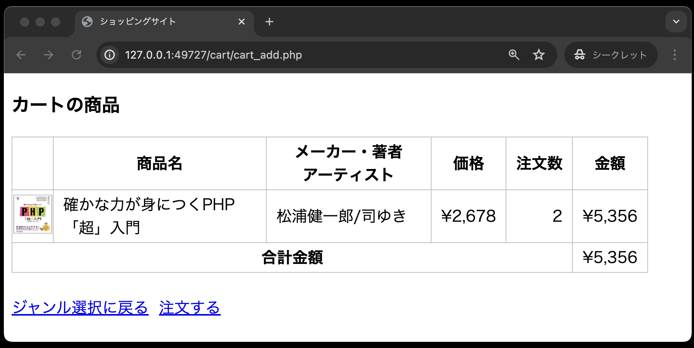

# 仕様書③ : カート内の商品画面、カート内の商品画面のバグ修正

- [仕様書③ : カート内の商品画面、カート内の商品画面のバグ修正](#仕様書--カート内の商品画面カート内の商品画面のバグ修正)
  - [事前準備](#事前準備)
  - [カートの概要説明](#カートの概要説明)
  - [本章から追加されたテーブルについて](#本章から追加されたテーブルについて)
  - [カート内の商品画面(cart\_list.php)の作成](#カート内の商品画面cart_listphpの作成)
  - [カート内に関するデータベース操作を行うクラスCart](#カート内に関するデータベース操作を行うクラスcart)
  - [注文追加機能(cart\_add.php)](#注文追加機能cart_addphp)
  - [カート内の商品画面(cart\_list.php)](#カート内の商品画面cart_listphp)
  - [動作確認](#動作確認)
  - [カート内の商品画面(cart\_list.php)のバグ修正](#カート内の商品画面cart_listphpのバグ修正)
  - [ディレクトリ構成の確認](#ディレクトリ構成の確認)
  - [動作確認](#動作確認-1)

## 事前準備

1. [こちらのページ]()から、ソースコードを`C:¥web_app_dev`へcloneしてください。

2. **「仕様書①,②」で作成した`public`ディレクトリ内のソースコードを、今回colneした`public`ディレクトリにコピーしてください。**
「仕様書①,②」で作成したソースコードをコピーすると、以下のようなディレクトリ構成となります。

```text
public
├── classes
│   ├── dbdata.php
│   └── product.php
├── css
│   └── minishop.css
├── images(中のファイル名は省略)
├── index.php
└── product
    ├── product_detail.php
    └── product_select.php
```

以降からは、このディレクトリ構成を前提として作業を進めていきます。

## カートの概要説明

カート内の商品画面(cart_list.php)には、以下の３つの機能が順番に追加されます。

- カート内に商品を追加する・・・仕様書③で実装する←本章はここ
- カート内の商品を表示する・・・仕様書③で実装する←本章はここ
- 特定の商品をカートから削除する・・・仕様書④で実装する
- カート内の商品の注文数を変更する・・・仕様書⑤で実装する


## 本章から追加されたテーブルについて

前章で作成したテーブルitemsに加え、新たにテーブルcartを作成します。

**テーブル名：cart**

| カラム名 | データ型 | 制約 | 備考 |
| - | - | - | - |
|ident|int型|主キー|商品番号|
|quantity|int型||注文数|

## カート内の商品画面(cart_list.php)の作成

カート内に商品を登録し、画面に表示するまでの一連の流れを以下に示します。

その商品がテーブルcartに登録され、カート内の商品画面(cart_list.php)がカート内の商品を表示します。

商品詳細画面

- 「カートに入れる」ボタンをクリック
- 商品番号と注文数を送信


カート内の商品画面

- 商品番号と注文数を受け取り、テーブルcartに登録
- テーブルcart内のすべてのデータを抽出し、画面に表示

**単一の商品がカート内に入っている場合**


**複数の商品がカート内に入っている場合**


上記の処理の流れですが、よりプログラム的に表現すると以下のようになります。
※実際の開発現場でも、抽象的なものをよりプログラム的な表現に変換することが求められます。

1. public/classes/cart.php にクラス`Cart`を宣言し、以下の2つのメソッドを定義
   1. `addItem`メソッド
      - 商品番号をキーにテーブルitemsから商品データを抽出
      - 注文数とあわせてテーブルcartに登録

   2. `getItems`メソッド
      - テーブルcart内のすべてのデータを抽出

2. 商品詳細画面(product_detail.php)から送られてくるリクエストを受け取る、注文追加(cart_add.php)を作成
   1. 商品詳細画面(product_detail.php)から送られてきた商品番号と注文数を取得
   2. クラス`Cart`のオブジェクトを生成
   3. `addItem`メソッドを呼び出し、テーブルcartに商品データと注文数を登録
   4. カート内の商品を表示する「cart_list.php」を読み込む

3. カート内の商品画面(cart_list.php)に、以下の処理を記述
   1. Cartオブジェクトの`getItems`メソッドを呼び出し、テーブルcart内のすべてのデータを抽出
   2. 抽出したテーブルcart内のすべてのデータを画面に表示(その際、金額と合計金額も計算し表示すること)

## カート内に関するデータベース操作を行うクラスCart

データベースの基本事項を定義するクラス`DbData`を継承し、カートに関するデータベース操作を行うクラス`Cart`を定義します。
定義するファイルは、public/classes/cart.php で、このクラス`Cart`には以下の２つのメソッドを定義します。

1. 商品番号をキーにテーブルitemsから商品データを抽出し、注文数とともにテーブルcartに登録するメソッド

```text
アクセス修飾子： public
メソッド名： addItem
引数： $ident(商品番号)、$quantity(注文数)
戻り値： なし
```

2. テーブルcart内のすべてのデータを抽出するメソッド

```text
アクセス修飾子： public
メソッド名： getItems
引数： なし
戻り値： カート内のすべてのデータの結果セット
```

以上の仕様から、クラス`Cart`を定義する「cart.php」を作成します。

**classes/cart.php**

```php
<?php
// スーパークラスであるDbDataを利用するため
require_once __DIR__ . '/dbdata.php';

class Cart extends DbData
{
  // 商品をカートに入れるメソッド
  // 【ヒント】商品番号($ident)と注文数($quantity)をテーブルcartに登録する処理①、②を記述する
  public function addItem($ident, $quantity)
  {
    // ① SQL文を定義する
    // ② 実行する
  }

  // カート内のすべてのデータを取り出すメソッド
  // 【ヒント】テーブルcart内のすべてのデータを抽出し、商品テーブルitemsの結果セットを返す処理①〜④を記述する
  public function getItems()
  {
    // ① SQL文を定義する
    // ② 実行する
    // ③ 結果セットを取り出す
    // ④ 結果セットを戻り値として返す
  }
}
```

【ヒント】 `getItems`メソッドで定義するSQL文は以下のとおりです。
テーブルcartの商品番号から商品テーブルitemsの項目を取り出す必要があるため、以下のようにJOINを使い、テーブルを結合し取得します。

```php
$sql = "SELECT items.ident, items.name, items.maker, items.price, cart.quantity, items.image, items.genre FROM cart JOIN items ON cart.ident = items.ident";
```

## 注文追加機能(cart_add.php)

※ファイルを作成する前に、1つ注意事項があります。
今後作成する **cart_xxx.php** というファイル名のファイルは、すべて`cart`ディレクトリに配置してください。
また、`cart`ディレクトリは、`public`ディレクトリに配置してください。

注文追加機能(cart_add.php)には、以下の処理を記述します。

1. 商品詳細画面(product_detail.php)から送られてきた商品番号と注文数を受け取る
2. クラス`Cart`のオブジェクトを生成する
3. Cartオブジェクトの`addItem`メソッドを呼び出し、テーブルcartに商品番号と注文数を登録する
4. カート内の商品を表示するカート内の商品画面(cart_list.php)を読み込む

**cart/cart_add.php**

```php
<?php
    // 送られてきた商品番号と数量を受け取る
    $ident = $_POST['ident'];
    $quantity = $_POST['quantity'];

    // Cartオブジェクトを生成し、カートに入れるメソッドを呼び出す
    require_once  __DIR__  .  '/../classes/cart.php';
    $cart = new Cart( );
    $cart->addItem($ident, $quantity);

    // cart_list.phpを読み込み、カート内の商品を画面に表示する
    require_once __DIR__ . '/cart_list.php';
```

## カート内の商品画面(cart_list.php)

この画面の完成形は以下のとおりです。(画面は3の商品がカートに入っている場合です。)


この画面と以下の処理概要を参考に、カート内の商品画面(cart_list.php)を作成します。

1. Cartオブジェクトの `getItems` メソッドを呼び出し、テーブルcart内のすべてのデータを抽出する
2. 抽出したテーブルcart内のすべてのデータを画面に表示する(金額と合計金額も)

**cart/cart_list.php**

```php
<?php
require_once  __DIR__  .  '/../header.php'; // header.phpを読み込む
?>

<h3>カートの商品</h3>
<table>
  <tr>
    <th>&nbsp;</th>
    <th>商品名</th>
    <th>メーカー・著者<br>アーティスト</th>
    <th>価格</th>
    <th>注文数</th>
    <th>金額</th>
  </tr>

  <!-- ====ここから以下の2つの処理を記載してください==== -->
  <!-- 1. CartオブジェクトのgetItemsメソッドを呼び出し、テーブルcart内のすべてのデータを抽出する -->

  <!-- 2. 抽出したテーブルcart内のすべてのデータを画面に表示する。商品一覧の表示に関しては、ジャンル別商品一覧画面(product_select.php)を参考にすると作りやすい。ただし、注文数欄、金額欄、合計金額欄の追加を忘れないこと。 -->
  <!-- =========================================== -->


<a href="../index.php">ジャンル選択に戻る</a>&nbsp;&nbsp;<a href="../order/order_now.php">注文する</a>

<?php
require_once  __DIR__ . '/../footer.php';  // footer.phpを読み込む
?>
```

【ヒント】画面に表示するにあたり、カート内の商品一覧表のセル(`<td>`や`<th>`)には以下の`class`属性の設定を以下のように行います。
なお、[「仕様書① : ジャンル選択画面、ジャンル別商品一覧画面」の**`<td>`セル内のクラス設定について**](../ec-site-i/README.md####tdセル内のクラス設定について)で説明した内容と同様のものです。

- 画像: `<td class="td_mini_img">` また、`` には `class="mini_img"` を設定する。
- 商品名: `<td class="td_item_name">`
- メーカー・著者・アーティスト: `<td class="td_item_maker">`
- 価格: `<td class="td_right">`
- 注文数: `<td class="td_right">` ←本章で追加
- 金額: `<td class="td_right">` ←本章で追加
- 合計金額: `<th colspan="5">` ←本章で追加

## 動作確認

商品詳細画面(product_detail.php)の「カートに入れる」ボタンをクリックすると、その商品がテーブル cart に登録され、カート内の商品画面(cart_list.php)が表示されることを確認してください。

**但し、この時点ではある「バグ」が潜んでいます。**
この動作確認が完了しましたら、バグの修正にうつります。

商品詳細画面：product_detail.php


カート内の商品画面：cart_list.php


複数の商品が入っている場合


## カート内の商品画面(cart_list.php)のバグ修正

作成したカート内の商品画面(cart_list.php)に、以下のバグが発見されたので、修正します。

【バグ内容】<br>
すでにカート内に入っている商品をさらに追加しようとするとエラーが発生します。


【修正内容】<br>
すでにカート内に入っている商品をさらに追加しようとした場合、注文数の追加として処理します。
但し、注文数は最大「10」個までとします。なお、追加して10個以上となる場合、**今回は強制的に10個にします。**

【ヒント】<br>
修正箇所は、クラス`Cart`の `addItem`メソッドです。
このメソッドを以下の内容に修正してください。

```text
1. 今回追加する商品データが既にカート内にあるかどうかをチェックする
2. 既にカート内にあるならば、今回の商品の注文数を加算する
3. 但し、加算して「10」個を超えるようなら、注文数は「10」とする
4. カート内にない商品なら、新たに注文データとして登録する
```

## ディレクトリ構成の確認

動作確認をする前に、ディレクトリ構成が以下のようになっていることを確認してください。

```text
public
├── cart
│   ├── cart_add.php ←本章で追加
│   └── cart_list.php ←本章で追加
├── classes
│   ├── cart.php ←本章で追加
│   ├── dbdata.php
│   └── product.php
├── css
│   └── minishop.css
├── images
├── index.php
└── product
    ├── product_detail.php
    └── product_select.php
```

## 動作確認

1. １つの商品がカートに入っている状態


2. 同じ商品をさらに2個カートに入れる


3. 注文数が追加され3個となった


4. 同じ商品を9個カートに入れる


5. 注文数は「12」とならず「10」となる


**ミニショップのカートに関する機能はまだ完成ではありません。pushはしないでください。**
