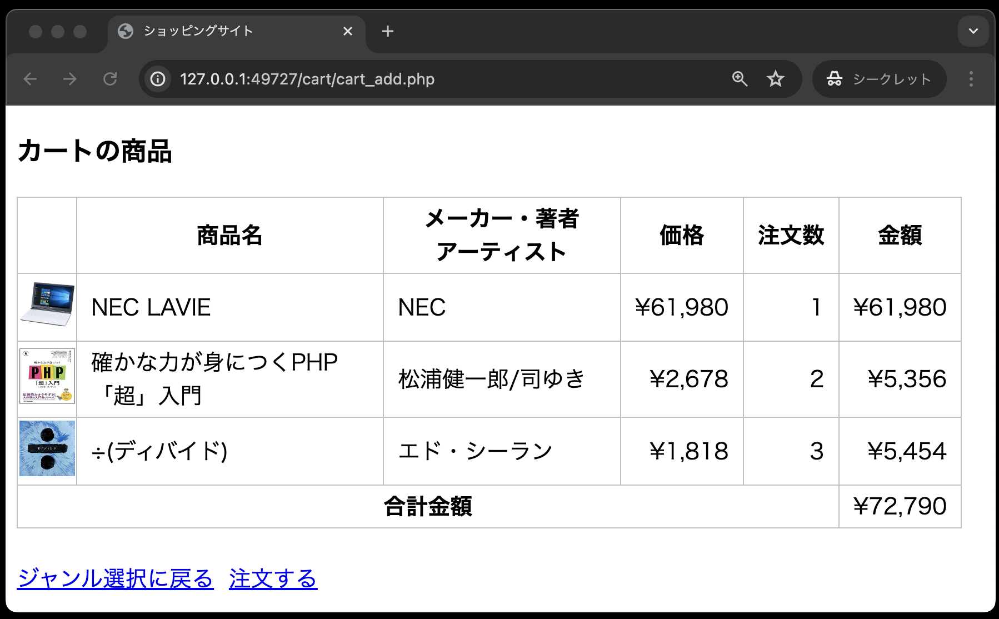
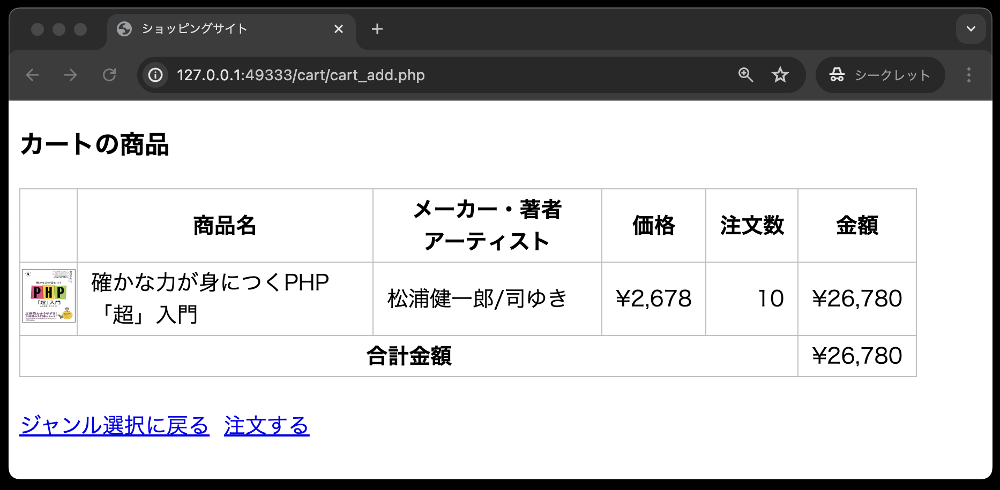

# 仕様書③ : カート内の商品画面、カート内の商品画面のバグ修正

- [仕様書③ : カート内の商品画面、カート内の商品画面のバグ修正](#仕様書--カート内の商品画面カート内の商品画面のバグ修正)
  - [事前準備](#事前準備)
  - [カート機能について](#カート機能について)
  - [本章から追加されたテーブルについて](#本章から追加されたテーブルについて)
  - [カート内の商品画面(cart\_list.php)の作成](#カート内の商品画面cart_listphpの作成)
  - [カート内に関するデータベース操作を行うクラスCart](#カート内に関するデータベース操作を行うクラスcart)
  - [商品詳細画面(product\_detail.php)からリクエストが送られてくる「注文追加」(cart\_add.php)](#商品詳細画面product_detailphpからリクエストが送られてくる注文追加cart_addphp)
  - [カート内の商品画面(cart\_list.php)](#カート内の商品画面cart_listphp)
  - [動作確認](#動作確認)
  - [カート内の商品画面のバグ修正](#カート内の商品画面のバグ修正)
  - [動作確認](#動作確認-1)

## 事前準備

1. [こちらのページ]()から、ソースコードを`C:¥web_app_dev`へcloneしてください。

2. **「仕様書①,②」で作成した`public`ディレクトリ内のソースコードを、今回colneした`public`ディレクトリにコピーしてください。**
「仕様書①,②」で作成したソースコードをコピーすると、以下のようなディレクトリ構成となります。

```text
public
├── classes
│   ├── dbdata.php
│   └── product.php
├── css
│   └── minishop.css
├── images(中のファイル名は省略)
├── index.php
└── product
    ├── product_detail.php
    └── product_select.php
```

以降からは、このディレクトリ構成を前提として作業を進めていきます。

## カート機能について

ここから、今回のミニショップで一番重要な「カート」に関する以下の機能を実装していきます。

1. カートに商品(情報)を入れる
2. カート内の商品を表示する
3. カート内の商品の注文数を変更する
4. カート内の特定の商品を削除する

こられの機能を実装するために、クラス`Cart`を宣言し、以下の4つのメソッドを定義します。

- `addItem`メソッド: 商品(情報)をカートに入れる
- `getItems`メソッド: カート内のすべての商品を取り出す(画面表示用)
- `changeQuantity`メソッド: カート内の商品の注文数を変更する
- `deleteItem`メソッド: カート内の特定の商品を削除する

## 本章から追加されたテーブルについて

前章で作成したテーブルitemsに加え、新たにテーブルcartを作成します。

**テーブル名：cart**

| カラム名 | データ型 | 制約 | 備考 |
| - | - | - | - |
|ident|int型|主キー|商品番号|
|quantity|int型||注文数|

## カート内の商品画面(cart_list.php)の作成

カート内に商品を登録し、画面に表示するまでの一連の流れを以下に示します。

その商品がテーブルcartに登録され、カート内の商品画面(cart_list.php)がカート内の商品を表示します。

商品詳細画面

- 「カートに入れる」ボタンをクリック
- 商品番号と注文数を送信


カート内の商品画面

- 商品番号と注文数を受け取り、テーブルcartに登録
- テーブルcart内のすべてのデータを抽出し、画面に表示

**単一の商品がカート内に入っている場合**


**複数の商品がカート内に入っている場合**


上記の処理の流れですが、よりプログラム的に表現すると以下のようになります。
※実際の開発現場でも、このように抽象的なものをよりプログラム的な表現に変換することが求められます。

1. public/classes/cart.php にクラス`Cart`を宣言し、以下の2つのメソッドを定義
   1. `addItem`メソッド
      - 商品番号をキーにテーブルitemsから商品データを抽出
      - 注文数とあわせてテーブルcartに登録

   2. `getItems`メソッド
      - テーブルcart内のすべてのデータを抽出

2. 商品詳細画面(product_detail.php)から送られてくるリクエストを受け取る、注文追加(cart_add.php)を作成
   1. 商品詳細画面(product_detail.php)から送られてきた商品番号と注文数を取得
   2. Cartクラスのオブジェクトを生成
   3. `addItem`メソッドを呼び出し、テーブルcartに商品データと注文数を登録
   4. カート内の商品を表示する「cart_list.php」を読み込む

3. カート内の商品画面(cart_list.php)に、以下の処理を記述
   1. Cartオブジェクトの`getItems`メソッドを呼び出し、テーブルcart内のすべてのデータを抽出
   2. 抽出したテーブルcart内のすべてのデータを画面に表示(その際、金額と合計金額も計算し表示すること)

## カート内に関するデータベース操作を行うクラスCart

データベースの基本事項を定義するクラス`DbData`を継承し、カートに関するデータベース操作を行うクラス`Cart`を定義します。
定義するファイルは、public/classes/cart.php で、このクラス`Cart`には次の２つのメソッドを定義します。

1. 商品番号をキーにテーブルitemsから商品データを抽出し、注文数とともにテーブルcartに登録するメソッド

```text
アクセス修飾子： public
メソッド名： addItem
引数： $ident(商品番号)、$quantity(注文数)
戻り値： なし
```

2. テーブルcart内のすべてのデータを抽出するメソッド

```text
アクセス修飾子： public
メソッド名： getItems
引数： なし
戻り値： カート内のすべてのデータの結果セット
```

以上の仕様から、クラス`Cart`を定義する「cart.php」を作成します。

**classes/cart.php**

```php
<?php
// スーパークラスであるDbDataを利用するため
require_once __DIR__ . '/dbdata.php';

class Cart extends DbData
{
  // 商品をカートに入れる ・・ テーブルcartに登録する
  public function addItem($ident, $quantity)
  {
    // ① SQL文を定義する
    // ② 実行する
  }

  // カート内のすべてのデータを取り出す
  public function getItems()
  {
    // ① SQL文を定義する
    // ② 実行する
    // ③ 結果セットを取り出す
    // ④ 結果セットを戻り値として返す
  }
}
```

【ヒント】 `getItems`メソッドで定義するSQL文は以下のとおりです。
テーブルcartの商品番号から商品テーブルitemsの項目を取り出す必要があるため、以下のようにJOINを使い、テーブルを結合し取得します。

```php
$sql = "SELECT items.ident, items.name, items.maker, items.price, cart.quantity, items.image, items.genre FROM cart JOIN items ON cart.ident = items.ident";
```

## 商品詳細画面(product\_detail.php)からリクエストが送られてくる「注文追加」(cart\_add.php)

このPHPファイルには、次の処理を記述する

```text
1. 商品詳細画面(product_detail.php)から送られてきた商品番号と注文数を受け取る。
2. Cartクラスのオブジェクトを生成する。
3. CartオブジェクトのaddItem( )メソッドを呼び出し、テーブルcartに商品データと注文数を登録する。
4. カート内の商品を表示する「cart_list.php」を読み込む。
```

**【注目】** この「cart\_add.php」のコードを次に示すが、今後次の2つのPHPを作成するときには、これを参考にする。

- 14\_ミニショップ4.pdfの「cart\_delete.php」(カート内の特定の商品を削除する)
- 14\_ミニショップ5.pdfの「cart\_change.php」(カート内の商品の注文数を変更する)

**ファイル：src\cart\cart_add.php**


2行目： `require_once  __DIR__  .  '/../classes/cart.php';`

**この絶対パスの書き方(「/../」の箇所)をしっかり理解すること。** 「cart\_add.php」と「cart.php」は次に示す配置となっている。


```text
src    
 |-- cart 
 |    |-- cart_add.php
 |
 |-- classes
 |    |-- cart.php
```

この「cart\_add.php」から「cart.php」へのパスを相対パスで記述すると 1つ上の階層に上がる必要があるため「../classes/cart.php」となる。

これを絶対パスで作成する場合、まず `__DIR__` でcart\_add.phpのパスを取得するが、このときの値が `C:\xampp\htdocs\14-minishop-GitHubのユーザー名\src\cart` となる。(Windowsの場合)

そして、やはり1つ上の階層へ上がるため `/../` が必要となるので、このような書き方となる。

## カート内の商品画面(cart\_list.php)

この画面の完成形は次の通り。(複数の商品がカート内に入っている場合)


この画面と次の処理概要を参考に、cart\_list.phpを作成する。

1. Cartオブジェクトの `getItems( )` メソッドを呼び出し、テーブルcart内のすべてのデータを抽出する。
2. 抽出したテーブルcart内のすべてのデータを画面に表示する。(金額と合計金額も)


**ファイル：src\cart\cart_list.php**


【ヒント】画面に表示するにあたり、各セルには次のクラス設定を行う。(13\_ミニショップ1.pdfの「**`<td>`セル内のクラス設定について**」を参照)

- 画像: `<td class="td_mini_img">` また、`` には `class="mini_img"` を設定する。
- 商品名: `<td class="td_item_name">`
- メーカー・著者・アーティスト: `<td class="td_item_maker">`
- 価格: `<td class="td_right">`
- 注文数: `<td class="td_right">`
- 金額: `<td class="td_right">`
- 合計金額: `<th colspan="5">`

**※注文数と合計金額は、cart_list.php で初めてでてきた項目です。**


## 動作確認

商品詳細画面(product\_detail.php)の「カートに入れる」ボタンをクリックすると、その商品がデータベース minishop のテーブル cart に登録され、カート内の商品画面(cart\_list.php)が表示されることを確認する。

商品詳細画面：product\_detail.php


カート内の商品画面：cart\_list.php


複数の商品が入っている場合


**但し、この時点ではある「バグ」が潜んでいる。 以降のページでは、バグの内容や修正方法について説明していく。**


## カート内の商品画面のバグ修正

作成したカート内の商品画面(cart_list.php)に、次のバグが発見されたので、これを修正する。

【バグ内容】

すでにカート内に入っている商品をさらに入れようとするとエラーが発生する。(ちなみに、このエラーメッセージはWindowsのみ表示されます。Macはエラーメッセージは表示されず、なんの処理も行われません。)


【修正内容】<br>
すでにカート内に入っている商品をさらに入れようとした場合、注文数の追加として処理する。 (アマゾン、楽天などがこの方法で処理している) 但し、注文数は最大「10」個までとする。※追加して10個以上となる場合、今回は強制的に10個にする。

【ヒント】<br>
修正箇所は、Cartクラスの `addItem( )`メソッド。 このメソッドを次の内容に修正する。

```text
1. 今回追加する商品データが既にカート内にあるかどうかをチェックする。
2. 既にカート内にあるならば、今回の商品の注文数を加算する。
3. 但し、加算して「10」個を超えるようなら、注文数は「10」とする。
4. カート内にない商品なら、新たに注文データとして登録する。
```


## 動作確認

1. １つの商品がカートに入っている状態


2. 同じ商品をさらに2個カートに入れる


3. 注文数が追加され3個となった


4. 同じ商品を9個カートに入れる


5. 注文数は「12」とならず「10」となる



**ミニショップのカートに関する機能はまだ完成ではありません。pushはしないでください。**
