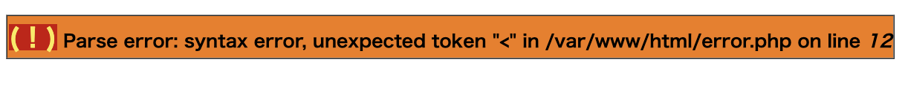
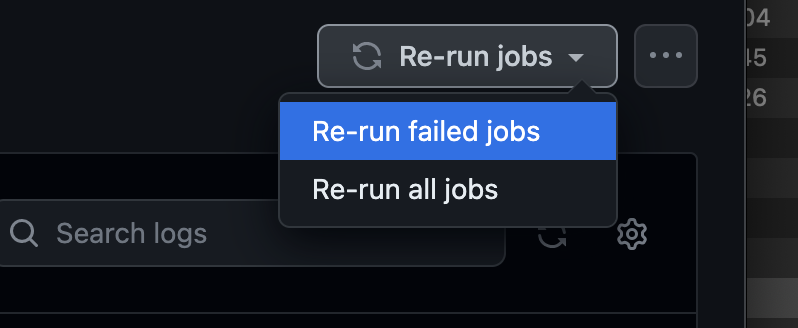

# はじめてのPHP

- [はじめてのPHP](#はじめてのphp)
  - [課題へのアクセス、受諾](#課題へのアクセス受諾)
    - [Gitの下準備](#gitの下準備)
    - [VSCode(Visual Studio Code)でのコード取得](#vscodevisual-studio-codeでのコード取得)
  - [はじめてのPHP](#はじめてのphp-1)
    - [プログラムを書く](#プログラムを書く)
    - [実行環境を準備する(Docker \& Dev Containers)](#実行環境を準備するdocker--dev-containers)
  - [エラーメッセージ](#エラーメッセージ)
  - [課題の作成と提出](#課題の作成と提出)
    - [テキストファイルの追加(add)とコミット(commit)](#テキストファイルの追加addとコミットcommit)
    - [テキストファイルをプッシュ(push)する](#テキストファイルをプッシュpushする)
  - [採点について](#採点について)
    - [課題の合格基準について](#課題の合格基準について)
    - [合格確認方法](#合格確認方法)
    - [エラーが出た時の対処法](#エラーが出た時の対処法)
      - [タイムアウトになっていないかを確認する](#タイムアウトになっていないかを確認する)
    - [プログラムが正確に書かれているか確認する](#プログラムが正確に書かれているか確認する)
  - [付録: Dev Containers](#付録-dev-containers)
    - [Dev Containersとは？](#dev-containersとは)
    - [なぜDev Containersを使うのか？](#なぜdev-containersを使うのか)
    - [Dev Containersの使用方法](#dev-containersの使用方法)

## 課題へのアクセス、受諾

[今回の課題ページ]()

1. 認証を求められた場合は、GitHubアカウントでログインしてください。<br><br>
   ※前回の授業までで、Gitがインストールできていない方は、[Git、GitHub](https://2024web1.github.io/web_app_dev/git/#git)の`Git`の章を参考に、インストールを行ってください。<br><br>
  ※前回の授業までで、GitHubアカウントを作成できていない方は、[Git、GitHub](https://2024web1.github.io/web_app_dev/git/#github)の `GitHub`, `GitHubアカウントの作り方`の章を参考にアカウント作成を行なってください。<br><br>

1. GitHub Classroomで自分の名前を選んでクリックして進めてください<br>
<br><br>
<br><br>

1. 招待の受け入れをすると、課題ページに到達します。ただし即座にできないこともあるため、 リロードしてみてと言われたらリロードしてください。<br>
<br>


1. 待たされたら、リロードするとOKです。<br>


1. リポジトリリンク(上記の水色背景行)をクリックすると、課題用に作成されたリポジトリにアクセスできます。

2. clone(取得)用のURLは、緑のボタン(code)から確認できます。httpsを選び、コピー用のボタンでクリップボードに一度取り込んでください。

<div style="page-break-before:always"></div>

### Gitの下準備

※前回の授業までで、commitの際に使う名前とメールアドレスが登録できていない方は、[Git、GitHub](https://2024web1.github.io/web_app_dev/git/#git%E3%81%AE%E4%B8%8B%E6%BA%96%E5%82%99)の`Gitの下準備`の章を参考に登録してください。

### VSCode(Visual Studio Code)でのコード取得

※前回の授業までで、VSCodeにプラグインの `Git Graph` がインストールできていない方は、[Git、GitHub](https://2024web1.github.io/web_app_dev/git/#%E3%83%97%E3%83%A9%E3%82%B0%E3%82%A4%E3%83%B3git-graph%E3%82%A4%E3%83%B3%E3%82%B9%E3%83%88%E3%83%BC%E3%83%AB)の`プラグインGit Graphインストール`の章を参考にインストールしてください。

1. `Ctrl+Shift+P`を押し、フォームに`git: clone`と入力し、`Git:クローン`を押してください。するとURLを貼り付けるフォームが出るので、先ほどコピーしたリポジトリのURLを貼り付け、Enterを押してください。
<br>

2. フォルダの選択画面になるので、`C:¥web_app_dev` フォルダを選択してください。(※認証を求められた場合は、ブラウザでアカウントを入れて認証してください。)
3. 認証に成功すれば、`C:¥web_app_dev` 直下にコード`03-first-php-GitHubのユーザー名`がcloneできている。cloneしたコードは、下記のような構成となります。

```text
C:¥web_app_dev
    └── 03-first-php-GitHubのユーザー名
        ├── 《中略》
        ├── src
        └── 《中略》
```

<div style="page-break-before:always"></div>

## はじめてのPHP

今回は、次のように画面に表示されるPHPファイルを作成することを目標としてください。<br>
<br>
**※出席番号と名前は各自のものが表示されるようにする**

### プログラムを書く

このPHPを作成し、ブラウザで実行確認する手順は次のとおり。

1. 各自の`src`フォルダに`first`フォルダを作成してください
2. `first`内に、`hello.php`ファイルを作成してください。フォルダの構造は下記のようになる。<br>

    ```text
    C:¥web_app_dev
       └── 03-first-php-GitHubのユーザー名
           ├── 《中略》
           ├── src
           │    └── first
           │        └── hello.php
           └── 《中略》
    ```

3. `hello.php`をVSCodeで開き、下記のコードを書く。<br>

    ```php

    <!DOCTYPE html> <!-- ① -->
    <html lang="ja"> <!-- ② -->

    <head>
        <meta charset="UTF-8">　<!-- ③ -->
        <title>はじめてのPHP</title>
    </head>

    <body>
        <?php // ④
        echo '<p>Hello,PHP</p>'; // ⑤
        ?>　<!-- ⑥ -->
        <p>0J0X00X神戸電子</p>
    </body>

    </html>

    ```

**`<!-- ① -->` や、`// ⑤` は注釈です。以降の章でも同様にコード内に番号で注釈を記載しますが、入力する必要はありません。**

①: この文書がHTMLのバージョン5で作成されたものであることを宣言している<br>
②: `lang="ja"` は、この文書が日本語で書かれていることを示している<br>
③: このPHPファイルが`UTF-8`の文字コードで書かれていることを示している<br>
④: ここからPHPスクリプト（プログラムコード）が始まることを示している（`<?php` で始まる）<br>
⑤: 画面に文字列や`<p>`タグなどのHTMLタグを出力するには`echo`コマンドを用い、文字列をシングルクォーテーションで囲む<br>
⑥: PHPスクリプト（プログラムコード）が終わったことを示している（`?>` で終わる）<br><br>

### 実行環境を準備する(Docker & Dev Containers)

1. Dockerをインストールできていない方は、[こちら](https://classroom.google.com/c/NjYwMjEyMzgyMzQ2/a/NjczMzA3MDU1MTA2/details)の添付資料を参考にインストールをお願いします。
2. Dockerを起動してください。
3. VScodeで、cloneしたフォルダ`03-first-php-GitHubのユーザー名`が開かれていることを確認してください。
4. `Ctrl+Shift+P`を押し、フォームに`reopen`と入力しすると、`Dev Containers: Rebuild and Reopen in Container`という項目が出るので選択してください。
5. VSCodeがこのような画面になれば成功です。
6. `http://localhost/03-first-php-GitHubのユーザー名/src/` にアクセスすると次のように表示されます。

1. `http://localhost/03-first-php-GitHubのユーザー名/src/first` にアクセスすると次のように表示されます。

1. `http://localhost/03-first-php-GitHubのユーザー名/src/first/hello.php` にアクセスすると次のように表示されます。


<div style="page-break-before:always"></div>

## エラーメッセージ

PHPは、スクリプトの文法上の誤りや、動作上の不具合をブラウザの画面に表示してくれます。

1. `error.php`を、`C:¥web_app_dev¥03-first-php-GitHubのユーザー名¥src¥first`フォルダに保存してください。
2. `error.php`に下記コードを書いてください。<br>

    ```php
    <!DOCTYPE html>

    <html lang="ja">

    <head>
        <meta charset="UTF-8">
        <title>エラーPHP</title> <!-- タイトルも変更する -->
    </head>

    <body>
        <?php
        echo <p>Hello,PHP</p>; // 文字列をシングルクォーテーションで囲まなかった  
        ?>
        <p>0J0X0XX神戸電子</p>
    </body>

    </html>
    ```

3. `http://localhost/03-first-php-GitHubのユーザー名/src/first/error.php` にアクセスすると次のように表示されます。
<br>
このメッセージは、次のように解釈することができます。<br>

   - `Parse error: syntax error, unexpected '<'`<br>
   予期しない `<` による構文エラー<br><br>

   - `in C:¥web_app_dev¥03-first-php-GitHubのユーザー名¥src¥first¥error.php on line 12`<br>
   その `<` は`error.php`の12行目に書かれている。<br><br>

<div style="page-break-before:always"></div>

## 課題の作成と提出

### テキストファイルの追加(add)とコミット(commit)

1. 課題として提出するファイルをVSCodeで開く。VSCodeのメニューから「ファイル->フォルダーを開く」を選択し、<br>`C:¥web_app_dev¥03-first-php-GitHubのユーザー名`を選択してください。
2. VSCodeサイドバーのGit Graphのアイコンを押す。
3. 変更の欄に`hello.php`,`error.php`が表示されていることを確認し、+ボタンを押す。<br>

1. 「ステージされている変更」に移動していれば、addは成功。
2. メッセージの欄にメッセージを入力し、✔のボタンを押すとcommitは完了。<br><br>

<div style="page-break-before:always"></div>

### テキストファイルをプッシュ(push)する

あとは課題を提出するのみ。

1. 変更の同期ボタンを押す。<br><br>
※ちなみにこの「変更の同期ボタン」は、「Branchの発行」という文言に変わることもあるが、どちらもリポートリポジトリにpushできるので問題ありません。

1. ブラウザで、再度課題のリンクにアクセスすると(cloneで使ったURLでも良い)、編集内容が反映されているのがわかる。<br>


<div style="page-break-before:always"></div>

## 採点について

提出した課題がGitHub上で自動採点されます採点自体は皆さんが特に意識するようなことはないが、提出した課題が合格したかは提出後に必ず確認してください

### 課題の合格基準について

`hello.php`をブラウザで開いた時、`Hello,PHP`と表示されること。<br>

### 合格確認方法

1. 課題を提出してください。※既に実施済み
1. 下記青色背景のページにアクセスしてください。※もしこのページを閉じている方は、
   [今回の課題ページ](https://classroom.github.com/a/t3R3ygFY)からアクセスすることができます<br>
   
2. 画面上部にある`Actions`をクリックしてください。<br>
   
3. **一番上**の行のタイトル横に、緑色のチェックが入っていればOK。※一番下に赤いばつ印があるが、無視してください。<br>
   

<div style="page-break-before:always"></div>

### エラーが出た時の対処法

自動採点がエラーになると、タイトルの横に赤いばつ印がでます。その場合の解決策を下記に示す。

#### タイムアウトになっていないかを確認する

※タイムアウト自体はGitHubの仕様上防ぎようがありませんので、あらかじめご了承ください。タイムアウトになっている場合は、GitHub上で処理を再開すると解決できます。<br>
例えば、エラーが出た場合、右端の赤枠で囲まれている箇所に処理時間がる。ここが4分前後かかっている場合は、タイムアウトの可能性を疑うこと。


具体的なタイムアウトの確認・解決方法は、

  1. タイトルが下記のようにリンクになっているので、クリック
      
  2. `Autograding`をクリック
      
  3. 赤いばつ印が出ている行をクリックし、開く
      
  4. `Operation timed out after 180000 milliseconds with 0 bytes received`のメッセージがあればタイムアウトである。
      
  5. 解決策としては、右上に`Re-run jobs`(再実行)のボタンがあるので、`Re-run failed jobs`(失敗した処理だけ再実行)をクリックしてください。
      <br>
      
  6. タイムアウトにならず処理が終了したらOK。また、タイムアウトになった場合は、同じことを繰り返す。※タイムアウトでないエラーは、次の解決策を参照。

### プログラムが正確に書かれているか確認する

プログラムが正確に書かれているかを確認してください。たとえ、ブラウザの画面でそれっぽく表示されても、自動採点ですので融通は聞きません。エラーが出た際は、以下の点を確認してください。

- `Hello,PHP`の大文字と小文字が正しく書けているか
- `Hello,PHP`の前後、間にスペースが入っていないか
- HTMLタグ(`<>`で囲まれているもの)が正しく書けているか
  
  - `Hello,PHP`前後の、`<p>`タグ大事です。HTMLでブラウザにテキスト(文字情報)を表示するときは、`<p>`タグなど、何らかのタグで括られているのが一般的です。タグの記述をおろそかにしないようにしましょう。

<div style="page-break-before:always"></div>

## 付録: Dev Containers

### Dev Containersとは？

Dev Containers（開発用コンテナ）は、VSCodeで使用できる拡張機能で、プロジェクトの開発環境をコンテナ技術を使って構築・管理することができます。ここで言う「コンテナ」とは、ソフトウェアを実行するための環境をパッケージ化する技術のことです。これにより、プログラミング言語やライブラリ、ツールなどの設定を含めた完全な開発環境を、誰でも簡単に再現・共有することができます。

### なぜDev Containersを使うのか？

1. **環境の一貫性**：チームメンバー全員が同じ開発環境を使用できるため、動作するはずのコードが特定のPCでは動かないという問題を防げます。

1. **セットアップの簡単化**：新しいプロジェクトに取り組む際、開発環境のセットアップに必要な手順を大幅に削減できます。必要なツールやライブラリが予めコンテナに組み込まれているため、すぐに開発を始めることができます。

1. **システムの汚染を避ける**：開発に必要な依存関係や設定をローカルのシステムにインストールすることなく、コンテナ内で完結させることができます。これにより、システムを「汚す」ことなく、さまざまなプロジェクトを進行できます。

### Dev Containersの使用方法

VSCodeにRemote - Containers拡張機能をインストール：この拡張機能をVSCodeに追加することで、Dev Containersの機能を利用できるようになります。
コンテナ設定ファイルの作成：プロジェクトに.devcontainerディレクトリを作成し、そこにdevcontainer.jsonファイルを置きます。このファイルには、使用するコンテナイメージや、インストールするソフトウェア、設定すべき環境変数などが記述されます。
コンテナの起動と接続：設定が完了したら、VSCodeからコンテナを起動し、自動的にその環境に接続します。これにより、ローカルの環境とは全く独立した状態でコーディングが可能になります。
Dev Containersは、特にチームでの開発や、多くの依存関係がある複雑なプロジェクトにおいて、非常に有効なツールです。一度設定を行えば、どんな環境でも同じ開発環境を再現できるため、開発の効率が大幅に向上します。
