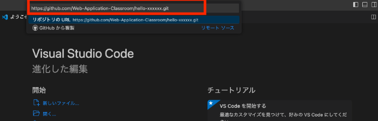

# HTMLとCSS

- [HTMLとCSS](#htmlとcss)
  - [事前準備](#事前準備)
  - [HTML(HyperText Markup Language)](#htmlhypertext-markup-language)
  - [CSS(Cascading Style Sheets)](#csscascading-style-sheets)
  - [課題へのアクセス、受諾](#課題へのアクセス受諾)
    - [Gitの下準備](#gitの下準備)
    - [VSCode(Visual Studio Code)でのコード取得](#vscodevisual-studio-codeでのコード取得)
      - [cloneできなかった場合](#cloneできなかった場合)
  - [HTMLを書いてみましょう](#htmlを書いてみましょう)
  - [HTML\&CSSサンプルを見てみましょう](#htmlcssサンプルを見てみましょう)
  - [ここまでのまとめ](#ここまでのまとめ)
  - [HTMLの構造について](#htmlの構造について)
  - [(付録)タグリファレンス](#付録タグリファレンス)
  - [課題の作成と提出](#課題の作成と提出)
    - [テキストファイルの追加(add)とコミット(commit)](#テキストファイルの追加addとコミットcommit)
    - [テキストファイルをプッシュ(push)する](#テキストファイルをプッシュpushする)
  - [採点について](#採点について)
    - [課題の合格基準について](#課題の合格基準について)
    - [合格確認方法](#合格確認方法)
    - [エラーが出た時の対処法](#エラーが出た時の対処法)
      - [タイムアウトになっていないかを確認する](#タイムアウトになっていないかを確認する)
    - [プログラムが正確に書かれているか確認する](#プログラムが正確に書かれているか確認する)

## 事前準備

必要ありません。エディタとして、VSCodeを使用します。

## HTML(HyperText Markup Language)

Webページを作るために使われるマークアップ言語の一つです。マークアップ言語とは、文章やデータなどのテキスト情報に対して、意味や構造を付与するための言語です。Webページには、テキスト、画像、動画、音声など様々なコンテンツが含まれますが、HTMLはこれらのコンテンツをどのように表示するかを指定するために使われます。

具体的には、HTMLでは各コンテンツに対して「タグ(<>)」と呼ばれる特定の記号を使って囲み、そのタグによって要素の意味や構造を示します。例えば、`<p>`というタグは段落を表し、``というタグは画像を表します。

## CSS(Cascading Style Sheets)

Webページの見た目を指定する言語です。CSSは、HTMLで定義された構造にスタイルを適用することで、Webページを美しく、読みやすくすることができます。

<div style="page-break-before:always"></div>

## 課題へのアクセス、受諾

[今回の課題ページ](https://classroom.github.com/a/Cwkmq6P5)

1. 認証を求められた場合は、GitHubアカウントでログインしてください。</br></br>
   ※前回の授業までで、Gitがインストールできていない方は、[01.Git.pdf](https://drive.google.com/file/d/1_RSMVeiXnsyUkVo-QhGpxZbwaxZPmqg7/view?usp=share_link)の`Git`の章を参考に、インストールを行ってください。</br></br>
  ※前回の授業までで、GitHubアカウントを作成できていない方は、[01.Git.pdf](https://drive.google.com/file/d/1_RSMVeiXnsyUkVo-QhGpxZbwaxZPmqg7/view?usp=share_link)の `GitHub`, `GitHubアカウントの作り方`の章を参考にアカウント作成を行なってください。</br>
  ※前回の授業までで、GitHubアカウントをGitHub Classroomにリンクできていない方は、[01.Git.pdf](https://drive.google.com/file/d/1_RSMVeiXnsyUkVo-QhGpxZbwaxZPmqg7/view?usp=share_link)の `課題へのアクセス、受諾`の章を参考にアカウント作成を行なってください。</br>

1. 招待の受け入れをすると、課題ページに到達できます。ただし即座にできないこともあるため、リロードしてみてと言われたらリロードしてみてください。※下の図のように待たされる場合があります。</br>


1. 待たされたら、リロードするとOKです。</br>


1. リポジトリリンク(上記の水色背景行)をクリックすると、課題用に作成されたリポジトリにアクセスできます。

1. clone(取得)用のURLは、緑のボタン(code)から確認できます。httpsを選び、コピー用のボタンでクリップボードに一度取り込んでください。

<div style="page-break-before:always"></div>

### Gitの下準備

※前回の授業までで、commitの際に使う名前とメールアドレスが登録できていない方は、[01.Git.pdf](https://drive.google.com/file/d/1_RSMVeiXnsyUkVo-QhGpxZbwaxZPmqg7/view?usp=share_link)の`Gitの下準備`の章を参考に登録してください。

### VSCode(Visual Studio Code)でのコード取得

※前回の授業までで、VSCodeにプラグインの `Git Graph` がインストールできていない方は、[01.Git.pdf](https://drive.google.com/file/d/1_RSMVeiXnsyUkVo-QhGpxZbwaxZPmqg7/view?usp=share_link)の`プラグインGit Graphインストール`の章を参考にインストールしてください。

1. `Ctrl+Shift+P`を押し、フォームに`git: clone`と入力し、`Git:クローン`を押してください。するとURLを貼り付けるフォームが出るので、先ほどコピーしたリポジトリのURLを貼り付け、Enterを押してください。</br>
</br>
1. フォルダの選択画面になるので、`C:¥xampp¥htdocs` フォルダを選択してください。(※認証を求められた場合は、ブラウザでアカウントを入れて認証してください。)
2. `C:¥xampp¥htdocs` 直下にコード`02_html-css-...`がcloneできています。</br></br>

#### cloneできなかった場合

現象と解決策は下記のいずれかと考えられます。

1. `repository not found`とエラーが出る。</br>
  過去に別のGitHubアカウントを作成し、Gitを利用した経験がある方は、`repository not found`のエラーでcloneできない場合があります。その場合は、下記サンプルのように、cloneするリポジトリのURLに`ユーザー名@`を追記し、再度cloneをしてください。※このユーザー名はアカウント作成時に登録したユーザー名です。</br>

```
https://ユーザー名@github.com/〜.git
```

1. cloneが終わらない。</br>
  エラーは出ないが、cloneがいつまで経っても終了しない場合があります。実際は、別ウインドウ・ブラウザで、GitHubアカウントの認証待ちの状態になっていることがあるので、認証を済ませてください。

1. `user.name`と`user.email`が設定できていない。</br>
  [Gitの下準備](#gitの下準備)に戻って、設定し直してください。

<div style="page-break-before:always"></div>

## HTMLを書いてみましょう

cloneした`02_html-css-...`は下記の構造をしています。※ちなみにcloneした  `02_html-css-...`の`...`には、Githubアカウントのユーザー名が入ります。

```text
02_html-css-...
├── <中略>
├── src
│   ├── helloWorld.html
│   ├── images
│   │   ├── pose_gutspose_couple.png
│   ├── sample.css
│   └── sample.html
└── <中略>
```

**以降の課題でも、`src`フォルダ内のコード以外は編集しませんので、他のファイルやフォルダは無視してください。**

`helloWorld.html`を開き、下記のコードを入力してください。※`<!-- -->`で囲まれている部分はコメントです。書く必要はありません。

`helloWorld.html`
```html:helloWorld.html
<!DOCTYPE html>
<html lang="ja">
    <head>
        <meta charset="UTF-8">
        <title>Hello,World</title>
    </head>
    <body>
        <p>Hello,World</p>
        <p>0J0X0XX神戸電子</p>   <!--自分の出席番号と名前に書き換えてください-->
    </body>
</html>
```

入力後、ブラウザで`helloWorld.html`を開いてください。下記のように表示されればOKです。


## HTML&CSSサンプルを見てみましょう

ここからは、より複雑なHTMLとCSSのサンプルを見ていきます。下記はHTMLとCSSのサンプルコードです。cloneしたソースコードの中にこれらは記入済みです。VSCodeで`sample.html`と`sample.css`をそれぞれ開いてみてください。

`sample.html`
```html:sample.html
<!DOCTYPE html>
<html lang="ja">
  <head>
    <meta charset="UTF-8">
    <!-- コメントを外すと、CSSが有効になります。 -->
    <!-- <link rel="stylesheet" href="sample.css"> -->
    <title>サンプルWebページ</title>
  </head>
  <body>
    <h1>サンプルWebページ</h1>
    
    <p>
      ようこそ、サンプルWebページへ!ここでは、「商品紹介ページ」という設定の元で、HTML&CSSの参考例を見ていきましょう。
      
    </p>
  
    <table>
      <tr>
        <th>商品名</th>
        <th>説明</th>
        <th>金額</th>
      </tr>
      <tr>
        <td>商品 A</td>
        <td>お求めやすい金額の商品です。</td>
        <td>¥300</td>
      </tr>
      <tr>
        <td>商品 B</td>
        <td>一般的な金額の商品です。</td>
        <td>¥3,000</td>
      </tr>
      <tr>
        <td>商品 C</td>
        <td>高級な金額の商品です。</td>
        <td>¥30,000</td>
      </tr>
    </table>
    
    <p>ご不明な点がございましたらお問合せください。 
      <a href="https://www.kobedenshi.ac.jp/">詳細はこちら</a>
    </p>
    
    <form>
      <label for="name">Name:</label>
      <input type="text" id="name" name="name" required>
      <label for="email">Email:</label>
      <input type="text" id="email" name="email" required>
      <label for="message">Message:</label>
      <textarea id="message" name="message" required></textarea>
      <input type="submit" value="Send">
    </form>
  </body>
</html>
```

`sample.css`
```css:sample.css
body {
  font-family: Arial, sans-serif;
  background-color: #f5f5f5;
  padding: 20px;
}

h1 {
  text-align: center;
  font-size: 36px;
  color: #333;
  margin-bottom: 20px;
}

table {
  width: 100%;
  border-collapse: collapse;
  margin-bottom: 20px;
}

th, td {
  border: 1px solid #ddd;
  padding: 10px;
  text-align: center;
}

th {
  background-color: #f2f2f2;
}

a {
  color: #333;
}

form {
  width: 50%;
  margin: 0 auto;
}

input[type="text"], textarea {
  width: 100%;
  padding: 10px;
  margin-bottom: 20px;
  border: 1px solid #ddd;
  border-radius: 5px;
  font-size: 16px;
}

input[type="submit"] {
  background-color: #333;
  color: #fff;
  padding: 10px 20px;
  border: none;
  border-radius: 5px;
  font-size: 16px;
  cursor: pointer;
}

input[type="submit"]:hover {
  background-color: #555;
}

img {
  max-width: 5%;
  height: auto;
}
```

今度は、`src`フォルダ内の`sample.html`をブラウザで開いてみてください。</br>


お世辞にも綺麗な画面とは言えませんね...</br>原因はHTMLに、CSSが反映されていないからです。では、CSSを反映しましょう。`sample.html`の下記の部分のコメントを外します。

```html:sample.html
<!-- <link rel="stylesheet" href="sample.css"> -->
```

コメントの外し方は、`Ctrl + /`です。コメントを外すと下記のようになります。

```html:sample.html
<link rel="stylesheet" href="sample.css">
```

では、もう一度ブラウザで`sample.html`を開いてみてください。CSSが動き、画面が綺麗になりました。</br>


<div style="page-break-before:always"></div>

## ここまでのまとめ

HTMLとCSSは、Webブラウザ上でテキストを美しく表示するために使われる言語です。HTMLはレイアウト、CSSはデザインの役割を持つと覚えましょう。</br>ただし、厳密にはHTMLやCSSはプログラミング言語ではなく、テキストを構造化するためのマークアップ言語であるため、HTMLやCSSだけでは、皆さんが普段利用しているような、制御構造を持つWebアプリケーションを構築することはできません。</br></br>
そこでサーバーサイド言語である**PHP**の出番です。本科目でPHPを学びながら、Webアプリケーションを構築する基本的な力を身につけていきましょう。</br>
※本科目は、PHPがメインのため、HTMLとCSSについてレクチャーするのは今回のみです。CSSについては基本的にこちらで用意します。HTMLについては、皆さんに書いてもらいますが、サンプルコードはあるのでご安心ください。</br>

## HTMLの構造について

最後にHTMLの概念的な構造について説明します。タグの種類を完璧に覚えるより、この概念を理解することが非常に大切です。HTMLは、階層構造を持ちます。階層構造とは、HTML要素が親要素と子要素の関係で組織化されていることを意味します。

HTMLの階層構造は、ツリーのような構造を持ちます。最上位の要素がルート要素（root element）であり、その下に複数の子要素があり、それらの子要素にさらに子要素を持つことができます。このように、要素は親要素と子要素の関係で結ばれ、階層的に組織化されます。

階層構造は、HTML文書の構造を定義するために使用されます。親要素は子要素を包み込み、子要素は親要素に含まれることになります。これにより、Webページのレイアウトやデザインを制御することができます。以下は、`sample.html`の階層構造を図示したものです。

```text
html
├── head
│   ├── meta
│   ├── title
└── body
    ├── h1
    ├── p
    │   ├── img
    ├── table
    │   ├── tr
    │   │   ├── th
    │   ├── tr
    │   │   ├── td
    │   ├── tr
    │   │   ├── td
    │   ├── tr
    │   │   ├── td
    ├── p
    │   ├── a
    ├── form
    │   ├── label
    │   ├── input
    │   ├── label
    │   ├── input
    │   ├── label
    │   ├── textarea
    │   ├── input
    └───
```

## (付録)タグリファレンス

`<!DOCTYPE html>`：HTML文書のバージョンとタイプを指定する宣言です。この宣言がない場合、ブラウザはHTML5として解釈されます。

`<head>`：HTML文書のヘッダーを定義するためのタグです。このタグ内には、文書のタイトル、スタイルシート、JavaScriptファイル、キーワード、説明などのメタデータが含まれます。

`<meta>`：HTML文書に関する情報を提供するためのタグです。charset属性を使用して、文書の文字エンコーディングを定義することができます。

`<title>`：HTML文書のタイトルを定義するためのタグです。このタグ内に書かれたテキストは、ブラウザのタブや検索エンジンの検索結果などで表示されます。

`<body>`：HTML文書の本文部分を定義するタグです。通常、ページのほとんどのコンテンツを含むブロック要素として使用されます。

`<h>`：タグはHTMLにおける見出しを定義するためのタグで、1から6までの数字で表される見出しレベルを持ちます。ドキュメントのセクションや節の見出しをマークアップするために使用されます。

`<p>`：タグはHTMLにおける段落を定義するタグです。文章やテキストを段落に分けるために使用されます。

``：画像を表示するためのHTML要素です。src属性に画像ファイルのURLを指定することで、画像を表示できます。

`<table>`：表を作成するために使用されるHTML要素です。通常、`<tr>`タグで定義された行と、`<th>`または`<td>`タグで定義された列から構成されます。

`<th>`：表の見出しを表すHTML要素です。このタグで囲まれたテキストは通常太字で表示されます。

`<td>`：表のセルを定義するHTML要素です。このタグで囲まれたテキストは通常標準のフォントで表示されます。

`<a>`：アンカータグとして知られ、他のページやWebサイトへのリンクを作成するために使用されます。href属性にリンク先のURLを指定することで、ユーザーがクリックすると指定されたページに移動します。

`<label>`:HTMLのフォーム要素に関連付けられたラベルを定義するためのタグです。for属性を使用して、ラベルと対象のフォーム要素を関連付けます。

`<form>`：ユーザーからの入力を受け付けるためのHTML要素です。このタグと以下の<`input`>,<`textarea`>に関しては、重要なタグであるため詳しく別の章で説明します。

`<input>`:HTMLのフォーム要素で、ユーザーにテキスト入力やボタンの選択などのインタラクティブな操作を可能にするためのタグです。

`<textarea>`:HTMLのフォーム要素で、複数行のテキストの入力を可能にするためのタグです。

<div style="page-break-before:always"></div>

## 課題の作成と提出

### テキストファイルの追加(add)とコミット(commit)

1. 課題として提出するファイルをVSCodeで開きます。VSCodeのメニューから「ファイル->フォルダーを開く」を選択し、</br>`C:¥xampp¥htdocs¥02_html-css-...`を選択します。
1. VSCodeサイドバーのGit Graphのアイコンを押します。
2. 変更の欄に`helloWorld.html`と`sample.html`が表示されていることを確認し、+ボタンを押します。</br>

3. `helloWorld.html`と`sample.html`が「ステージされている変更」に移動していれば、addは成功です。</br>

4. メッセージの欄にメッセージを入力し、✔のボタンを押すとコミットは完了です。</br></br>

### テキストファイルをプッシュ(push)する

あとは課題を提出するのみです。

1. 変更の同期ボタンを押します。</br></br>
※ちなみにこの「変更の同期」ですが、同じローカルリポジトリを繰り返しpushすると、「Branchの発行」という文言に変わることがありますが、どちらもリモートリポジトリにpushできるので問題はありません。

1. ブラウザで、再度課題のリンクにアクセスすると(cloneで使ったURLでも良い)、編集内容が反映されていることがわかります。</br>


## 採点について

今回から、提出した課題がGitHub上で自動採点されます。ですので提出後、課題が合格しているかを確認するようにしてください。合格していない場合は、修正後、再提出してください。

### 課題の合格基準について

`helloWorld.html`をブラウザで開いた時、`Hello,World`と表示されること。</br>

<div style="page-break-before:always"></div>

### 合格確認方法

1. 課題を提出した後、下記青色背景のページにアクセスする。※もしこのページを閉じている方は、
   [今回の課題ページ](https://classroom.github.com/a/Cwkmq6P5)からアクセスすることができます。</br>
   
2. 画面上部にある`Actions`をクリックする。</br>
   
3. **一番上**の行のタイトル横に、緑色のチェックが入っていればOKです。確認したところ、自動採点には2,3分かかります。場合によってはもう少しかかるかもしれません。※一番下に赤いばつ印がありますが、無視してください。</br>
   

<div style="page-break-before:always"></div>

### エラーが出た時の対処法

自動採点がエラーになると、タイトルの横に赤いばつ印がでます。その場合の解決策を下記に示します。

#### タイムアウトになっていないかを確認する

※タイムアウト自体はGitHubの仕様上防ぎようがありませんので、あらかじめご了承ください。タイムアウトになっている場合は、GitHub上で処理を再開すると解決できる。<br>
例えば、エラーが出た場合、右端の赤枠で囲まれている箇所に処理時間がる。ここが4分前後かかっている場合は、タイムアウトの可能性を疑ってください。


具体的なタイムアウトの確認・解決方法は、

  1. タイトルが下記のようにリンクになっているので、クリック
      
  2. `Autograding`をクリック
      
  3. 赤いばつ印が出ている行をクリックし、開く
      
  4. `Operation timed out after 180000 milliseconds with 0 bytes received`のメッセージがあればタイムアウトである。
      
  5. 解決策としては、右上に`Re-run jobs`(再実行)のボタンがあるので、`Re-run failed jobs`(失敗した処理だけ再実行)をクリックする。
      </br>
      
  6. タイムアウトにならず処理が終了したらOK。また、タイムアウトになった場合は、同じことを繰り返す。※タイムアウトでないエラーは、次の解決策を参照。

### プログラムが正確に書かれているか確認する

プログラムが正確に書かれているかを確認してください。たとえ、ブラウザの画面でそれっぽく表示されても、自動採点ですので融通は聞きません。エラーが出た際は、以下の点を確認してください。

- `Hello,World`の大文字と小文字が正しく書けているか
- `Hello,World`の前後、間にスペースが入っていないか
- HTMLタグ(`<>`で囲まれているもの)が正しく書けているか
  
  - `Hello,World`前後の、`<p>`タグ大事です。HTMLでブラウザにテキスト(文字情報)を表示するときは、`<p>`タグなど、何らかのタグで括られているのが一般的です。タグの記述をおろそかにしないようにしましょう。
