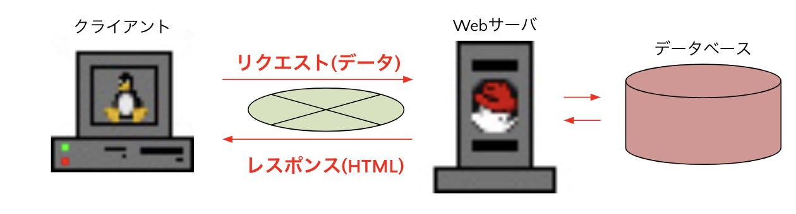
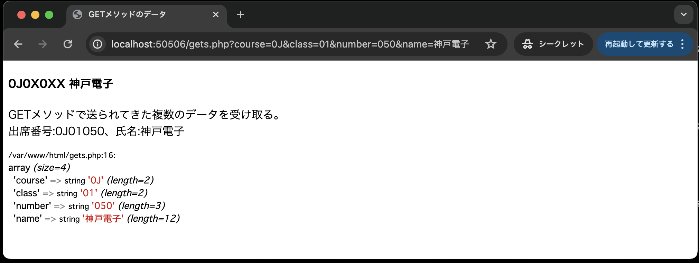

# データ送信

- [データ送信](#データ送信)
  - [事前準備](#事前準備)
  - [HTTP（HyperText Transfer Protocol）](#httphypertext-transfer-protocol)
  - [URL （Uniform Resource Locator）](#url-uniform-resource-locator)
  - [HTTPのメソッド](#httpのメソッド)
    - [GETとPOSTの特徴](#getとpostの特徴)
  - [GETメソッドでデータ送信](#getメソッドでデータ送信)
  - [GETメソッドで複数のデータを送信](#getメソッドで複数のデータを送信)
  - [付録: `var_dump()`で連想配列を理解する](#付録-var_dumpで連想配列を理解する)

## 事前準備

[こちらのページ]()から、ソースコードを`C:¥web_app_dev`へcloneすること。

## HTTP（HyperText Transfer Protocol）

Webアプリケーションでは、クライアント（Webブラウザ）からWebサーバーへHTTPのプロトコルを使ってデータを送信しています。



HTTPの特徴は次の通り。

1. クライアント/サーバモデル
2. シンプルな構造
3. オーバーヘッドが少ない
4. ステートレス （ステート：状態、レス：ない）

## URL （Uniform Resource Locator）

URLとは、インターネットのリソースに対する統一的な名前付けの手法です。

例えば、「はじめてのPHP」の章で作成した`hello.php`にアクセスする場合のURLは以下のようになっていました。

```text
http：//localhost(:ポート番号)/hello.php
```

上記URLもルールに則り構成されており、大きく3つの要素に分類されます。

1. **スキーム(http://):** スキームには、そのリソースにたどり着くまでの手段(通信プロトコル)が含まれています。よく見るものとしてはhttpや、TLS/SSLによって通信経路が暗号化されるhttpsなどがあります。</br></br>
1. **ホスト名(localhost(:ポート番号)):** ホスト名には、リクエスト先のサーバの名前が入ります。ですので、今回この授業で用意されたサーバの名前は`localhost`となります。</br></br>
1. **パス(/hello.php):** パスには、ホスト名で指定されたサーバーのリソースへのパスが入ります。ちなみに、`public`ディレクトリ直下のパスがこの部分にあたります

## HTTPのメソッド

クライアントからWebサーバへリクエスト送信時にサーバでの処理方法も併せて送信します。


### GETとPOSTの特徴


## GETメソッドでデータ送信

それでは、まずGETメソッドを使って、データを送信してみましょう。

1. `public`ディテクトリ内に、`get.php`ファイルを作成し、以下のコードを入力してください。

`get.php`

```php
<!DOCTYPE html>
<html lang="ja">

<head>
    <meta charset="UTF-8">
    <meta name="viewport" content="width=device-width, initial-scale=1.0">
    <title>GETメソッドのデータ</title>
</head>

<body>
    <h4>0J0X0XX神戸電子</h4>
    <p>GETメソッドで送られてきたパラメータ名dataの値は、
        <?php
        echo $_GET['data'] . " です。</p>";
        ?>
</body>

</html>
```

`$_GET['data']`: HTTPのGETメソッドで送られてきたパラメータ名 `data` の値を受け取る処理です。 </br>この `$_GET[ ]`は、PHPの定義済み変数の一つで、その実態は連想配列です。

この `get.php` に、ブラウザから`http://localhost/05_http_get-GitHubのユーザー名/src/get.php` でアクセスすると、次のようなエラー画面となる。


これは、`$_GET['data']`でパラメータ名 `data` の値を受け取ろうとしているが、実際には値が送られてきていないため。

GETメソッドでデータを送信するときは、「クエリパラメータ」の仕組みを利用する。具体的には、リクエストとして送信したいデータを `?パラメータ名=値` の形式でURLの最後に付与する。

そこで、`http://localhost/05_http_get-GitHubのユーザー名/src/get.php?data=神戸` でアクセスすると次のように表示される。


## GETメソッドで複数のデータを送信

複数のデータをGETメソッドで送信するときは、次のように「パラメータ名=値」を「&」で連結する。

`http://localhost/05_http_get-GitHubのユーザー名/src/gets.php?course=0J&class=01&number=050&name=神戸電子` </br></br>

このデータを受け取る `gets.php` のコードは次の通り。

**gets.php**


<div style="page-break-before:always"></div>

`http://localhost/05_http_get-GitHubのユーザー名/src/gets.php?course=0J&class=01&number=050&name=神戸電子` </br>
このURLでアクセスすると次のように表示される


## 付録: `var_dump()`で連想配列を理解する

`var_dump()`関数は、PHPで変数のデータ型や値を出力するために使用される。変数の値と型が出力されるため、デバッグ時に非常に役立つ関数である。配列やオブジェクトなどの複雑なデータ構造を表示することもできる。

今回は、例として、クエリパラメータのデータが、連想配列形式で`$_GET`に格納されていることを `var_dump()` 関数で確認する。

`gets.php`のプログラムに、`var_dump`関数を追加する。

```PHP
<!DOCTYPE html>
<html lang="ja">

<head>
    <meta charset="UTF-8">
    <title>GETメソッドのデータ</title>
</head>

<body>
    <h4>0J0X0XX神戸電子</h4>
    GETメソッドで送られてきた複数のデータを受け取る。<br>
        <?php
        echo "出席番号:" . $_GET['course'] . 
        $_GET['class'] . $_GET['number'] . 
        "、氏名:" . $_GET['name'];
        
        // 下記2行を追加
        echo '</br>';
        var_dump($_GET);
        ?>
</body>

</html>
```

`http://localhost/05_http_get-GitHubのユーザー名/src/gets.php?course=0J&class=01&number=050&name=神戸電子` にアクセスすると、下記の画面が表示される。


赤枠が、`var_dump()`によって出力された`$_GET`の中身である。配列の中に4つの要素があり、「キー」と「値」のペアで格納されていることがわかる。また、`var_dump()`では、格納されている「値」の型の情報も出力される。

このように、中身がわからない、変数や配列、オブジェクトなどを`var_dump()`で確認できるので、特にデバッグ時に非常に役に立つ。
