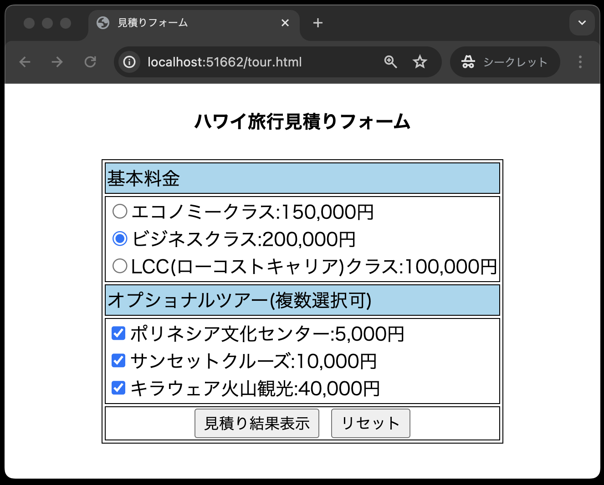
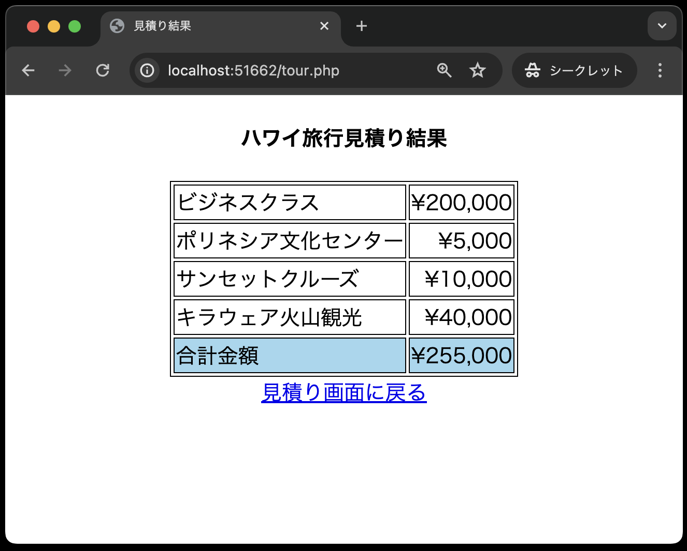

# 「入力フォーム」のチャレンジ問題

- [「入力フォーム」のチャレンジ問題](#入力フォームのチャレンジ問題)
  - [チャレンジ問題について](#チャレンジ問題について)

## チャレンジ問題について

[「入力フォーム」の課題](../http-post-kadai/README.md)が早めに終わった方はこちらをチャレンジしてみてください。
(※あくまでチャレンジ問題ですので、評価には含まれません。)

- 『「入力フォーム」の課題』のcloneした、`public`ディレクトリに、`tour.html`、`tour.php`、`tour.html`作成し、以下のようにブラウザに表示される見積もりフォームを作成してください。

`tour.html`


`tour.php`


なお、`tour.css`は自力で作成する必要はありません。以下のソースコードをコピーして貼り付けてください。

`tour.css`
```css
@charset "UTF-8";
/* ページ全体を中央に表示(センタリング)するには、
ページ全体である<body>~</body>の中に<div>~</div>を入れ、
その<div>~</div>を中央に表示する。

tour.htmlとtour.phpでは、<body>~</body>の中に
<div id="main">~</div>を入れている。

次のbodyと#mainの2つの設定でセンタリングが実装される。
*/

/* body要素内の文字列をセンタリング */
body {
    text-align: center;
}

/* <div id="main">~</div>全体をセンタリング ・・ 先頭に「#」」をつけるとid属性を表す */
#main {
    margin: 0 auto;
    /* 上下のマージンを0、左右のマージンをauto(オート:自動)にすることで中央に配置される */
}

/* id属性がmainTableであるテーブルの境界線を1ピクセルとし、センタリング表示する */
#mainTable {
    border: 1px solid;
    margin: 0 auto;
}

/* テーブルのセル(<td>と</td>で囲まれた領域)の境界線を1ピクセル、文字列表示をデフォルトの左詰めにする */
td {
    border: 1px solid;
    text-align: left;
}

/* titleColorクラス属性を持つセルの背景色を指定する ・・ 先頭に「.」(ピリオド)をつけるとクラス属性を表す */
.titleColor {
    background-color: #a0d8ef;
}

/* centerPosクラス属性を持つセル内の文字列を中央に表示する */
.centerPos {
    text-align: center;
}

/* rightPosクラス属性を持つセル内の文字列を右詰めに表示する(数字の場合デフォルト) ・・ これも*/
.rightPos {
    text-align: right;
}
```
