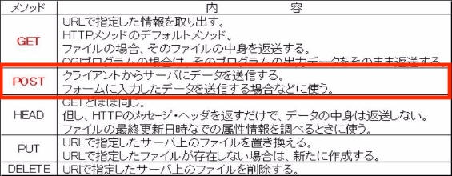
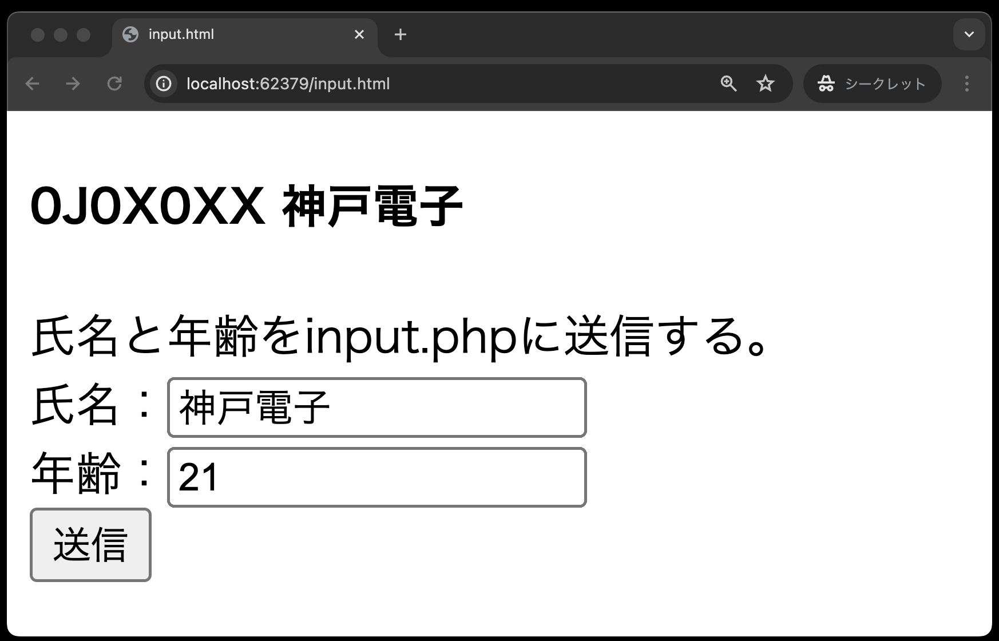
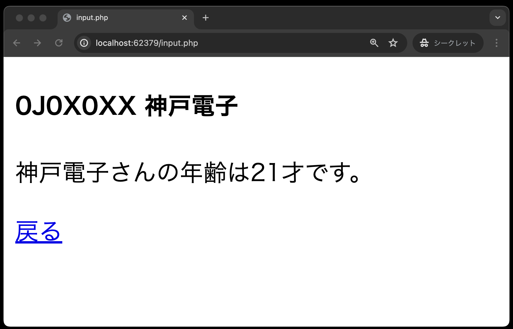

# 入力フォーム①
- [入力フォーム①](#入力フォーム)
  - [事前準備](#事前準備)
  - [本章でのデータ送信について](#本章でのデータ送信について)
  - [POSTメソッドでデータ送信](#postメソッドでデータ送信)
    - [テキストボックス](#テキストボックス)
  - [付録:PHPの定義済み変数について](#付録phpの定義済み変数について)

## 事前準備

[こちらのページ](https://classroom.github.com/a/kERZGGDr)から、ソースコードを`C:¥web_app_dev`へcloneしてください。

## 本章でのデータ送信について

本章では、様々な種類の入力フォームを使用し、POSTメソッドでデータを送信する方法を学びます。



## POSTメソッドでデータ送信

### テキストボックス

`public`ディレクトリ直下に`input.html`、`input.php`を作成してください。

まずは、入力フォーム の一種であるテキストボックスを使用し、`input.html`からPOSTメソッドでデータを送信し、それを受け取って`input.php`をブラウザに表示することを目標とします。

※ブラウザ上での確認方法を忘れた方は、[『PHPの基本』の「ブラウザ上での確認」](https://2024web1.github.io/web_app_dev/basicphp/#%E3%83%96%E3%83%A9%E3%82%A6%E3%82%B6%E4%B8%8A%E3%81%A7%E3%81%AE%E7%A2%BA%E8%AA%8D)を参考にしてください。

`input.html`


`input.php`


※POSTメソッドで送信した場合、URL末尾にデータ(クエリパラメータ)は表示されません。

`input.html`

```php
<!DOCTYPE html>
<html lang="ja">

<head>
  <meta charset="UTF-8">
  <meta name="viewport" content="width=device-width, initial-scale=1.0">
  <title>input.html</title>
</head>

<body>
  <h4><!-- ここに"出席番号 名前"を入れてください --></h4>
  氏名と年齢をinput.phpに送信する。<br>
  <form method="POST" action="input.php"> <!-- ① -->
    氏名：<input type="text" name="name"><br> <!-- ② -->
    年齢：<input type="text" name="age"><br> <!-- ③ -->
    <input type="submit" value="送信">  <!-- ④ -->
  </form>
</body>

</html>
```

①: 入力したデータを `input.php` にHTTPのプロトコル`POST` を使って送信する。<br>
②: 氏名のテキストボックスに入力された値のパラメータ名（変数名）を`name`とする。<br>
③: 年齢のテキストボックスに入力された値のパラメータ名（変数名）を`age`とする。<br>
④: ボタンに表示する値を「送信」とし、クリックすると10行目の`<form>`タグで定義した方法でデータを送信する。<br>

`input.php`

```php
<!DOCTYPE html>
<html lang="ja">

<head>
    <meta charset="UTF-8">
    <meta name="viewport" content="width=device-width, initial-scale=1.0">
    <title>input.php</title>
</head>

<body>
    <h4><!-- ここに"出席番号 名前"を入れてください --></h4>
    <?php
    echo '<p>' . $_POST['name'] . 'さんの年齢は' . $_POST['age'] . '才です。</p>';
    ?>
    <a href='input.html'>戻る</a>
</body>

</html>
```

※`$_POST['パラメータ名']` で送信されてきたデータを受け取ることができます。この `$_POST[ ]`も、`$_GET[ ]`同様、PHPの定義済み変数の一つで、その実態は連想配列です。

## 付録:PHPの定義済み変数について

ここで紹介するのは、PHPの定義済み変数の一部ですが、本授業で使用するものなので、この機会に知っておきましょう。

`$_GET[ ]`: HTTPのプロトコルGETで現在のスクリプトに渡された変数の連想配列です。クエリストリングスで送られてきたデータを受け取るときに使用します。

`$_POST[ ]`: HTTPのプロトコルPOSTで
現在のスクリプトに渡された変数の連想配列です。入力フォームから送られてきたデータを受け取るときに使用します。

`$_COOKIE[ ]`: クライアントから送られてきたクッキーの連想配列です。 （以降のセクションで取り扱う予定）

`$_SESSION[ ]`: セッションによって保存されたデータにアクセスするための連想配列です。（以降のセクションで取り扱う予定）

`$_SERVER[ ]`: HTTPのどのメソッドでデータが送られてきたかを確認するには `$_SERVER['REQUEST_METHOD']`を利用します。これも連想配列で、値は `GET`、`POST`、`PUT`、`HEAD` などが取得できます。

**使用例**

```PHP
if ($_SERVER['REQUEST_METHOD'] === 'POST') {

    $data = $_POST['パラメータ名'];

} else if ($_SERVER['REQUEST_METHOD'] === 'GET') {

    $data = $_GET['パラメータ名'];

}
```

これを使うことにより、同じパラメータ名だが、時には `GET` で、時には `POST` で送られてくるデータを処理することができます。この授業で「ショッピングサイト」を作成しますが、その時に使う予定です。

**本章はサンプルコードです。課題提出はございません。次章入力フォーム②に続きます。**
