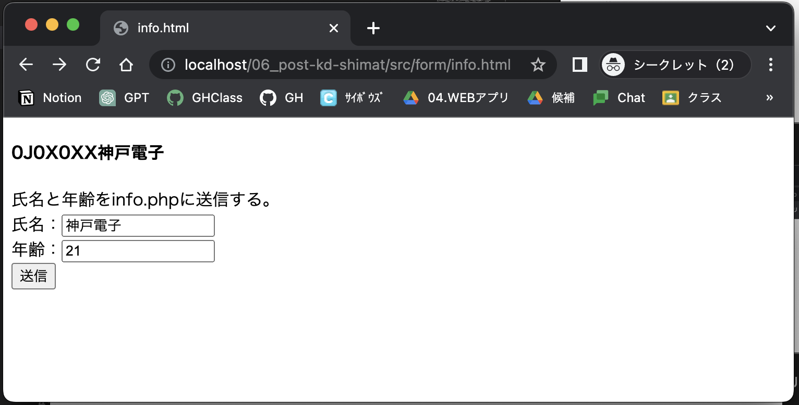
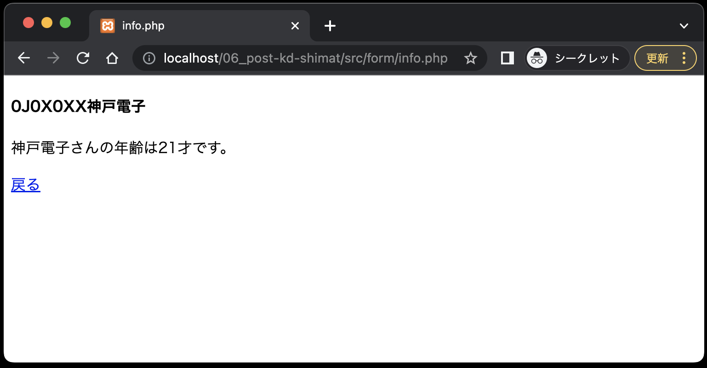
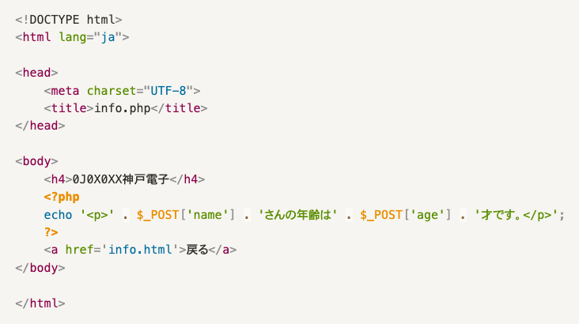

# 入力フォーム①
- [入力フォーム①](#入力フォーム)
  - [事前準備](#事前準備)
  - [POSTメソッドでデータ送信](#postメソッドでデータ送信)
  - [付録:PHPの定義済み変数について](#付録phpの定義済み変数について)

## 事前準備

[こちらのページ]()から、ソースコードを`C:¥web_app_dev`へcloneしてください。

## POSTメソッドでデータ送信

まずは、入力フォーム (`info.html`) からPOSTメソッドでデータを送信し、それを受け取ってブラウザに表示する(`info.php`)ことを目標とします。

**info.html**


**info.php**


※POSTメソッドで送信した場合、URLにデータ(クエリパラメータ)は表示されません。

**info.html**

```php
<!DOCTYPE html>
<html lang="ja">

<head>
  <meta charset="UTF-8">
  <meta name="viewport" content="width=device-width, initial-scale=1.0">
  <title>info.html</title>
</head>

<body>
  <h4><!-- ここに"出席番号 名前"を入れてください --></h4>
  氏名と年齢をinfo.phpに送信する。<br>
  <form method="POST" action="info.php"> <!-- ① -->
    氏名：<input type="text" name="name"><br> <!-- ② -->
    年齢：<input type="text" name="age"><br> <!-- ③ -->
    <input type="submit" value="送信">  <!-- ④ -->
  </form>
</body>

</html>
```

①: 入力したデータを `info.php` にHTTPのプロトコル`POST` を使って送信する。<br>
②: 氏名のテキストボックスに入力された値のパラメータ名（変数名）を`name`とする。<br>
③: 年齢のテキストボックスに入力された値のパラメータ名（変数名）を`age`とする。<br>
④: ボタンに表示する値を「送信」とし、クリックすると10行目の`<form>`タグで定義した方法でデータを送信する。<br>

<div style="page-break-before:always"></div>

**info.php**



※`$_POST['パラメータ名']` で送信されてきたデータを受け取る。この `$_POST[ ]`も、`$_GET[ ]`同様、PHPの定義済み変数の一つで、その実態は連想配列である。

<div style="page-break-before:always"></div>

## 付録:PHPの定義済み変数について

ここで紹介するのは、PHPの定義済み変数の一部だが、本授業で使用するものなので、この機会に知っておくこと。

`$_GET[]`: HTTPのプロトコルGETで現在のスクリプトに渡された変数の連想配列である。クエリストリングスで送られてきたデータを受け取るときに使用する。

`$_POST[]`: HTTPのプロトコルPOSTで
現在のスクリプトに渡された変数の連想配列である。入力フォームから送られてきたデータを受け取るときに使用する。

`$_COOKIE[]`: クライアントから送られてきたクッキーの連想配列である。 （以降のセクションで取り扱う予定）

`$_SESSION[]`: セッションによって保存されたデータにアクセスするための連想配列である。（以降のセクションで取り扱う予定）

`$_SERVER[]`: HTTPのどのメソッドでデータが送られてきたかを確認するには `$_SERVER['REQUEST_METHOD']`を利用する。これも連想配列で、値は `GET`、`POST`、`PUT`、`HEAD` などが取得できる。

**使用例**

```PHP
if ($_SERVER['REQUEST_METHOD'] === 'POST') {

    $data = $_POST['パラメータ名'];

} else if ($_SERVER['REQUEST_METHOD'] === 'GET') {

    $data = $_GET['パラメータ名'];

}
```

これを使うことにより、同じパラメータ名だが、時には `GET` で、時には `POST` で送られてくるデータを処理することができる。この授業で「ショッピングサイト」を作成するが、その時に使う予定である。
