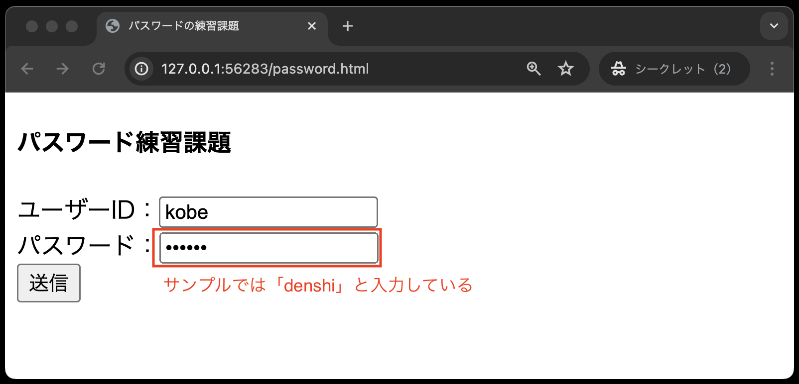
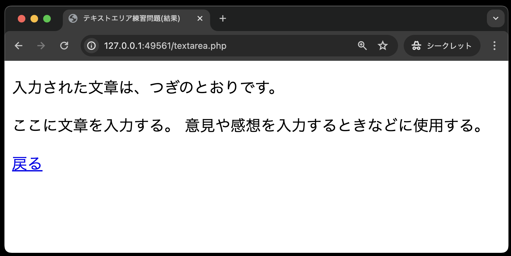

# 入力フォーム課題

- [入力フォーム課題](#入力フォーム課題)
  - [事前準備](#事前準備)
  - [今回の課題について](#今回の課題について)
  - [パスワード](#パスワード)
    - [password.html](#passwordhtml)
    - [password.php](#passwordphp)
  - [プルダウン](#プルダウン)
    - [pulldown.html](#pulldownhtml)
    - [pulldown.php](#pulldownphp)
  - [テキストエリア](#テキストエリア)
    - [textarea.html](#textareahtml)
    - [textarea.php](#textareaphp)
  - [採点について](#採点について)
    - [課題の合格基準について](#課題の合格基準について)
    - [合格確認方法](#合格確認方法)
    - [エラーが出た時の対処法](#エラーが出た時の対処法)
    - [タイムアウトになっていないかを確認する](#タイムアウトになっていないかを確認する)
    - [プログラムが正確に書かれているか確認する](#プログラムが正確に書かれているか確認する)
      - [どの入力フォームでエラーがでているか確認する](#どの入力フォームでエラーがでているか確認する)

## 事前準備

[こちらのページ](https://classroom.github.com/a/5z3Je8ku)から、ソースコードを`C:¥web_app_dev`へcloneしてください。

## 今回の課題について

今回の課題では、**授業中では紹介されていない入力フォームを使って**プログラムを作成します。そのため、**各自で調査し、作成する必要があります。**

また、作成する各ファイルには、それぞれ作成条件が記載されておりますので、そちらには必ず従ってください。**条件を満たしていなければ、GitHub上の自動テストでエラーになります。**

## パスワード

### password.html

- 作成条件
  - H4タグに自分の `出席番号 氏名` を入れる
  - フォームの送り先を `password.php` に設定する
  - 入力フォームとして、以下のものを設定する
    - テキスト「ユーザーID:」として変数`user`に`text`形式
    - テキスト「パスワード:」として変数`pass`に`password`形式
    - 初期値は設定しない
  - フォーム要素はそれぞれ改行する

### password.php

- 作成条件
  - H4タグに自分の`出席番号 氏名`を入れる
  - フォームとして受け取った`user`,`pass`の値をそれぞれPHPの命令で出力する
    - 以下の1,2の文章は、それぞれ**別々にpタグでくくる**こと
      1. 「入力されたユーザーIDは、XXXX(`user`の値)です」
      2.  「入力されたパスワードは、XXXX(`pass`の値)です」

※戻るをクリックすると前の画面に戻ります。
 

## プルダウン

### pulldown.html

- 作成条件
  - H4タグに自分の `出席番号 氏名` を入れる
  - フォームの送り先を `pulldown.php` に設定する
  - 入力フォームとして、以下のものを設定する
    - 入力された値は変数名`fruit`に入る
    - 果物(fruit)の候補として、以下の値を挿入すること(順番は気にしないでよい)
      - オレンジ
      - リンゴ
      - メロン
    - 送信ボタンには名前 `submit` を付与する

※ここでは、リンゴを選択しています。

### pulldown.php

- 作成条件
  - H4タグに自分の`出席番号 氏名`を入れる
    - フォームとして受け取った`frult`を出力する
    - 出力するテキストは`p`タグでくくる
    - `p`タグ内のテキストは「あなたの好きなフルーツは、XXX(fruitで受け取ったもの)ですね。」とする
  
※戻るをクリックすると前の画面に戻ります。

## テキストエリア

### textarea.html

- 作成条件
  - H4タグに自分の `出席番号 氏名` を入れる
  - フォームの送り先を `textarea.php` に設定する
  - 入力フォームとして、以下のものを設定する
    - 横幅(1桁の文字数)50、縦幅(行数)4に設定する
    - 入力テキストの渡される変数名を `input_text` とする
    - 送信ボタンには名前 `submit` を付与する
    - テキストエリアの初期値は設定しない

### textarea.php

- 作成条件
  - H4タグに自分の`出席番号 氏名`を入れる
  - 以下の1と2は、それぞれ**別々にpタグでくくる**こと
    1. `入力された文章はつぎのとおりです。`という文章
    2. フォームとして受け取った`input_text`の値

## 採点について

提出した課題がGitHub上で自動採点されます。pushした課題が合格したかはpush後に必ず確認してください。

### 課題の合格基準について

- ３つの入力フォーム(password, pulldown, textarea)について、POSTメソッドでデータ送信がブラウザで確認できること
- 各作成条件に従い、コーディングできていること

### 合格確認方法

1. 本課題の[課題ページ](https://classroom.github.com/a/5z3Je8ku)に再度アクセスしてください。
2. 画面上部にある`Actions`をクリックしてください。 

1. **一番上**の行に、緑色のチェックが入っていればOKです。 

### エラーが出た時の対処法

自動採点がエラーになると、**一番上**の行に赤いばつ印がでます。その場合の解決策を以下に示します。

### タイムアウトになっていないかを確認する

※右端の赤枠で囲まれている箇所に処理時間がでますが、**4分前後**かかっている場合には、まずタイムアウトの可能性を疑ってください。

具体的なタイムアウトの確認・解決方法は、

  1. `Actions`のタイトルが以下のようにリンクになっているので、クリック
      
  2. `run-autograding-tests.png`をクリック
   
  3. 赤いばつ印が出ている箇所をクリック
  
  1. `::error::Setup timed out in XXXXXX milliseconds`のメッセージがあればタイムアウト
   
  6. 解決策としては、右上に`Re-run jobs`(再実行)のボタンがあるので、`Re-run failed jobs`(失敗した処理だけ再実行)をクリックする。
   
  
  7. タイムアウトにならず1分以内に処理が終了したらOK。※タイムアウトでないエラーは、次の解決策を参照。

### プログラムが正確に書かれているか確認する

プログラムが正確に書かれているかを確認してください。たとえ、ブラウザの画面でそれらしく表示されても、自動採点なので融通は効きません。エラーが出た際は、以下の点を確認してください。

#### どの入力フォームでエラーがでているか確認する

今回は3つの入力フォーム(password, pulldown, textarea)それぞれのテストがあるので、以下の手順で、どの入力フォームがエラーか確認してください。
※ただし、GitHub上でのエラーメッセージでは、原因の特定が難しい場合もあるので、その場合は適宜質問してください。

1. `Actions`のタイトルが以下のようにリンクになっているので、クリック
  　
2. `run-autograding-tests.png`をクリック
   
3. 以下のような3種類のテストの存在が確認できる
   - `TestPassword.py`: passwordに関するテスト
   - `TestPulldown.py`: pulldownに関するテスト
   - `TestTextarea.py`: textareaに関するテスト
   
4. 各テストエラーがあった場合、それぞれのテストでFILEDと表示される。以下は、`TestPassword.py`(passwordに関するテスト)でエラーが出ている場合の表示例
   

