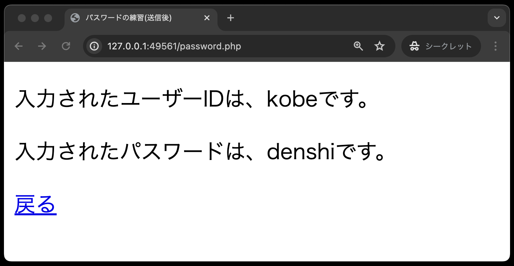
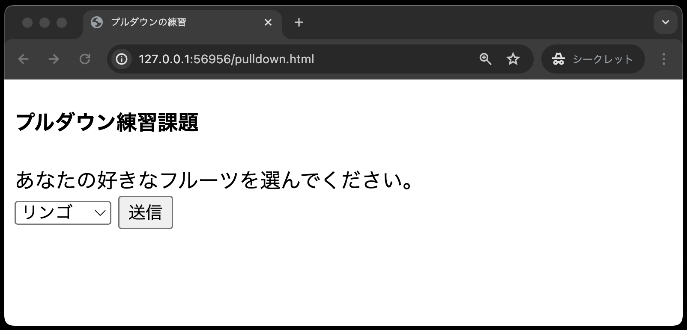
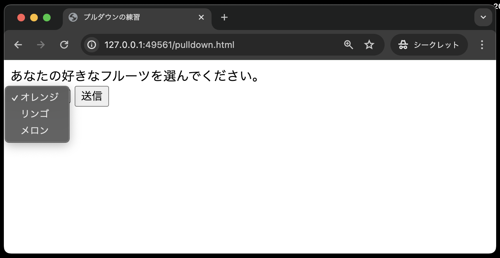
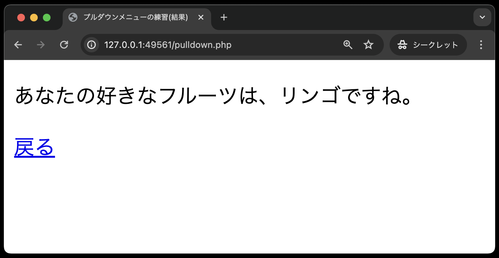
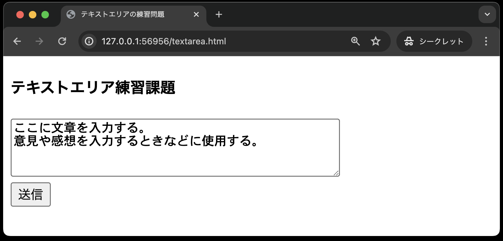
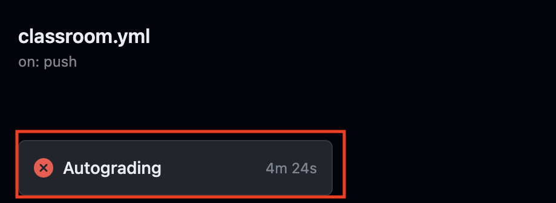

# 入力フォーム課題

- [入力フォーム課題](#入力フォーム課題)
  - [事前準備](#事前準備)
  - [今回の課題について](#今回の課題について)
  - [パスワード](#パスワード)
    - [password.html](#passwordhtml)
    - [password.php](#passwordphp)
  - [プルダウン](#プルダウン)
    - [pulldown.html](#pulldownhtml)
    - [pulldown.php](#pulldownphp)
  - [テキストエリア](#テキストエリア)
    - [textarea.html](#textareahtml)
    - [textarea.php](#textareaphp)
  - [課題の作成と提出](#課題の作成と提出)
    - [テキストファイルの追加(add)とコミット(commit)](#テキストファイルの追加addとコミットcommit)
    - [テキストファイルをプッシュ(push)する](#テキストファイルをプッシュpushする)
  - [採点について](#採点について)
    - [課題の合格基準について](#課題の合格基準について)
    - [合格確認方法](#合格確認方法)
    - [エラーが出た時の対処法](#エラーが出た時の対処法)
    - [タイムアウトになっていないかを確認する](#タイムアウトになっていないかを確認する)
    - [プログラムが正確に書かれているか確認する](#プログラムが正確に書かれているか確認する)
      - [どの入力フォームでエラーがでているか確認する](#どの入力フォームでエラーがでているか確認する)
      - [スペルミス、入力ミスがないか](#スペルミス入力ミスがないか)
      - [`
と
`タグを忘れない](#pとpタグを忘れない)
  - [GitHub上での採点についてのお願い](#github上での採点についてのお願い)

## 事前準備

[こちらのページ](https://classroom.github.com/a/5z3Je8ku)から、ソースコードを`C:¥web_app_dev`へcloneしてください。

## 今回の課題について

今回の課題では、**授業中では紹介されていない入力フォームを使って**プログラムを作成します。そのため、**各自で調査し作成する必要があります。**

また、作成する各ファイルには、それぞれ作成条件が記載されておりますので、そちらには必ず従ってください。**GitHub上の自動テストでエラーになります。**

## パスワード

### password.html

- 作成条件
  - H4タグに自分の `出席番号 氏名` を入れる
  - フォームの送り先を `password.php` に設定する
  - 入力フォームとして、以下のものを設定する
    - テキスト「ユーザーID:」として変数`user`に`text`形式
    - テキスト「パスワード:」として変数`pass`に`password`形式
    - 初期値は設定しない
  - フォーム要素はそれぞれ改行する

### password.php

- 作成条件
  - H4タグに自分の`出席番号 氏名`を入れる
  - フォームとして受け取った`user`,`pass`の値をそれぞれPHPの命令で出力する
    - 以下の1,2の文章は、それぞれ**別々にpタグでくくる**こと
      1. 「入力されたユーザーIDは、XXXX(`user`の値)です」
      2.  「入力されたパスワードは、XXXX(`pass`の値)です」

※戻るをクリックすると前の画面に戻ります。
 

## プルダウン

### pulldown.html

- 作成条件
  - H4タグに自分の `出席番号 氏名` を入れる
  - フォームの送り先を `pulldown.php` に設定する
  - 入力フォームとして、以下のものを設定する
    - 入力された値は変数名`fruit`に入る
    - 果物(fruit)の候補として、以下の値を挿入すること(順番は気にしないでよい)
      - オレンジ
      - リンゴ
      - メロン
    - 送信ボタンには名前 `submit` を付与する

※ここでは、リンゴを選択しています。

プルダウンのリストは次のように設定してください。

### pulldown.php

- 作成条件
  - H4タグに自分の`出席番号 氏名`を入れる
    - フォームとして受け取った`frult`を出力する
    - 出力するテキストは`p`タグでくくる
    - `p`タグ内のテキストは「あなたの好きなフルーツは、XXX(fruitで受け取ったもの)ですね。」とする
  
※戻るをクリックすると前の画面に戻ります。

## テキストエリア

### textarea.html

- 作成条件
  - H4タグに自分の `出席番号 氏名` を入れる
  - フォームの送り先を `textarea.php` に設定する
  - 入力フォームとして、以下のものを設定する
    - 横幅(1桁の文字数)50、縦幅(行数)4に設定する
    - 入力テキストの渡される変数名を `input_text` とする
    - 送信ボタンには名前 `submit` を付与する
    - テキストエリアの初期値は設定しない

### textarea.php

- 作成条件
  - H4タグに自分の`出席番号 氏名`を入れる
  - 以下の1と2は、それぞれ**別々にpタグでくくる**こと
    1. `入力された文章はつぎのとおりです。`という文章
    2. フォームとして受け取った`input_text`の値

## 課題の作成と提出

### テキストファイルの追加(add)とコミット(commit)

1. 課題として提出するファイルをVSCodeで開く。VSCodeのメニューから「ファイル->フォルダーを開く」を選択し、`C:¥xampp¥htdocs¥06_post_kadai-GitHubのユーザー名`を選択する。
2. VSCodeサイドバーのGit Graphのアイコンを押す。
3. 変更の欄に作成したファイルが表示されていることを確認し、+ボタンを押す。 

1. 作成したファイルが「ステージされている変更」に移動していれば、addは成功。 

1. メッセージの欄にメッセージを入力し、✔のボタンを押すとコミットは完了。
  

### テキストファイルをプッシュ(push)する

あとは課題を提出するのみ。

1. 「変更の同期」ボタンを押す。  
※ちなみにこの「変更の同期」は、同じローカルリポジトリを繰り返しpushすると、「Branchの発行」という文言に変わることがあるが、どちらもリモートリポジトリにpushできるので問題はない。

1. ブラウザで、再度課題のリンクにアクセスすると(cloneで使ったURLでも良い)、編集内容が反映されていることがわかる。 

## 採点について

提出した課題はGitHub上で自動採点される。提出後、課題が合格しているかを確認すること。合格していない場合は修正後、再提出すること。

### 課題の合格基準について

３つの入力フォーム(password, pulldown, textarea)にて、POSTメソッドで、データが送信できていること。 

### 合格確認方法

1. 本課題の[課題ページ](https://classroom.github.com/a/IFzVC66a)に再度アクセスする。
2. 画面上部にある`Actions`をクリックする。 

1. **一番上**の行に、緑色のチェックが入っていればOK。※その下に赤いばつ印が入っているものがあるが、それは無視する。 

### エラーが出た時の対処法

自動採点がエラーになると、**一番上**の行に赤いばつ印がでる。その場合の解決策を以下に示す。

### タイムアウトになっていないかを確認する

※右端の赤枠で囲まれている箇所に処理時間がでるが、**1分以上**かかっている場合はタイムアウトである。

なお、タイムアウトの場合は、GitHub上で処理を再開すると解決できる。具体的なタイムアウト解決方法は、

  1. Actionsタブをクリック
  2. タイトルが以下のようにリンクになっているので、クリック
      
  3. Autogradingをクリック
   
  4. 赤いばつ印が出ている箇所をクリック
  
  5. `::error::Setup timed out in 60000 milliseconds`のメッセージがあればタイムアウト
   

  6. 右上に`Re-run jobs`(再実行)のボタンがあるので、`Re-run failed jobs`(失敗した処理だけ再実行)をクリックする。
   
  
  7. タイムアウトにならず1分以内に処理が終了したらOK。※タイムアウトでないエラーは、次の解決策を参照。

### プログラムが正確に書かれているか確認する

プログラムが正確に書かれているかを確認すること。たとえ、ブラウザの画面でそれっぽく表示されても、自動採点なので融通がきかない。エラーが出た際は、以下を確認すること。

#### どの入力フォームでエラーがでているか確認する

今回は3つの入力フォーム(password, pulldown, textarea)があるので、以下の手順で、どの入力フォームがエラーか確認する必要がある。

1. Actionsタブをクリック
2. タイトルが以下のようにリンクになっているので、クリック
      
3. Autogradingをクリック
   
4. 赤いばつ印が出ている箇所をクリック
  
1. エラーがある入力フォームには、下記画像のように、`SampleTest::testXXXXXX`というエラーメッセージが表示される。testXXXXXXには,Password,Pulldown, Textareaのいずれかが入り、これによってどの入力フォームでエラーとなっているか特定できる。 

#### スペルミス、入力ミスがないか

プログラムのエラーのほとんどはスペルミス、入力ミスなどの人為的ミス。再度確認すること。

#### `
と
`タグを忘れない

念のため、繰り返し伝えます。 
各種phpファイル(password.php, pulldown.php, textarea.php)にて、`echo`で出力する文字列は、1行ごとに `
` と `
` でくくること。(※くくらないと採点されないので注意！) 

## GitHub上での採点についてのお願い

今回、再度GitHub上での採点をするにあたりお願いがあります。それは、 
GitHubに課題をpushする前に、**必ずブラウザで動作確認をしてください。**　理由は以下の2つです。 

1. Webアプリケーションはブラウザ上で動作することが前提であるため。
2. GitHubの採点処理時間に上限があるため。 
以前の自動採点プログラムと比べ、処理時間の高速化には成功したものの、GitHubの合計処理時間には毎月上限があります。むやみやたらにpushすると、上限に達しかねないので、必ずブラウザ上で正常に動作することを確認してからpushしてください。**エラーの原因が特定できない場合は、お気軽に質問してください。**
