# ログイン認証①

- [ログイン認証①](#ログイン認証)
  - [事前準備](#事前準備)
  - [Webアプリケーション「ログイン認証」を作成](#webアプリケーションログイン認証を作成)
  - [詳細画面](#詳細画面)
  - [本章で使用するテーブルについて](#本章で使用するテーブルについて)
  - [プログラムの作成](#プログラムの作成)
    - [login.html](#loginhtml)
    - [register.html](#registerhtml)
    - [util.php](#utilphp)
  - [付録: `<input>` タグの `required` 属性](#付録-input-タグの-required-属性)

## 事前準備

[こちらのページ]()から、ソースコードを`C:¥web_app_dev`へcloneしてください。

## Webアプリケーション「ログイン認証」を作成

今回作成するWebアプリケーションでは、以下のファイルを作成します。
それぞれのファイル名と主な機能は以下のとおりです。

1. register.html・・・新規ユーザー登録を行うため、ユーザーID、パスワード、氏名を入力する画面

1. register.php・・・新規ユーザの登録処理結果を表示する画面

1. login.php・・・ユーザーID、パスワードを入力する画面

2. login_check.php・・・認証処理をする画面

3. welcome.php・・・ログイン認証が完了した場合、ログインしたユーザー名を表示する画面

4. logout.php・・・ログアウト処理を行う画面

5. dbdata.php・・・データベースの基本事項を定義する

6. user.php・・・認証処理や新規ユーザの登録を行う

7. util.php・・・画面共通で利用するエスケープ関数をまとめたファイル

8. login.css・・・各画面のデザイン用スタイルシート

画面遷移は以下のとおり。
（`dbdata.php`, `user.php`, `util.php`, `login.css`は直接画面表示に関係ないので、下図では省略しています。）

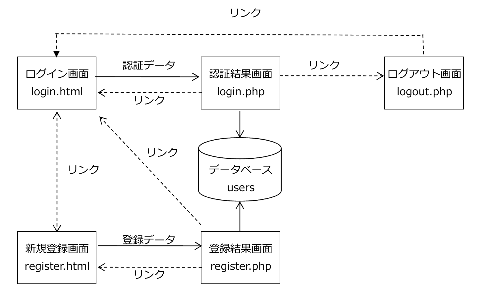

## 詳細画面

1. 新規登録画面（register.html） 
新規ユーザーが、「ユーザーID」、「パスワード」、「名前」をデータベースに登録する入力フォームを用意する。 
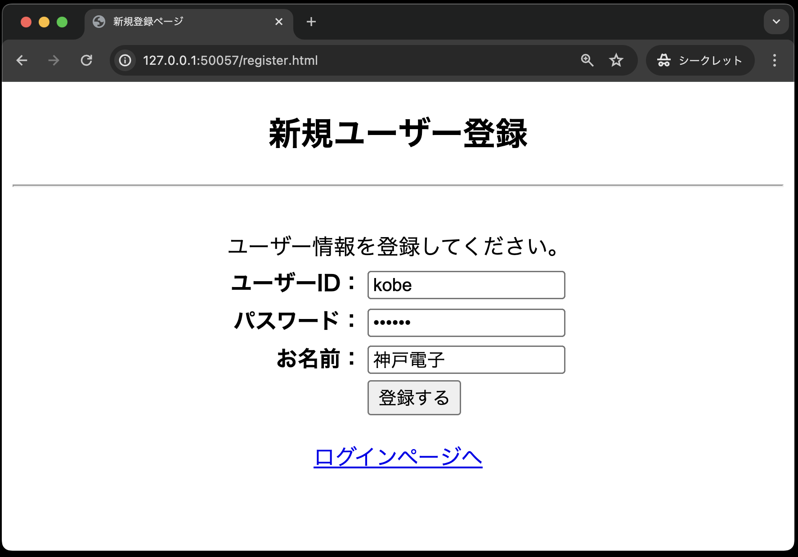  

1. 登録結果画面（register.php） 
ユーザー登録が完了した場合、登録した「ユーザーID」、「パスワード」、「名前」を画面に表示する。 
※実際のシステムでは、パスワードを見せることはせずに「\*\*\*\*\*」といった形で表示するが、ここではあえて見える形で表示している 
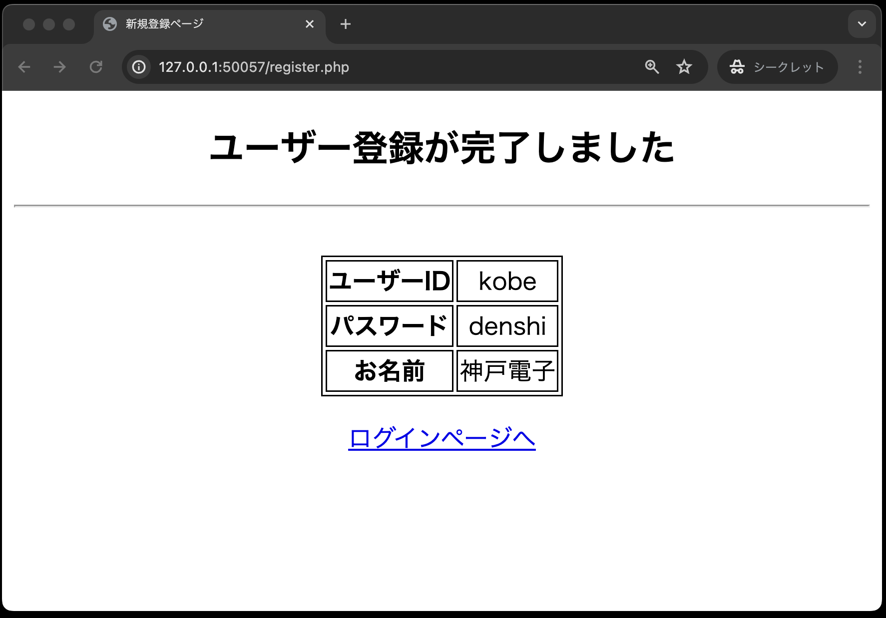  
登録済みのユーザーIDを使った場合はエラーとし、入力されたユーザーIDを画面に表示する。 
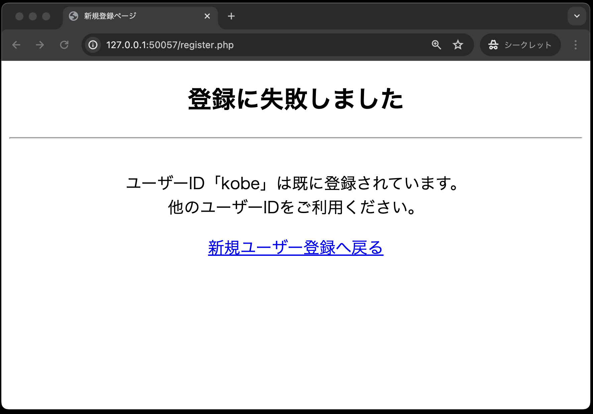

1. ログイン画面（login.html） 
新規登録完了後、登録したユーザーIDとパスワードを入力する。 
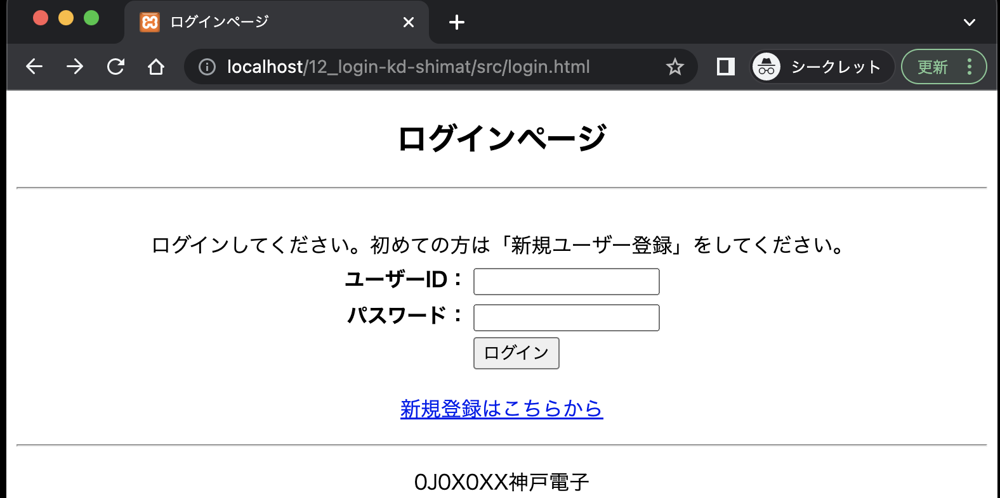  

1. 認証確認画面(login_check.php) 
入力したユーザーIDとパスワードが、データベースに登録した内容と一致した場合、ログインを認め、認証結果画面(welcome.php)に遷移する。 
登録されていないユーザーIDやパスワードでログインしようとした場合には、次のエラー画面を表示する。 
 

1. 認証結果画面(welcome.php) 
入力したユーザーIDとパスワードが、データベースに登録した内容と一致した場合、ログインを認め、「○○○○ さんログイン中」とログインしたユーザー名を表示する。 
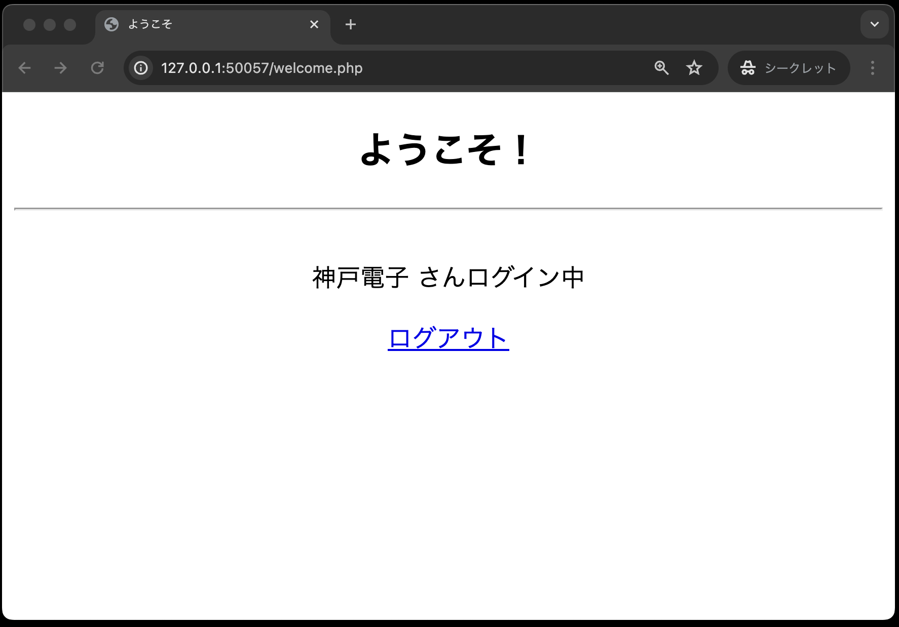  
なお、認証をしていない状態で直接URLを入力した場合は、以下の画面が表示されログインするように促す。 
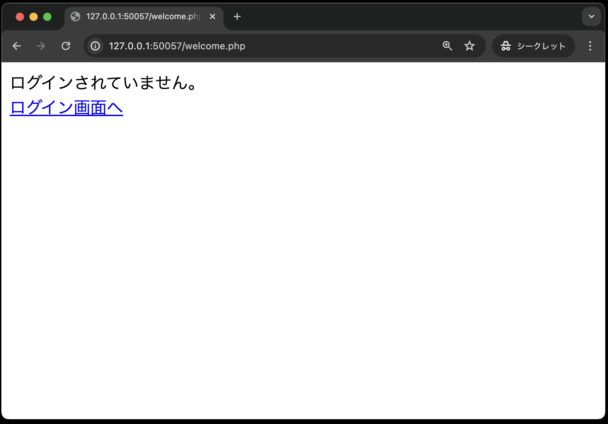 

1. ログアウト画面（logout.php） 
ログアウトボタンを押すと、ログアウト処理をしたことを表示する。 
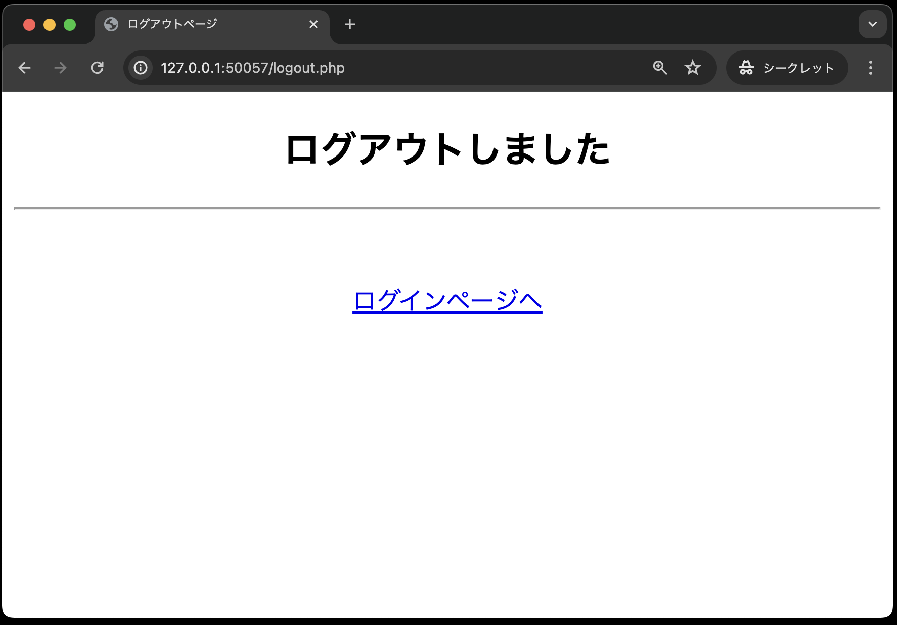  

## 本章で使用するテーブルについて

使用するテーブルは、以下の通りです。

**テーブル名：users**

- userId: varchar型、最大文字数8、主キーとして設定、大文字・小文字を区別するためbinary属性を設定
- password: varchar型、最大文字数12、not null制約
- userName: varchar型、最大文字数50、not null制約

## プログラムの作成

プログラムは、次の順番で作成していく。

1. login.html・・・ユーザーID、パスワードを入力する画面
1. register.html・・・新規ユーザー登録を行うため、ユーザーID、パスワード、氏名を入力する画面
1. util.php・・・画面共通で利用するエスケープ関数をまとめたファイル
1. dbdata.php・・・データベースの基本事項を定義する
1. user.php・・・認証処理や新規ユーザの登録を行う
1. register.php・・・新規ユーザの登録処理結果を表示する画面
1. login.php・・・認証処理結果を表示する画面

なお、「login.css」を利用し画面デザインを適用するため、HTMLのタグに`id`や`class`といった属性を追加しています。

CSSについて初めての方は、以下のサイトなどで簡単な使い方などを参考に理解しておいてください。

[【初心者向け】CSSセレクタとは？セレクタの種類や指定方法を解説！（基礎編）](https://www.asobou.co.jp/blog/web/css-selectors)

### login.html

 

入力が終わったなら、必ずブラウザで以下のように正しく表示されるかを確認すること。問題がないことを確認したうえで次の「register.html」に取り掛かること。 
 

### register.html

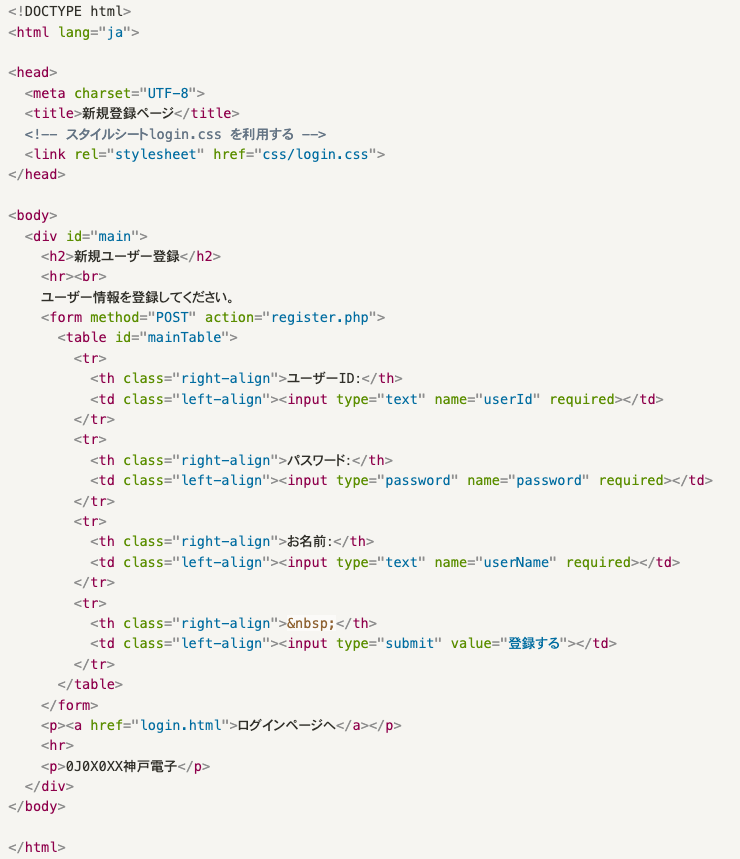 

ブラウザでの表示確認と、「ログインページへ」のリンクから遷移することを確認すること。

 

### util.php

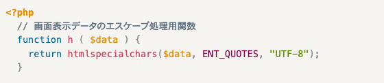 

「util.php」はブラウザでの表示確認はなし。

**ログイン認証はまだ完成ではありません。まだpushはしないでください。**

## 付録: `<input>` タグの `required` 属性

htmlの `<input>`タグに `required` 属性をつけると未入力チェックができる。

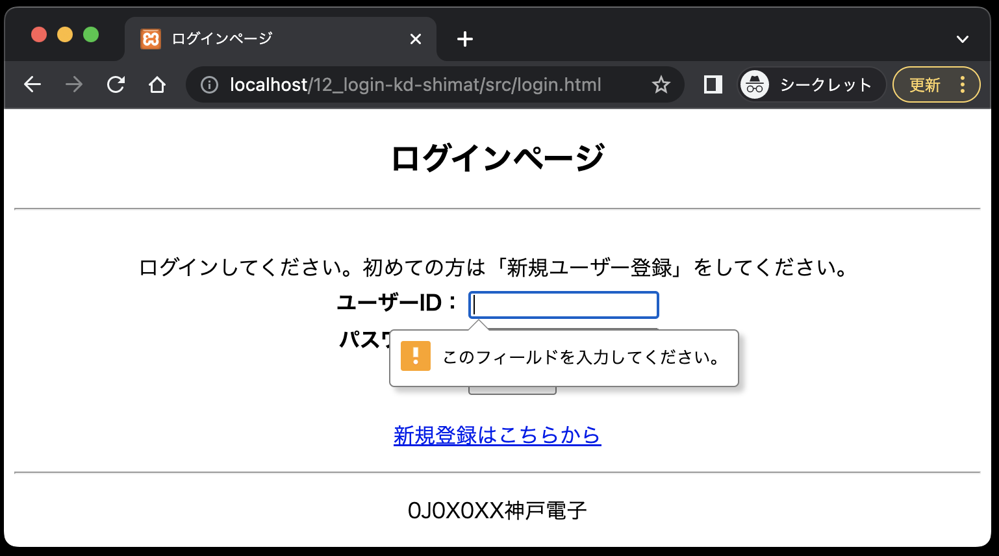 
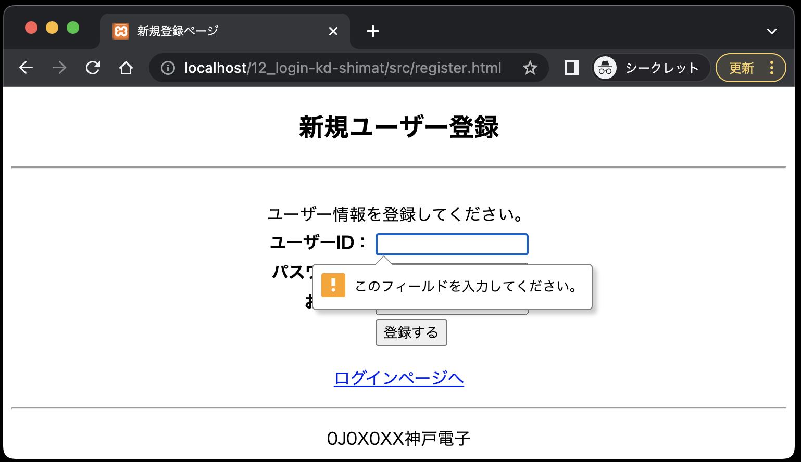
