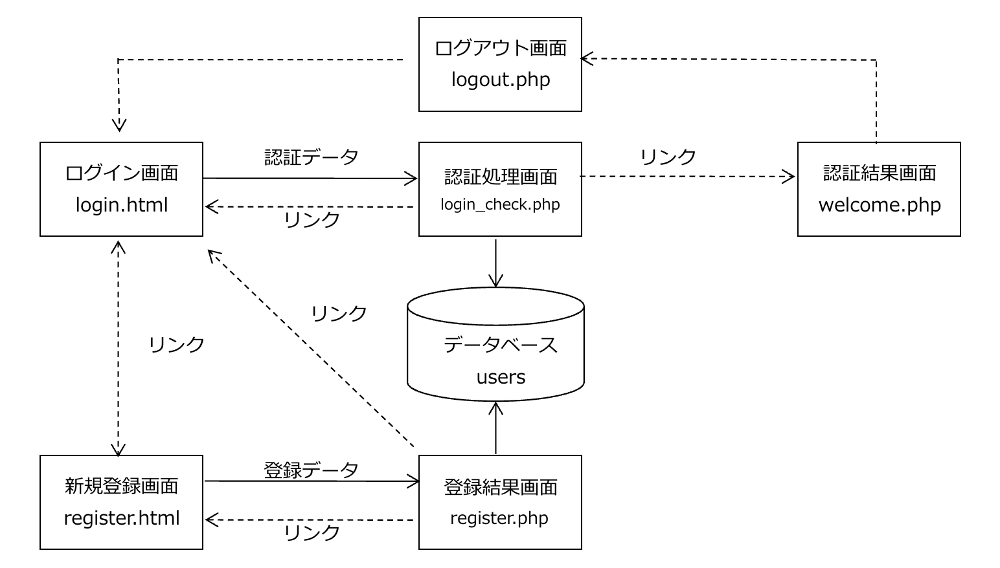
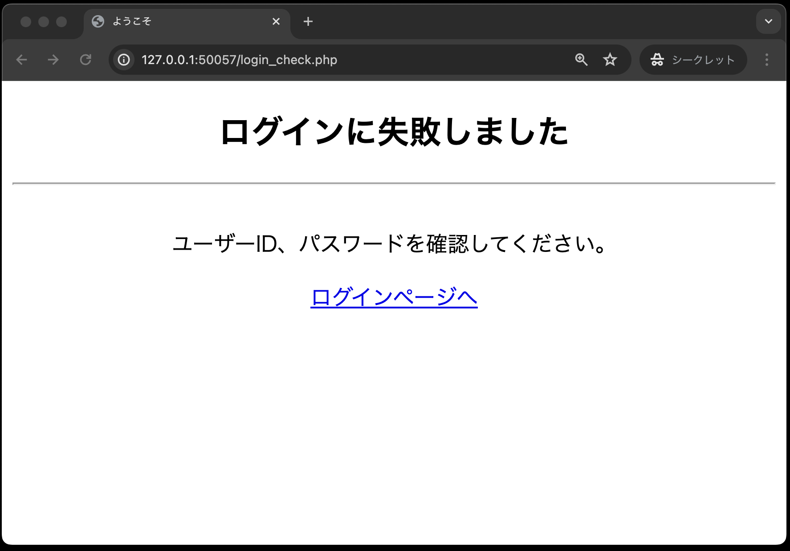

# ログイン認証①

- [ログイン認証①](#ログイン認証)
  - [事前準備](#事前準備)
  - [Webアプリケーション「ログイン認証」を作成](#webアプリケーションログイン認証を作成)
  - [詳細画面](#詳細画面)
  - [本章で使用するテーブルについて](#本章で使用するテーブルについて)
  - [プログラムの作成](#プログラムの作成)
    - [register.html](#registerhtml)
    - [util.php](#utilphp)
  - [dbdata.php](#dbdataphp)
  - [user.php](#userphp)
  - [register.php](#registerphp)

## 事前準備

[こちらのページ]()から、ソースコードを`C:¥web_app_dev`へcloneしてください。

## Webアプリケーション「ログイン認証」を作成

今回作成するWebアプリケーションでは、以下のファイルを作成します。
それぞれのファイル名と主な機能は以下のとおりです。

1. register.html・・・新規ユーザー登録を行うため、ユーザーID、パスワード、氏名を入力する画面

1. register.php・・・新規ユーザの登録処理結果を表示する画面

1. login.html・・・ユーザーID、パスワードを入力する画面

1. login_check.php・・・認証処理をする画面

1. welcome.php・・・ログイン認証が完了した場合、ログインしたユーザー名を表示する画面

1. logout.php・・・ログアウト処理を行う画面

1. dbdata.php・・・データベースの基本事項を定義する

1. user.php・・・認証処理や新規ユーザの登録を行う

1. util.php・・・画面共通で利用するエスケープ関数をまとめたファイル

1. login.css・・・各画面のデザイン用スタイルシート

画面遷移は以下のとおり。
（`dbdata.php`, `user.php`, `util.php`, `login.css`は直接画面表示に関係ないので、下図では省略しています。）



## 詳細画面

1. 新規登録画面（register.html）<br>
新規ユーザーが、「ユーザーID」、「パスワード」、「名前」をデータベースに登録する入力フォームを用意する。<br>
<br><br>

1. 登録結果画面（register.php）<br>
ユーザー登録が完了した場合、登録した「ユーザーID」、「パスワード」、「名前」を画面に表示する。<br>
※実際のシステムでは、パスワードを見せることはせずに「\*\*\*\*\*」といった形で表示するが、ここではあえて見える形で表示している<br>
<br><br>
登録済みのユーザーIDを使った場合はエラーとし、入力されたユーザーIDを画面に表示する。<br>


1. ログイン画面（login.html）<br>
新規登録完了後、登録したユーザーIDとパスワードを入力する。<br>
<br><br>

1. 認証処理画面(login_check.php)<br>
入力したユーザーIDとパスワードが、データベースに登録した内容と一致した場合、ログインを認め、認証結果画面(welcome.php)に遷移する。<br>
登録されていないユーザーIDやパスワードでログインしようとした場合には、次のエラー画面を表示する。<br>
<br>

1. 認証結果画面(welcome.php)<br>
入力したユーザーIDとパスワードが、データベースに登録した内容と一致した場合、ログインを認め、「○○○○ さんログイン中」とログインしたユーザー名を表示する。<br>
<br><br>
なお、認証をしていない状態で直接URLを入力した場合は、ログイン画面に遷移する。<br>

1. ログアウト画面（logout.php）<br>
ログアウトボタンを押すと、ログアウト処理をしたことを表示する。<br>
<br><br>

## 本章で使用するテーブルについて

使用するテーブルは、以下の通りです。

**テーブル名：users**

- userId: varchar型、最大文字数8、主キーとして設定、大文字・小文字を区別するためbinary属性を設定
- password: varchar型、最大文字数12、not null制約
- userName: varchar型、最大文字数50、not null制約

## プログラムの作成

プログラムは、次の順番で作成します。

1. register.html・・・新規ユーザー登録を行うため、ユーザーID、パスワード、氏名を入力する画面
1. util.php・・・画面共通で利用するエスケープ関数をまとめたファイル
1. dbdata.php・・・データベースの基本事項を定義する
1. user.php(登録用メソッド追加)・・・認証処理や新規ユーザの登録を行う
1. register.php・・・新規ユーザの登録処理結果を表示する画面
1. login.html・・・ユーザーID、パスワードを入力する画面
1. user.php(認証用メソッド追加)・・・認証処理や新規ユーザの登録を行う
1. login_check.php・・・認証処理をする画面
1. welcome.php・・・ログイン認証が完了した場合、ログインしたユーザー名を表示する画面
1. logout.php・・・ログアウト処理を行う画面

なお、「login.css」を利用し画面デザインを適用するため、HTMLのタグに`id`や`class`といった属性を追加しています。

CSSについて初めての方は、以下のサイトなどで簡単な使い方などを参考に理解しておいてください。

[【初心者向け】CSSセレクタとは？セレクタの種類や指定方法を解説！（基礎編）](https://www.asobou.co.jp/blog/web/css-selectors)

### register.html

```php
<!DOCTYPE html>
<html lang="ja">

<head>
    <meta charset="UTF-8">
    <meta name="viewport" content="width=device-width, initial-scale=1.0">
    <title>新規登録ページ</title>
    <!-- スタイルシートlogin.css を利用する -->
    <link rel="stylesheet" href="css/login.css">
</head>

<body>
    <div id="main">
        <h2>新規ユーザー登録</h2>
        <hr><br>
        ユーザー情報を登録してください。
        <form method="POST" action="register.php">
            <table id="mainTable">
                <tr>
                    <th class="right-align">ユーザーID：</th>
                    <td class="left-align"><input type="text" name="userId" required></td>
                </tr>
                <tr>
                    <th class="right-align">パスワード：</th>
                    <td class="left-align"><input type="password" name="password" required></td>
                </tr>
                <tr>
                    <th class="right-align">お名前：</th>
                    <td class="left-align"><input type="text" name="userName" required></td>
                </tr>
                <tr>
                    <th class="right-align">&nbsp;</th>
                    <td class="left-align"><input type="submit" value="登録する"></td>
                </tr>
            </table>
        </form>
        <p><a href="login.html">ログインページへ</a></p>
    </div>
</body>

</html>
```

コードが作成できたら、ブラウザでの表示確認をしてください。


なお、今回はhtmlの `<input>`タグに `required` 属性をつけているので、入力をしないまま「登録する」をクリックすると、未入力チェックメッセージが表示されます。


### util.php

[関数](../function/README.md)で紹介したエスケープ処理用関数をまとめたファイルです。

```php
<?php
// 画面表示データのエスケープ処理用関数
function h($data)
{
    return htmlspecialchars($data, ENT_QUOTES, "UTF-8");
}
```

## dbdata.php

データベースの基本事項に関するクラスが定義されているクラスです。
前章の[オブジェクト指向プログラミング①](../object-i/README.md)のときとほぼ同じですが、今回は`exec`メソッドの戻り値を判定に利用するため、その部分を追記しています。

```php
<?php
// DbDataクラスの宣言
class DbData
{
    // PDOオブジェクト用のプロパティ(メンバ変数)の宣言
    protected $pdo;

    // コンストラクタ
    // 「__construct」の「̲̲__」は「_(アンダースコア)」を2つ記述する
    public function __construct()
    {
        // PDOオブジェクトを生成する
        $user = 'sampleuser';
        $password = 'samplepass';
        $host = 'db';
        $dbName = 'SAMPLE';
        $dsn = 'mysql:host=' . $host . ';dbname=' . $dbName . ';charset=utf8';
        try {
            $this->pdo = new PDO($dsn, $user, $password);
        } catch (Exception $e) {
            // 接続できなかった場合のエラーメッセージ
            exit('データベースに接続できませんでした：' . $e->getMessage());
        }
    }

    // SELECT文実行用のquery( )メソッド ・・・このメソッドはユーザー定義関数
    protected function query($sql, $array_params)
    {
        $stmt = $this->pdo->prepare($sql);
        $stmt->execute($array_params);
        // PDOステートメントオブジェクトを返すので
        // 呼び出し側でfetch( )、またはfetchAll( )で結果セットを取得
        return $stmt;
    }

    // INSERT、UPDATE、DELETE文実行用のメソッド ・・・このメソッドもユーザー定義関数
    protected function exec($sql, $array_params)
    {
        $stmt = $this->pdo->prepare($sql);
        // 成功:true、失敗:false
        $stmt->execute($array_params);
        // 【今回追記】実行結果(true or false)を利用するので、戻り値を返す
        return $stmt;
    }
}
```

## user.php

次に、クラス`DbData`を継承する、クラス`User`を定義するPHPファイル「user.php」 を作成します。
まずクラス`User`に、新規ユーザー登録処理を行う`signUp`メソッドを追加します。

```php
<?php
// スーパークラスであるDbDataを利用するため
require_once __DIR__ . '/dbdata.php';

class User extends DbData
{
    // ユーザー登録処理
    public function signUp($userId, $password, $userName)
    {
        // userIdを条件とするSELECT文の定義
        $sql = 'SELECT * FROM users WHERE userId = ?';
        // dbdata.phpのquery()メソッドの実行
        $stmt = $this->query($sql, [$userId]);
        // 抽出したデータを取り出す
        $result = $stmt->fetch();
        // 登録しようとしているユーザーID（Eメール）が既に登録されている場合
        if ($result) {
            return 'ユーザーID「' . $userId . '」は既に登録されています。<br>他のユーザーIDをご利用ください。';
        }
        $sql = 'INSERT into users(userId, password, userName) VALUES (?, ?, ?)';
        $result = $this->exec($sql, [$userId, $password, $userName]);

        if ($result) {
            // ここも空文字を返すので「''」はシングルクォーテーションが２つ
            return '';
        } else {
            // 何らかの原因で失敗した場合
            return '新規登録できませんでした。管理者にお問い合わせください。';
        }
    }
}
```

## register.php

```php
<?php
// 送られてきたデータを受けとる
$userId   = $_POST['userId'];
$password = $_POST['password'];
$userName  = $_POST['userName'];

// Userオブジェクトを生成し、 ユーザー登録処理を行うsignUp( )メソッドを呼び出し、その結果のメッセージを受け取る
require_once  __DIR__  .  '/classes/user.php';
$user = new User();
$result = $user->signUp($userId, $password, $userName);

// 共通するデータ・関数を定義したPHPファイルを読み込む
require_once  __DIR__  .  '/util.php';
?>

<!DOCTYPE html>
<html lang="ja">

<head>
    <meta charset="UTF-8">
    <meta name="viewport" content="width=device-width, initial-scale=1.0">
    <title>新規登録ページ</title>
    <link rel="stylesheet" href="css/login.css">
</head>

<body>
    <div id="main">
        <?php

        // エラーがなく、正しく登録された場合
        if ($result === '') {
        ?>
            <h2>ユーザー登録が完了しました</h2>
            <hr><br>
            <table id='regiTable'>
                <tr>
                    <th>ユーザーID</th>
                    <td><?= h($userId) ?></td> <!-- ① -->
                </tr>
                <tr>
                    <th>パスワード</th>
                    <td><?= h($password) ?></td>
                </tr>
                <tr>
                    <th>お名前</th>
                    <td><?= h($userName) ?></td>
                </tr>
            </table>
            <p><a href='login.html'>ログインページへ</a></p>
        <?php
            // 登録に失敗した場合
        } else {
        ?>
            <h2>登録に失敗しました</h2>
            <hr><br>
            <?= $result ?>
            <p><a href='register.html'>新規ユーザー登録へ戻る</a></p>
        <?php
        }
        ?>
    </div>
</body>

</html>
```

①: `<?= h($userId) ?>` は、`<?php echo ?>`の省略形であり、htmlの中に部分的にPHPの変数を埋め込みたい時に便利な書き方です。
`h($userId)` は、`util.php` で定義したエスケープ処理用関数です。

完成させた後、ブラウザで「register.html」を表示し、以下のデータを入力後「登録する」ボタンを押し、無事に登録されたことを確認してください。

- ユーザーID: kobe
- パスワード: denshi
- お名前: 神戸電子


また、もう一度「register.html」で同じユーザーを登録しようとすると、以下のように登録が失敗することも確認してください。


**次回「ログイン認証②」に続きます。まだpushはしないでください。**
