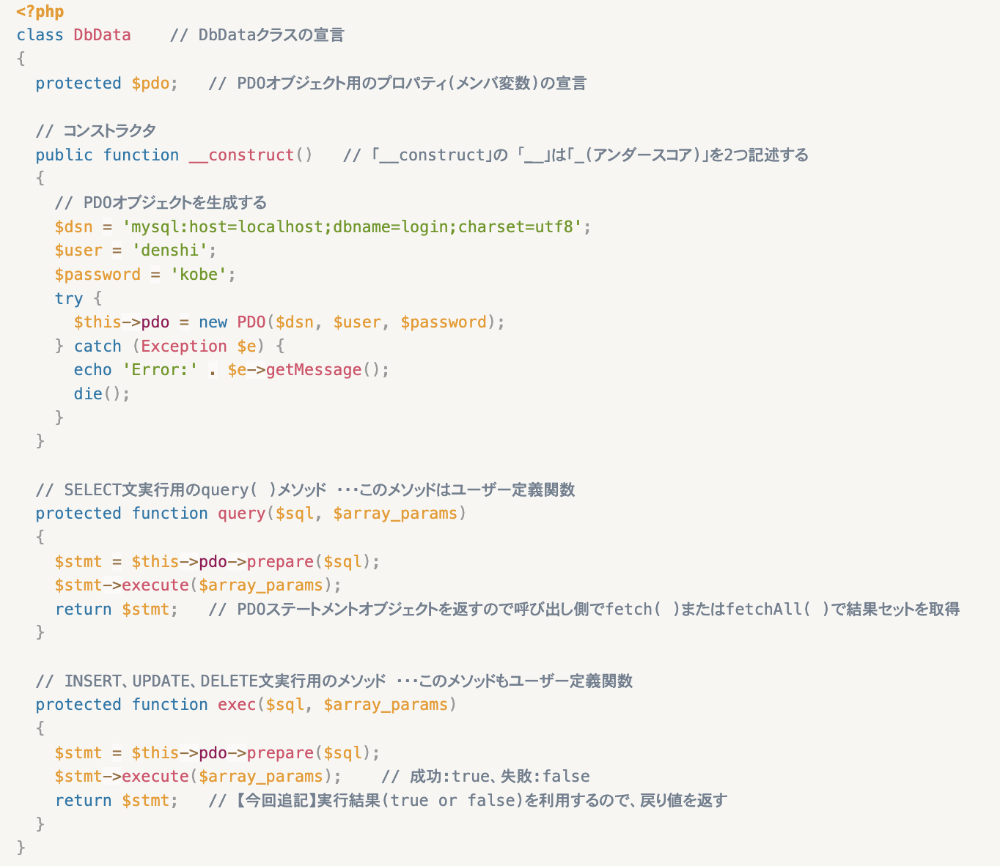
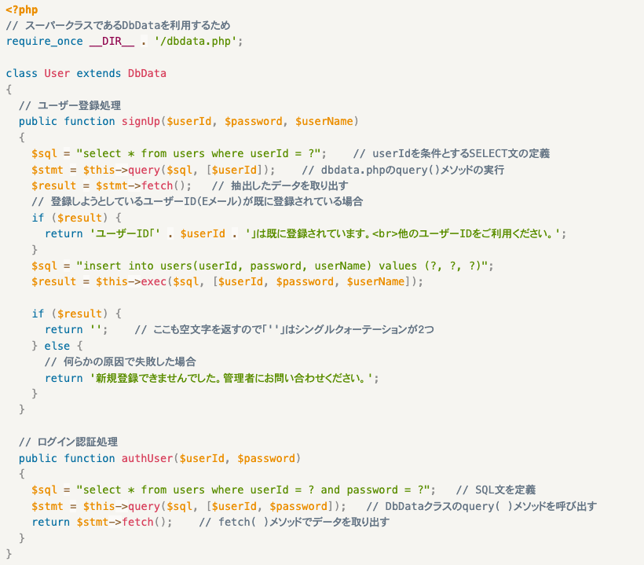

# ログイン認証②

- [ログイン認証②](#ログイン認証)
  - [事前準備](#事前準備)
  - [dbdata.php](#dbdataphp)
  - [user.php](#userphp)

## 事前準備

前回の「12.ログイン認証2」でcloneしたコードをそのまま利用する。

```text
C:¥xampp¥htdocs
    └── 11_obj-GitHubのユーザー名
        ├── <中略>
        └── src
        |   └── classes
        |   |   ├── dbdata.php
        |   |   └── user.php
        |   └── css
        |   |   └── login.css
        |   └── script
        |   |   └── mysql_login.txt
        |   ├── login.html
        |   ├── login.php
        |   ├── register.html
        |   ├── register.php
        |   └── util.php
        └── <中略>
```

## dbdata.php

データベースの基本事項に関するクラスが定義されているクラス。前章の「11.オブジェクト指向プログラミング」のときとほぼ同じだが、今回は`exec`メソッドの戻り値を判定に利用するので、その部分が追記されている。



## user.php

次に、**クラス「DbData」を継承する、クラス「User」を定義するPHPファイル「user.php」** を作成する。このクラス「User」には、次の2つのメソッドを定義する。

① `signUp($userId, $password, $userName)` メソッド</br>
引数で渡されたユーザーID、パスワード、ユーザー名の値で新規ユーザーを登録するメソッド

② `authUser($userId, $password)` メソッド</br>
引数で指定されたユーザーID、パスワードの値でログイン認証するメソッド



**dbdata.php, user.phpのプログラムを作成しても、動作確認はまだできません。次章の「12.ログイン認証4」にあるプログラムを作成する必要があります。**
