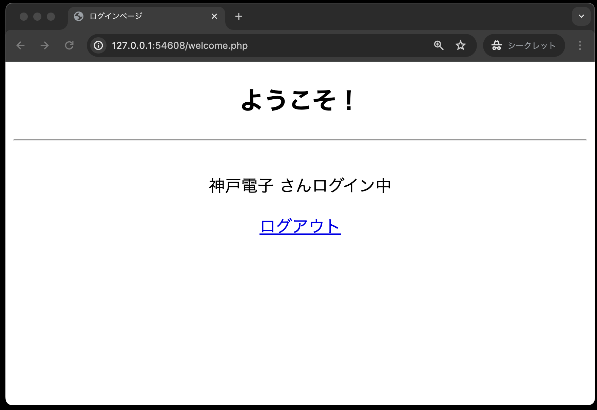
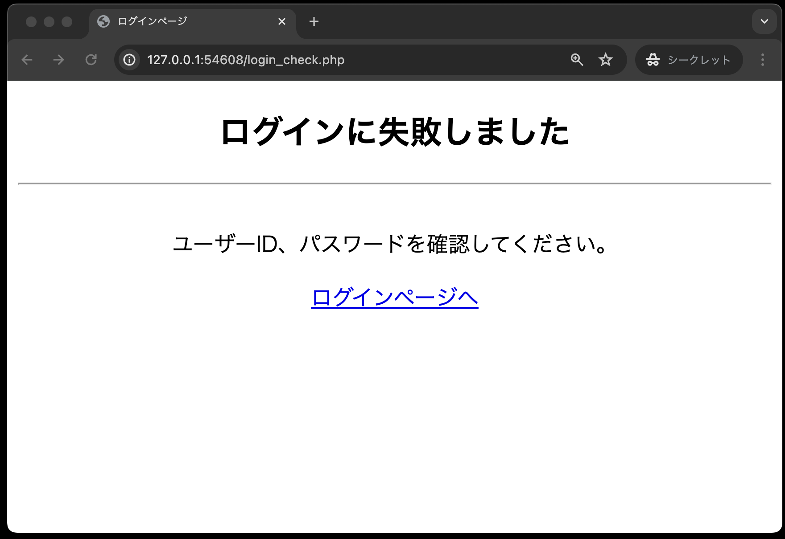

# ログイン認証②

- [ログイン認証②](#ログイン認証)
  - [事前準備](#事前準備)
    - [login.html](#loginhtml)
    - [user.php](#userphp)
  - [login\_check.php](#login_checkphp)
  - [welcome.php](#welcomephp)

## 事前準備

前回の[ログイン認証①](../login-i/README.md)でcloneしたコードをそのまま利用してください。

### login.html

```php
<!DOCTYPE html>
<html lang="ja">

<head>
    <meta charset="UTF-8">
    <meta name="viewport" content="width=device-width, initial-scale=1.0">
    <title>ログインページ</title>
    <link rel="stylesheet" href="css/login.css">
</head>

<body>
    <div id="main">
        <h2>ログインページ</h2>
        <hr><br>
        ログインしてください。初めての方は「新規ユーザー登録」をしてください。
        <form method="POST" action="login_check.php">
            <table id="mainTable">
                <tr>
                    <th class="right-align">ユーザーID：</th>
                    <td class="left-align"><input type="text" name="userId" required></td>
                </tr>
                <tr>
                    <th class="right-align">パスワード：</th>
                    <td class="left-align"><input type="password" name="password" required></td>
                </tr>
                <tr>
                    <th>&nbsp;</th>
                    <td class="left-align"><input type="submit" value="ログイン"></td>
                </tr>
            </table>
        </form>
        <p><a href="register.html">新規登録はこちらから</a></p>
    </div>
</body>

</html>
```

入力が終わったら、必ずブラウザで以下のように正しく表示されるかを確認あしてください。


### user.php

前回は、クラス`User`に、新規ユーザー登録処理を行う`signUp`メソッドを追加しました。
今回は、ログイン認証処理を行う`authUser`メソッドを追加します。

```php
<?php
// スーパークラスであるDbDataを利用するため
require_once __DIR__ . '/dbdata.php';

class User extends DbData
{
    // ユーザー登録処理
    public function signUp($userId, $password, $userName)
    {
        // userIdを条件とするSELECT文の定義
        $sql = 'SELECT * FROM users WHERE userId = ?';
        // dbdata.phpのquery()メソッドの実行
        $stmt = $this->query($sql, [$userId]);
        // 抽出したデータを取り出す
        $result = $stmt->fetch();
        // 登録しようとしているユーザーID（Eメール）が既に登録されている場合
        if ($result) {
            return 'ユーザーID「' . $userId . '」は既に登録されています。<br>他のユーザーIDをご利用ください。';
        }
        $sql = 'INSERT into users(userId, password, userName) VALUES (?, ?, ?)';
        $result = $this->exec($sql, [$userId, $password, $userName]);

        if ($result) {
            // ここも空文字を返すので「''」はシングルクォーテーションが２つ
            return '';
        } else {
            // 何らかの原因で失敗した場合
            return '新規登録できませんでした。管理者にお問い合わせください。';
        }
    }

    // --- ここから追加 ---

    // ログイン認証処理
    public function authUser($userId, $password)
    {
        // SQL文を定義
        $sql = 'SELECT * FROM users WHERE userId = ? AND password = ?';
        // DbDataクラスのquery( )メソッドを呼び出す
        $stmt = $this->query($sql, [$userId, $password]);
        // fetch( )メソッドでデータを取り出す
        return $stmt->fetch();
    }

    // --- ここまで追加 ---
}

```

## login_check.php

```php
<?php
// 送られてきたユーザーIDとパスワードを受け取る
$userId   = $_POST['userId'];
$password = $_POST['password'];

// ---Userオブジェクトを生成し、「authUser()メソッド」を呼び出し、認証結果を受け取る
// user.phpを読み込む
require_once __DIR__  .  '/classes/user.php';
// UserクラスからUserオブジェクトを生成する
$user = new User();
// authUser()メソッドを呼び出し、認証結果を受け取る
$result = $user->authUser($userId, $password);

// ログインに成功した場合、welcome.phpにリダイレクトする
if ($result) {
    session_start();
    $_SESSION['userName'] = $result['userName'];
    header('Location: welcome.php');
    exit();
}

// 共通するデータ・関数を定義したPHPファイルを読み込む
require_once  __DIR__  .  '/util.php';
?>

<!DOCTYPE html>
<html lang="ja">

<head>
    <meta charset="UTF-8">
    <meta name="viewport" content="width=device-width, initial-scale=1.0">
    <title>ログインページ</title>
    <link rel="stylesheet" href="css/login.css">
</head>

<!-- ログインに失敗した場合のメッセージを表示する -->

<body>
    <div id="main">
        <h2>ログインに失敗しました</h2>
        <hr><br>
        ユーザーID、パスワードを確認してください。
        <p><a href='login.html'>ログインページへ</a></p>
    </div>
</body>

</html>
```

## welcome.php

```php
<?php
session_start();

// 共通するデータ・関数を定義したPHPファイルを読み込む
require_once  __DIR__  .  '/util.php';
?>

<!DOCTYPE html>
<html lang="ja">

<head>
    <meta charset="UTF-8">
    <meta name="viewport" content="width=device-width, initial-scale=1.0">
    <title>ログインページ</title>
    <link rel="stylesheet" href="css/login.css">
</head>

<body>
    <div id="main">
        <h2>ようこそ！</h2>
        <hr><br>
        <?= h($_SESSION['userName']) ?> さんログイン中
        <p><a href='logout.php'>ログアウト</a></p>
    </div>
</body>

</html>
```

完成させた後、ブラウザで「login.html」を表示し、次のデータを入力後「ログイン」ボタンを押し、認証できることを確認してください。

- ユーザーID: kobe
- パスワード: denshi




また、登録していないユーザーを「login.html」に入力すると、以下のように認証が失敗することを確認してください。


