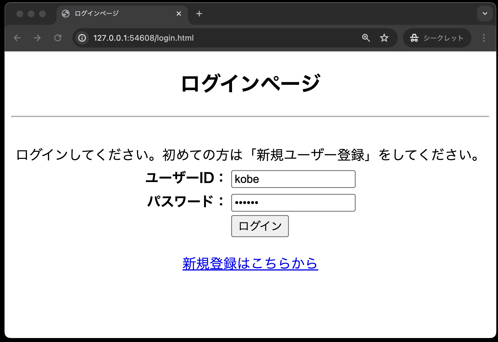

# ログイン認証②

- [ログイン認証②](#ログイン認証)
  - [事前準備](#事前準備)
    - [login.html](#loginhtml)
    - [user.php](#userphp)
  - [login.php](#loginphp)

## 事前準備

前回の「12.ログイン認証2」でcloneしたコードをそのまま利用してください。

### login.html

 

入力が終わったなら、必ずブラウザで以下のように正しく表示されるかを確認すること。問題がないことを確認したうえで次の「register.html」に取り掛かること。 
 

### user.php

## login.php

完成させた後、ブラウザで「login.html」を表示し、次のデータを入力後「ログイン」ボタンを押し、認証できることを確認する。

- ユーザーID: kobe
- パスワード: denshi

また、登録していないユーザーを「login.html」に入力すると、以下のように認証が失敗する。

