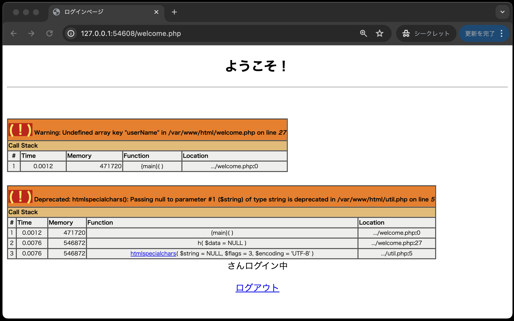
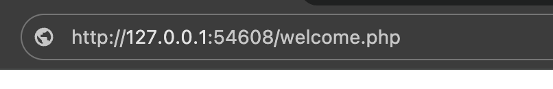
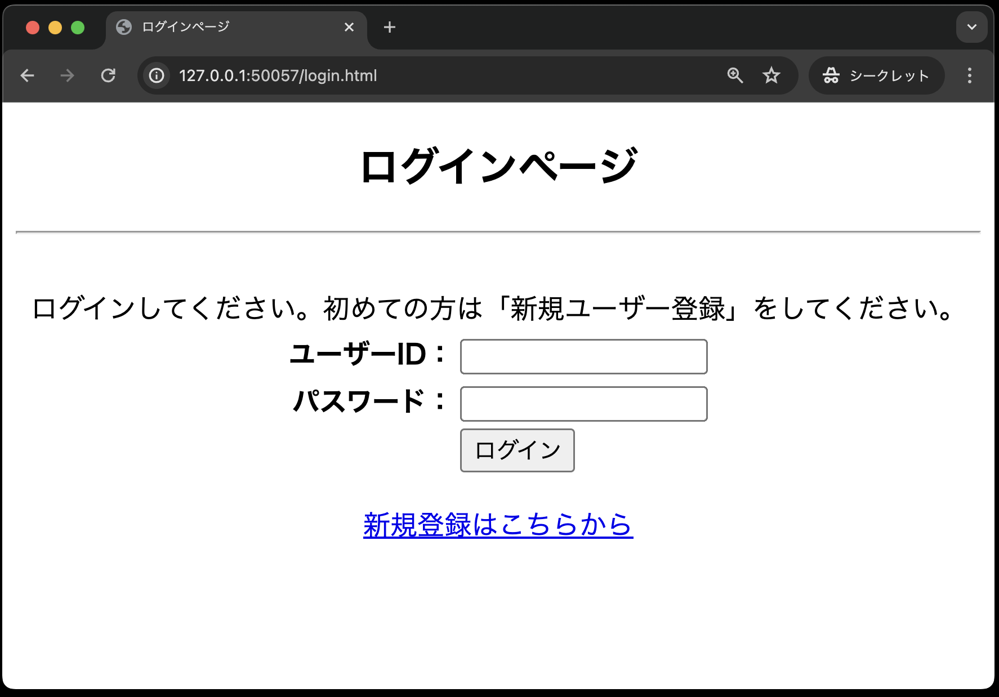

# ログイン認証③

- [ログイン認証③](#ログイン認証)
  - [事前準備](#事前準備)
  - [logout.php](#logoutphp)
  - [これでログイン認証作成完了！！...ではありません](#これでログイン認証作成完了ではありません)
    - [login\_check.php](#login_checkphp)
    - [welcome.php](#welcomephp)
  - [課題の作成と提出](#課題の作成と提出)
    - [作成したソースコードをpush](#作成したソースコードをpush)
  - [採点について](#採点について)
    - [課題の合格基準](#課題の合格基準)
    - [合格確認方法](#合格確認方法)
    - [エラーが出た時の対処法](#エラーが出た時の対処法)
    - [タイムアウトになっていないかを確認する](#タイムアウトになっていないかを確認する)
    - [プログラムが正確に書かれているか確認する](#プログラムが正確に書かれているか確認する)

## 事前準備
前回の[ログイン認証①](../login-i/README.md)でcloneしたコードをそのまま利用してください。

## logout.php

ログアウト処理を行う`logout.php`を作成します。

```php
<?php
// セッションを開始(穴埋め)

// $_SESSIONの中身を空にする
$_SESSION = array();
// クッキーの中にセッションIDがある場合、クッキーの中身を空にする
// session_name()は、セッションIDが入っているクッキーの名前を取得する関数
if (isset($_COOKIE[session_name()]) == true) {  // ①
    setcookie(session_name(), '', time() - 10, '/');
}
// セッションに 関連づけられた全てのデータを破棄する(破棄タイミングは、PHPスクリプトが実行された後)
session_destroy();
?>

<!DOCTYPE html>
<html lang="ja">

<head>
    <meta charset="UTF-8">
    <meta name="viewport" content="width=device-width, initial-scale=1.0">
    <title>ログアウトページ</title>
    <link rel="stylesheet" href="css/login.css">
</head>

<body>
    <div id="main">
        <h2>ログアウトしました</h2>
        <hr><br>
        <p><a href="login.html">ログインページへ</a></p>
    </div>
</body>
```

## これでログイン認証作成完了！！...ではありません

このままですと、実はログインしていなくても、直接URLを入力することで認証結果画面(welcome.php)にアクセスすることができてしまいます...(もちろん、正しい画面遷移ではないのでエラーが出ます)



このような不正アクセスを防ぐために、ログインしていない場合はログインページに遷移をするよう処理を追加します。

### login_check.php

まずは、認証処理画面(login_check.php)にて、ログインに成功した際、セッションに認証情報を保存します。

```php
<?php
// 送られてきたユーザーIDとパスワードを受け取る(穴埋め)
$userId   = 
$password = 

// Userクラスを利用するため、user.phpクラスを読み込む(穴埋め)
require_once 
// UserクラスからUserオブジェクトを生成する(穴埋め)
$user 
// authUser()メソッドを呼び出し、認証結果を受け取る(穴埋め)
$result = 

// ログインに成功した場合、welcome.phpにリダイレクトする
if ($result) { 
    // セッションを開始(穴埋め)
    
    // --ここだけ追加--
    $_SESSION['login'] = 1;　// ログインフラグ
    // --ここまで--
    // セッションにユーザー名を保存
    $_SESSION['userName'] = $result['userName'];
    header('Location: welcome.php');
    exit();
}

// 共通するデータ・関数を定義したPHPファイルを読み込む
require_once  __DIR__  .  '/util.php';
?>

<!DOCTYPE html>
<html lang="ja">

<head>
    <meta charset="UTF-8">
    <meta name="viewport" content="width=device-width, initial-scale=1.0">
    <title>ログインページ</title>
    <link rel="stylesheet" href="css/login.css">
</head>

<!-- ログインに失敗した場合のメッセージを表示する -->

<body>
    <div id="main">
        <h2>ログインに失敗しました</h2>
        <hr><br>
        ユーザーID、パスワードを確認してください。
        <p><a href='login.html'>ログインページへ</a></p>
    </div>
</body>

</html>
```

### welcome.php

続いて、認証結果画面(welcome.php)にて、セッションに認証情報が無い場合に、ログイン画面にリダイレクトする処理を追加します。

```php
<?php
// セッションを開始(穴埋め)

// ----ここから追加----
if (isset($_SESSION['login']) == false) {
    header('Location: login.html');
    exit();
}
// ----ここまで追加----

// 共通するデータ・関数を定義したPHPファイルを読み込む
require_once  __DIR__  .  '/util.php';
?>

<!DOCTYPE html>
<html lang="ja">

<head>
    <meta charset="UTF-8">
    <meta name="viewport" content="width=device-width, initial-scale=1.0">
    <title>ログインページ</title>
    <link rel="stylesheet" href="css/login.css">
</head>

<body>
    <div id="main">
        <h2>ようこそ！</h2>
        <hr><br>
        <!-- セッションに保存されたユーザー名を表示する(穴埋め) -->
        <?= h(                 ) ?>さんログイン中
        <p><a href='logout.php'>ログアウト</a></p>
    </div>
</body>

</html>
```

以上で、修正は完了です。
実際の動作を確認してみましょう。

1. ログインしていない状態で、welcome.phpにアクセスしてください。<br>


2. ログインページにリダイレクトされることを確認してください。


これで本当にログイン認証の作成が完了しました。
お疲れ様でした。

## 課題の作成と提出

### 作成したソースコードをpush

pushまでの説明は省略する。忘れた場合は、これより以前の資料を見返し確認すること。

## 採点について

提出した課題はGitHub上で自動採点されます。
提出後、課題が合格しているかを確認してください。
合格していない場合は修正後pushし、再提出してください。

### 課題の合格基準

以下の3つを合格基準とします。

1. ユーザーが新規登録できること
2. 新規登録したユーザーでログインできること
3. ログインしていない状態で、welcome.phpにアクセスすると、ログインページにリダイレクトされること

### 合格確認方法

1. 本課題の[課題ページ]()に再度アクセスします。
2. 画面上部にある`Actions`をクリックしてください。<br>

1. **一番上**の行に、緑色のチェックが入っていればOKです。<br>


### エラーが出た時の対処法

自動採点がエラーになると、**一番上**の行に赤いばつ印がでます。
その場合の解決策を以下に示します。

### タイムアウトになっていないかを確認する

※右端の赤枠で囲まれている箇所に処理時間がでますが、**4分前後**かかっている場合には、まずタイムアウトの可能性を疑ってください。


具体的なタイムアウトの確認・解決方法は、

  1. `Actions`のタイトルが以下のようにリンクになっているので、クリック
      
  2. `run-autograding-tests`をクリック
   
  3. 赤いばつ印が出ている箇所をクリック
  
  1. `::error::Setup timed out in XXXXXX milliseconds`のメッセージがあればタイムアウト
   
  6. 解決策としては、右上に`Re-run jobs`(再実行)のボタンがあるので、`Re-run failed jobs`(失敗した処理だけ再実行)をクリックする。
  <br>
  
  7. タイムアウトにならず3分以内に処理が終了したらOK。※タイムアウトでないエラーは、次の解決策を参照。

### プログラムが正確に書かれているか確認する

プログラムが正確に書かれているかを確認してください。
たとえ、ブラウザの画面でそれらしく表示されても、自動採点なので融通は効きません。
エラーが出た際は、以下の点を確認してください。
