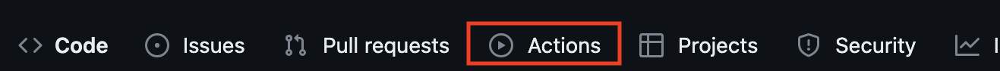

# ログイン認証③

- [ログイン認証③](#ログイン認証)
  - [課題の作成と提出](#課題の作成と提出)
    - [作成したソースコードをpush](#作成したソースコードをpush)
  - [採点について](#採点について)
    - [課題の合格基準](#課題の合格基準)
    - [合格確認方法](#合格確認方法)
    - [エラーが出た時の対処法](#エラーが出た時の対処法)
    - [タイムアウトになっていないかを確認する](#タイムアウトになっていないかを確認する)
    - [プログラムが正確に書かれているか確認する](#プログラムが正確に書かれているか確認する)
      - [どこでエラーがでているか確認する](#どこでエラーがでているか確認する)
      - [プログラムが正確に書かれているか確認する](#プログラムが正確に書かれているか確認する-1)
  - [GitHub上での採点についてのお願い](#github上での採点についてのお願い)

## 課題の作成と提出

### 作成したソースコードをpush

pushまでの説明は省略する。忘れた場合は、これより以前の資料を見返し確認すること。

## 採点について

提出した課題はGitHub上で自動採点される。提出後、課題が合格しているかを確認すること。合格していない場合は修正後pushし、再提出すること。

### 課題の合格基準

以下の3つを合格基準とする。

1. 新規ユーザーの登録処理ができること
2. 登録したユーザーで認証処理ができること

### 合格確認方法

1. 本課題の[課題ページ]()に再度アクセスする。
2. 画面上部にある`Actions`をクリックする。 

1. **一番上**の行に、緑色のチェックが入っていればOK。※その下に赤いばつ印が入っているものがあるが、それは無視する。 

### エラーが出た時の対処法

自動採点がエラーになると、**一番上**の行に赤いばつ印がでる。その場合の解決策を以下に示す。

### タイムアウトになっていないかを確認する

※右端の赤枠で囲まれている箇所に処理時間がでるが、**2分以上**かかっている場合はタイムアウトとなる。

なお、タイムアウトの場合は、GitHub上で処理を再開すると解決できる。具体的なタイムアウト解決方法は、

  1. Actionsタブをクリック
  2. タイトルが下記のようにリンクになっているので、クリック 
       
  3. Autogradingをクリック 
    
   

  4. 赤いばつ印が出ている箇所をクリック 
    
  1. `::error::Setup timed out in 120000 milliseconds`のメッセージがあればタイムアウト

  6. 右上に`Re-run jobs`(再実行)のボタンがあるので、`Re-run failed jobs`(失敗した処理だけ再実行)をクリックする。
   
  
  7. タイムアウトにならず2分以内に処理が終了したらOK。※タイムアウトでないエラーは、次の解決策を参照。

### プログラムが正確に書かれているか確認する

プログラムが正確に書かれているかを確認すること。たとえ、ブラウザの画面でそれっぽく表示されても、自動採点なので融通がきかない。エラーが出た際は、以下を確認すること。

#### どこでエラーがでているか確認する

今回は2つの自動採点(新規ユーザー登録処理、ログイン認証処理)があるので、以下の手順で、どごでエラーが出ているか確認する。

1. Actionsタブをクリック
2. タイトルが下記のようにリンクになっているので、クリック
       
3. Autogradingをクリック 
    
4. 赤いばつ印が出ている箇所をクリック 
   
1. エラーがあるソースコードは、下記画像のように、エラーメッセージが表示されるので、これにエラーが出ているソースコードを特定できる。 
 

#### プログラムが正確に書かれているか確認する

プログラムが正確に書かれているかを確認する。たとえ、ブラウザの画面でそれっぽく表示されても、自動採点ですので融通はききません。エラーが出た際は、サンプルコードと差異がないか確認してください。

## GitHub上での採点についてのお願い

今回、再度GitHub上での採点をするにあたりお願いがあります。それは、 
GitHubに課題をpushする前に、**必ずブラウザで動作確認をしてください。**　理由は下記の2つです。 

1. Webアプリケーションはブラウザ上で動作することが前提であるため。
2. GitHubの採点処理時間に上限があるため。 
以前の自動採点プログラムと比べ、処理時間の高速化には成功したものの、GitHubの合計処理時間には毎月上限があります。むやみやたらにpushすると、上限に達しかねないので、必ずブラウザ上で正常に動作することを確認してからpushしてください。**エラーの原因が特定できない場合は、お気軽に質問してください。**
