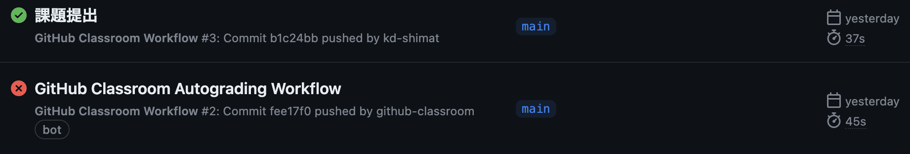

# Session

- [Session](#session)
  - [事前準備](#事前準備)
  - [ステート（状態）とセッションの概要](#ステート状態とセッションの概要)
  - [サンプル](#サンプル)

## 事前準備

前回の`07_Cookie.pdf`でcloneしたコードをそのまま利用する。

```text
C:¥xampp¥htdocs
    └── 07_cookie_session-GitHubのユーザー名
        ├── <中略>
        ├── src
        |   ├── <中略>
        |   ├── session1.php
        |   ├── session2.php
        |   ├── session3.php
        |   ├── session4.php
        |   ├── session5.php
        |   ├── session6.php
        |   └── session7.php
        └── <中略>

```

## ステート（状態）とセッションの概要

プロトコルのステート(状態)とは、前後の伝送間で「情報※を覚えておく」能力のこと。

※情報・・・アクセスしているのは誰か、認証済みか、直前にはどんなリクエストがあったのか、等。

HTTPは「ステート**レス**」なプロトコル<br>
→ 「情報」を覚えておく能力がない

Webアプリケーションでのクライアントとサーバ間でのやり取りは、「ステートフル」(情報を覚えておく能力がある)でなければならない。<br>
→ **「セッション」** を利用して、ステートレスなHTTPをステートフルなWebアプリケーションに変身させる。<br>
Webサーバーが作成した「セッションID」をクライアント（ブラウザ）側でクッキーを利用して保存し、ステートフルなやり取りができるようにする。

具体的には、ユーザーがログインした状態を保持したり、ショッピングサイトのカート機能の実装などで使われる。

デフォルトではステートレスなので以下のようになる。<br>


 セッションを利用してステートフルだと、以下のようになる。<br>

- サーバーが「セッションID」をクライアントに送る
- クライアントはそれを「クッキー」で保存する
<br>


## サンプル

今回のサンプルでは次のことを学びます。

1. セッションを開始する方法
2. セッションIDの値を取得する方法
3. セッションに値を保存する方法
4. セッションに保存した値を取り出す方法
5. セッションに保存している特定の値を破棄する方法
6. セッションに保存している全ての値を破棄する方法

<div style="page-break-before:always"></div>

**session1.php**

名前を入力し、**session2.php**にリクエストを送信する。


`session_start( );`<br>
セッションを開始する場合、session_start( )関数を実行しなければならない。 セッション管理を行うPHPファイルすべてに記述が必要。

<div style="page-break-before:always"></div>

**session2.php**

受け取った名前を画面に表示すると共に、セッションに保存する。 職業を入力し、**session3.php**に送信する。


①`session_start( );` セッションを開始する。

②`echo '<p>Session ID：' . $_COOKIE['PHPSESSID'] . '</p>';`<br>
セッションを開始すると、クライアント側にセッションIDがクッキーとして書き込まれる。 クッキー名は `PHPSESSID`と決められている。（PHPのSESSION  IDという意味）

③`$_SESSION['name'] = $_POST['user_name'];`<br>
セッションに値を保存するには、PHPで定義済みの変数 `$_SESSION`（実態は連想配列）を使う。 送られてきた名前データを受け取り、`name` というセッション変数（キー）でセッションに保存している。

<div style="page-break-before:always"></div>

**session3.php**

セッションから名前を取り出して表示し、受け取った職業を画面に表示するとともにセッションに保存する。 年齢を入力し、**session4.php**に送信する。


①`echo '<p>Session ID：' . $_COOKIE['PHPSESSID'] . '</p>';`<br>
セッションを開始すると、クライアント側にセッションIDがクッキーとして書き込まれる。 クッキー名は `PHPSESSID` と決められている。（PHPのSESSION  IDという意味）

②`$_SESSION['name'] = $_POST['user_name'];`<br>
セッションに値を保存するには、PHPで定義済みの変数 `$_SESSION`（実態は連想配列）を使う。 送られてきた名前データを受け取り、`name` というセッション変数（キー）でセッションに保存している。

<div style="page-break-before:always"></div>

**session4.php**

セッションから名前と職業を取り出して表示し、受け取った年齢を画面に表示するとともにセッションに保存する。 その後、職業のデータをセッションから削除する。


`unset ( $_SESSION[ 'job' ] );`<br>
`unset( )`関数を使って、セッション変数(キー）をセッションから削除している。<br>
【注意】`unset($_SESSION)`によって 全ての`$_SESSION`を初期化してはならない。そうしてしまうと、その後セッション変数の登録ができなくなってしまう。

<div style="page-break-before:always"></div>

**session5.php**

職業のデータはセッションから削除されているため、エラーメッセージが表示される。 セッションID、名前、年齢の情報を画面に表示した後、すべてのデータをセッションから削除する。


<div style="page-break-before:always"></div>


①`session_destroy ( );`<br>
セッション変数を全て削除する関数。

②`setcookie('PHPSESSID', '', time( ) - 10,  '/');`<br>

`session_destroy ( );` でセッション変数を全て削除しても、それだけではセッションIDは削除されない。 クライアント側に保存されているセッションIDを削除するために、クッキーで保存されている セッションID（クッキー名：PHPSESSID）を削除している。

なお、セッションクッキーは `session_start( )` 関数を実行した際に作成されるが、このときに session.cookie_pathの値（デフォルトは「/」）を付けてクッキーが作られる。 このため、セッションクッキーを削除するときは明示的にパスを指定しなければならない。 そのために、第4引数の「'/'」でデフォルトのパスを指定している。 もし、この第4引数のパスを指定しないと、セッションクッキーは削除されない。

③`echo '<p>職業：' . $_SESSION['job'] . '</p>';`

前のsession4.phpで「job」のセッション変数は削除されているためエラーメッセージが表示される。※画像のエラーメッセージは、Windowsとは違う環境で確認しているため、リソースへのパスがWindowsとは異なる。<br>

④`$oldsessid = $_COOKIE['PHPSESSID'];`<br>
⑤`echo '<a href="session6.php?oldsessid=' . $oldsessid . '">次へ（全てのセッションデータを削除済み）</a>'`

session7.phpで新しいセッションIDと比較するために、この時点でのセッションIDを取得し、クエリパラメータを 用いて次のsession6.phpへセッションIDの値を送信する。

<div style="page-break-before:always"></div>

**session6.php**

全てのデータがセッションから削除されているため、エラーメッセージが表示される。 また、セッションIDも削除されたため、ここで新しいセッションを開始する。


①セッションIDをはじめ、すべてのセッション変数が削除されているので、いずれもエラーメッセージが表示される。※画像のエラーメッセージは、Windowsとは違う環境で確認しているため、リソースへのパスがWindowsとは異なる。

②新しいセッションが開始され、次のsession7.phpで前のセッションIDと値を比較する。前のセッションIDは、クエリパラメータで送られてくるので`$_GET[ ]`で値を取得する。また、session7.phpで新しいセッションIDと比較するために、クエリパラメータをセッションIDの値を送信する。

<div style="page-break-before:always"></div>

**session7.php**

新しいセッションが開始されているので、前のセッションとセッションIDの値が異なっている。


①前のセッションID（Ole Session ID）と新しいセッションID（New Session ID）の値が違うことを確認できる。 前のセッションID（Ole Session ID）は、クエリパラメータで送られてくるので$_GET[ ]で値を取得する。

<div style="page-break-before:always"></div>

## 課題の作成と提出

### テキストファイルの追加(add)とコミット(commit)

1. 課題として提出するファイルをVSCodeで開く。VSCodeのメニューから「ファイル->フォルダーを開く」を選択し、`C:¥xampp¥htdocs¥07_cookie_session-GitHubのユーザー名`を選択する。
2. VSCodeサイドバーのGit Graphのアイコンを押す。
3. 変更の欄に作成したファイルが表示されていることを確認し、+ボタンを押す。<br>


1. 作成したファイルが「ステージされている変更」に移動していれば、addは成功。<br>

1. メッセージの欄にメッセージを入力し、✔のボタンを押すとコミットは完了。<br>
<br>

### テキストファイルをプッシュ(push)する

あとは課題を提出するのみ。

1. 「変更の同期」ボタンを押す。<br><br>
※ちなみにこの「変更の同期」は、同じローカルリポジトリを繰り返しpushすると、「Branchの発行」という文言に変わることがあるが、どちらもリモートリポジトリにpushできるので問題はない。

1. ブラウザで、再度課題のリンクにアクセスすると(cloneで使ったURLでも良い)、編集内容が反映されていることがわかる。<br>


## 採点について

提出した課題はGitHub上で自動採点される。提出後、課題が合格しているかを確認すること。合格していない場合は修正後、再提出すること。

### 課題の合格基準について

cookie,sessionに保存した値を取得し、ブラウザに表示されること。<br>

### 合格確認方法

1. 本課題の[課題ページ](https://classroom.github.com/a/N_z2N5xZ)に再度アクセスする。
2. 画面上部にある`Actions`をクリックする。<br>

1. **一番上**の行に、緑色のチェックが入っていればOK。※その下に赤いばつ印が入っているものがあるが、それは無視する。<br>


### エラーが出た時の対処法

自動採点がエラーになると、**一番上**の行に赤いばつ印がでる。その場合の解決策を以下に示す。

### タイムアウトになっていないかを確認する

※右端の赤枠で囲まれている箇所に処理時間がでるが、**1分以上**かかっている場合はタイムアウトである。


なお、タイムアウトの場合は、GitHub上で処理を再開すると解決できる。具体的なタイムアウト解決方法は、

  1. Actionsタブをクリック
  2. タイトルが下記のようにリンクになっているので、クリック
      
  3. Autogradingをクリック
   
  4. 赤いばつ印が出ている箇所をクリック
  
  5. `::error::Setup timed out in 60000 milliseconds`のメッセージがあればタイムアウト
   

<div style="page-break-before:always"></div>

  6. 右上に`Re-run jobs`(再実行)のボタンがあるので、`Re-run failed jobs`(失敗した処理だけ再実行)をクリックする。
  <br>
  
  7. タイムアウトにならず1分以内に処理が終了したらOK。※タイムアウトでないエラーは、次の解決策を参照。

### プログラムが正確に書かれているか確認する

プログラムが正確に書かれているかを確認すること。たとえ、ブラウザの画面でそれっぽく表示されても、自動採点なので融通がきかない。エラーが出た際は、以下を確認すること。

#### どこでエラーがでているか確認する

今回は2つの自動採点(cookie, session)があるので、以下の手順で、どちらでエラーが出ているか確認する必要がある。

1. Actionsタブをクリック
2. タイトルが下記のようにリンクになっているので、クリック
      
3. Autogradingをクリック
   
4. 赤いばつ印が出ている箇所をクリック
  
1. エラーがある入力フォームには、下記画像のように、`SampleTest::testXXXXXX`というエラーメッセージが表示される。testXXXXXXには,Cookie,Sessionのいずれかが入り、これによってどこでエラーとなっているか特定できる。<br>


<div style="page-break-before:always"></div>

#### プログラムが正確に書かれているか確認する

プログラムが正確に書かれているかを確認する。たとえ、ブラウザの画面でそれっぽく表示されても、自動採点ですので融通はききません。エラーが出た際は、サンプルコードと差異がないか確認してください。

## GitHub上での採点についてのお願い

今回、再度GitHub上での採点をするにあたりお願いがあります。それは、<br>
GitHubに課題をpushする前に、**必ずブラウザで動作確認をしてください。**　理由は下記の2つです。<br>

1. Webアプリケーションはブラウザ上で動作することが前提であるため。
2. GitHubの採点処理時間に上限があるため。<br>
以前の自動採点プログラムと比べ、処理時間の高速化には成功したものの、GitHubの合計処理時間には毎月上限があります。むやみやたらにpushすると、上限に達しかねないので、必ずブラウザ上で正常に動作することを確認してからpushしてください。**エラーの原因が特定できない場合は、お気軽に質問してください。**
